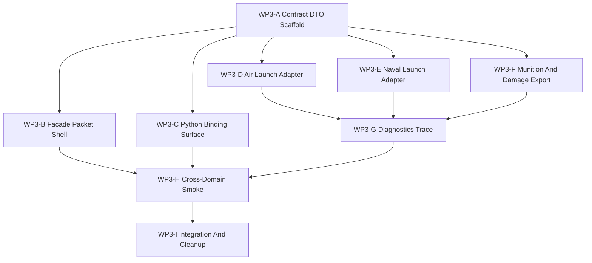

# WP3 交战试点任务族

状态：`2026-05-19` 活跃实现试点。

语言版本：

- 英文主文：[engagement_pilot_wp3_20260519.md](engagement_pilot_wp3_20260519.md)
- 中文辅文：`engagement_pilot_wp3_20260519.zh.md`

输入：

- [仿真系统架构设计](../../plan/architecture/simulation_system_architecture_design.zh.md)
- [WP1 管线盘点](pipeline_inventory_wp1_20260519.zh.md)
- [WP2 契约冻结](contract_freeze_wp2_20260519.zh.md)
- 围绕航空发射、舰载发射、facade/contracts、Python binding 风格和验证 harness 落点的只读分支证据。

WP3 把已经冻结的交战契约推进为第一条跨领域实现试点。该试点应证明航空挂架发射与舰载挂载或 VLS 发射共享同一条语义生命周期，而不是把它们强行塞进同一个私有实现路径。

当前实现备注：

- `src/runtime/contracts/engagement_contracts.h` 拥有该试点的稳定 DTO 词汇。
- `src/core/engine/weapon_launch_adapter.h` 是从旧 launch 观测结果转换为
  `LaunchRequest` 与 `LaunchEvent` 的共享 header-only seam。
- Air 与 naval worker 应消费该 seam，或在测试中镜像其字段语义，但不应并行编辑
  `simulation_kernel_weapon_api.cpp`。
- `RuntimeFacade::export_engagement_event_packet()` 目前仍是显式 packet shell；
  在航空与舰载 event shape 收敛前，不应把 live launch 行为接入 facade。
- `RuntimeFacade` 现在也提供专用的 `export_diagnostics_traces(...)`
  facade 路径，因此 `DiagnosticsTrace` 不再只是 engagement export 中的
  piggyback evidence。
- `tests/runtime/engagement/` 现在包含航空 launch accepted/rejected、舰炮 launch、
  munition lifecycle 镜像、合成 effects 与 damage report 的 adapter-level 验证。
  这些测试证明的是契约词汇，而不是最终 event-bus ownership。

## 一、试点论点

航空与舰载交战行为已经存在。缺口不是没有武器，而是 launch、munition lifecycle、effects、damage 与 observation 尚未通过窄 typed contract chain 暴露。

因此 WP3 应先构建 contract adapter 与跨领域验证切片：

```text
TrackPacket
  -> LaunchRequest
  -> LaunchEvent
  -> MunitionLifecyclePacket
  -> EffectsEvent
  -> DamageReport
  -> DiagnosticsTrace
  -> ObservationPacket
```

当同一套契约词汇能够解释以下行为时，试点即为成功：

1. 航空挂架或 hardpoint 发射，
2. 舰载 mount 或 VLS 发射，
3. accepted 与 rejected fire-control decision，
4. munition lifecycle progression，
5. effects 与 damage reporting，
6. observation 与 diagnostics trace export，
7. 本地 Windows 机器上的非 RL 验证。

## 二、非目标

- 一次性重写所有武器系统。
- 把航空和舰载发射内部实现合并为单一路径。
- 把完整 ECS component schema 作为公开契约暴露。
- 把 `RuntimeFacade::runtime()` 变成维护中的 engagement API。
- 要求 RL 训练依赖参与验证。
- 解决完整 GPU/resident-state 后端设计。

## 三、分支图

| 分支 | 目标 | 主要写入范围 | 并行性 | 建议 agent 预算 | 退出产物 |
|------|------|--------------|--------|-----------------|----------|
| `WP3-A Contract DTO Scaffold` | 新增稳定 engagement DTO surface。 | `src/runtime/contracts/engagement_contracts.h`；必要时只做 include plumbing。 | 应最先开始；解锁多数其他分支。 | 中等 worker；只有字段语义变化时才需要高预算。 | Header-only DTO 与 architecture/header hygiene 测试。 |
| `WP3-B Facade Packet Shell` | 新增 facade-shaped request/result 或 packet container，不暴露 raw runtime。 | `src/runtime/facade/runtime_facade_types.h`、`runtime_facade.h`、`runtime_facade.cpp`。 | 在 `WP3-A` 后开始；与 Python binding 独立。 | 中等 worker。 | Facade type 与由测试记录的 stub/export 路径。 |
| `WP3-C Python Binding Surface` | 按现有 nanobind 风格向 `ef_py` 暴露 DTO 与 facade packet。 | `src/interfaces/python/bindings_runtime.cpp`；binding tests。 | 在 `WP3-A` 后开始；如果方法签名稳定，可与 `WP3-B` 并行。 | 轻量或中等 worker。 | 字段面 binding 测试。 |
| `WP3-D Air Launch Adapter` | 把航空挂架/hardpoint 发射映射到 `LaunchRequest` 与 `LaunchEvent`。 | 航空侧 adapter code 与 air engagement tests，消费或镜像 `weapon_launch_adapter.h`。避免与 `WP3-E` 同时写 `simulation_kernel_weapon_api.cpp`。 | 如果停留在测试/adapter-local 可并行；若编辑共享 kernel launch code 则应串行。 | 中等 worker。 | 测试 adapter 层完成：带 station、ammo、cooldown、spawned munition 的 air launch accepted/rejected events。 |
| `WP3-E Naval Launch Adapter` | 把舰载 mount/VLS 发射映射到同一套 `LaunchRequest` 与 `LaunchEvent`。 | 舰载侧 adapter code 与 naval engagement tests，消费或镜像 `weapon_launch_adapter.h`。避免与 `WP3-D` 同时写 `simulation_kernel_weapon_api.cpp`。 | 如果停留在测试/adapter-local 可并行；若编辑共享 kernel launch code 则应串行。 | 中等 worker。 | DDG 舰炮与 VLS launch 的测试 adapter 层完成。 |
| `WP3-F Munition And Damage Export` | 外露最小 lifecycle、effects 与 damage report，不泄漏完整 component。 | 如果 DTO 仍需补充则写 `src/runtime/contracts/engagement_contracts.h`；否则写 export/adapter 与测试。 | 在 `WP3-A` 后开始；若写入范围分离，可与 launch adapter 并行。 | 中等 worker。 | 测试 adapter 层已启动：`MunitionLifecyclePacket`、`EffectsEvent` 与 `DamageReport` 可镜像现有 runtime/debug observation。 |
| `WP3-G Diagnostics Trace` | 用 id 串联 track、launch、lifecycle、effects、damage 与 observation。 | Diagnostics/export code 与 trace tests。 | 等 event/report 可观察后开始。 | 中等 worker；若 trace ownership 横跨 facade 与 engine，则使用高预算。 | 最小 trace index，而不是完整日志系统。 |
| `WP3-H Cross-Domain Smoke` | 新增 stage-aligned local non-RL smoke。 | `tests/runtime/engagement/`，若晋升 smoke 再改 `tests/smoke/ci_smoke_suite.json`。 | 等 air/naval contract event 可观察后开始。 | 测试为轻量 worker；fixture 适配为中等 worker。 | 一个本地 smoke，证明航空与舰载共享生命周期词汇。 |
| `WP3-I Integration And Cleanup` | 解决共享文件冲突并更新任务文档/状态。 | 多分支共同触达的共享文件，及 `docs/task/simulation_architecture` 下文档。 | 串行 integration branch。 | 高推理 integration worker 或主线程。 | 通过聚焦测试，并更新 work-package 状态。 |

## 四、依赖图



并行规则：

- `WP3-A` 应首先执行。
- DTO 名称稳定后，`WP3-B`、`WP3-C` 与测试规划可以并行。
- `WP3-D` 与 `WP3-E` 只有在不同时编辑同一个共享 kernel 文件时才适合并行。如果两者都需要 `simulation_kernel_weapon_api.cpp`，应由一个 integration owner 统一处理共享 adapter seam。
- `WP3-G` 与 `WP3-H` 不应在 launch event 与 damage report 可观察前开始实现。

## 五、证据锚点

| 领域 | 现有资产 | WP3 用途 |
|------|----------|----------|
| 航空挂架发射 | F-16 hardpoints 与 default loadout、child `Munition` entity、`PilotAction.weapon_select_id`、`fire_missile()`、`PilotWeaponRelease`。 | 把 station selection、ammo/cooldown、rejection gate 与 spawned missile id 映射到 `LaunchEvent`。 |
| 舰载 mount/VLS 发射 | `NavalWeaponMountDefinition`、DDG mount config、`fire_missile()` 中的 VLS selection、显式 `fire_naval_weapon()`。 | 把 mount id、ready count、cooldown、range gate、intercept 或 damage result 映射到同一 event shape。 |
| Track 与 observation | `TrackDatabase` 到 `AgentObservation.contacts`，facade `ObservationBatchRequest` 与 `ObservationBatchPacket`。 | 在窄 DTO 出现前，把 fused track export 当作 `TrackPacket` 等价面。 |
| Munition lifecycle | `Missile` component、guidance system、debug missile runtime state。 | 只导出最小 lifecycle 字段，并保持 guidance tuning 内部化。 |
| Effects 与 damage | Damage system、effects model、platform damage state、naval damage degradation tests。 | 产出 `EffectsEvent` 与 `DamageReport`，替代 raw health/debug reads。 |
| 验证 | Air combat tests、naval ship database tests、facade tests、smoke suite runner。 | 把 `tests/runtime/engagement/` 建成跨领域 smoke 归宿。 |

## 六、Subagent 写入范围规则

分发 implementation worker 时使用以下规则：

1. Contract worker 拥有 `src/runtime/contracts/engagement_contracts.h`，不得 include `core/engine/*`。
2. Facade worker 拥有 `src/runtime/facade/*`，不得把 `RuntimeFacade::runtime()` 变成维护中的 engagement path。
3. Binding worker 拥有 `src/interfaces/python/bindings_runtime.cpp` 与 binding tests。
4. Air 与 naval launch worker 不应同时编辑 `src/core/engine/simulation_kernel_weapon_api.cpp`。
   第一轮 adapter wave 应优先采用测试本地 DTO 构造或 header-only `weapon_launch_adapter.h`
   seam，而不是直接接入 live kernel。
5. Validation worker 拥有 `tests/runtime/engagement/`，只有在 focused test 稳定后才更新 `tests/smoke/ci_smoke_suite.json`。
6. Final integration worker 拥有跨分支冲突解决和任务状态更新。

## 七、验收门槛

每个分支都应满足任务入口中的通用架构门槛。WP3 整体还必须满足：

1. 航空挂架发射与舰载 mount/VLS 发射 emit 或 adapt 到同一 `LaunchEvent` shape。
2. Accepted 与 rejected launch 带显式 reason，不再把隐式 boolean return value 作为维护中契约。
3. Ammo、cooldown、selected launcher、selected munition 与 spawned munition ancestry 进入 event/report 字段。
4. Munition lifecycle export 不暴露完整 ECS component internal。
5. Damage 可见性使用 `DamageReport`，而不是 debug-only health read。
6. `DiagnosticsTrace` 能连接 track、launch request/event、munition、effects、damage 与 observation packet version。
7. Facade 与 Python access 是显式路径，或被记录为临时 compatibility adapter。
8. 本地验证不需要 RL 训练依赖。

## 八、验证命令

实现前的聚焦证据检查：

```powershell
.\tools\maintenance\cmo_env.ps1 python -m pytest -q tests\runtime\air_combat\test_air_combat_1v1_fire_missile.py tests\runtime\air_combat\test_weapon_guidance_realism_guards.py tests\runtime\naval\test_naval_ship_database.py tests\runtime\facade\test_runtime_facade.py
```

WP3 测试新增后的维护中 smoke loop：

```powershell
.\tools\maintenance\cmo_env.ps1 validate
.\tools\maintenance\cmo_env.ps1 python -m pytest -q tests\runtime\engagement
.\tools\maintenance\cmo_env.ps1 python tools\runners\run_pytest_suite.py --suite tests\smoke\ci_smoke_suite.json
```

如果本地 artifact 过旧，使用干净构建窗口：

```powershell
cmake -S . -B build-local-win -G Ninja -DCMAKE_BUILD_TYPE=Release
cmake --build build-local-win --target ef_core ef_py -j2
.\tools\maintenance\cmo_env.ps1 validate
```

## 九、建议首轮分发

建议第一波 worker：

1. `WP3-A Contract DTO Scaffold`：实现 `engagement_contracts.h` 与 contract hygiene tests。
2. `WP3-H Validation Skeleton`：创建 `tests/runtime/engagement/`；如果 DTO 可用就写 shape tests，否则只写测试计划补丁，不写 failing tests。
3. `WP3-B Facade Packet Shell`：DTO 名称稳定后新增 facade packet container。

建议第二波 worker：

1. `WP3-D Air Launch Adapter`。
2. `WP3-E Naval Launch Adapter`。
3. `WP3-C Python Binding Surface`。

第二波实现状态：

1. `WP3-D` 已把旧航空 `fire_missile()` 的 accepted 与 rejected 结果验证为
   `LaunchRequest` 和 `LaunchEvent`。
2. `WP3-E` 已把旧 DDG Mk 45 `fire_naval_weapon()` 验证为同一 launch event shape；
   VLS 覆盖已纳入同一 launch event shape。
3. `WP3-F` 已从现有 observation 开始构造测试级 lifecycle、effects 与 damage DTO。

建议第三波 worker：

1. `WP3-F Munition And Damage Export`。
2. `WP3-G Diagnostics Trace`。
3. `WP3-I Integration And Cleanup`。

WP9 基础设施闭合说明：

1. `INF-6` 仍保留为 blocked handoff。真实导弹 terminal hit resolution 已经在
   维护中的 guidance/effects system 中执行，但当前 recent-event DTO capture
   仍主要通过 naval direct-fire 与 debug/synthetic proximity-hit recorder
   进入。`damage_system.h` 目前没有窄的 kernel recorder seam，因此 WP9
   选择把它保留为显式交接，而不是在并行 ownership 下引入更宽的 shared-world
   callback。
2. `INF-7` 现已被明确为 compatibility wrapper，而不是未记录的临时方案。
   有界的 `RecentEngagementEvents` buffer 继续保留，但它们共享一个单调递增的
   `next_engagement_event_id_` 分配器，并在导出时按 event/report/trace id 排序，
   使 facade/replay consumer 可以把它视为与 event queue 对齐的 recent window，
   而不是依赖插入顺序的偶然结果。

## 十、退出标准

WP3 退出条件：

1. 跨领域 engagement lifecycle 可在本地不依赖 RL 地执行。
2. 航空与舰载发射路径共享一套 typed contract vocabulary。
3. Facade-shaped access 已可用，或每个验收相关缺口都有显式 compatibility adapter 记录。
4. Diagnostics 能解释从 track 到 observation 的链条。
5. 后续 WP4/WP5 工作被收敛为 facade hardening 与 maintained smoke promotion，而不是重新发现架构。
