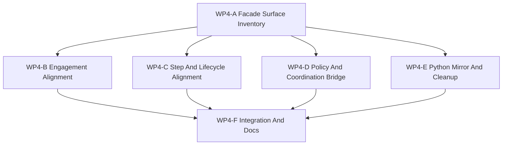

# WP4 Facade Alignment

Status: `2026-05-19` facade alignment accepted; WP5 validation handoff completed.

Language:

- English canonical: `facade_alignment_wp4_20260519.md`
- Chinese companion: [facade_alignment_wp4_20260519.zh.md](facade_alignment_wp4_20260519.zh.md)

Inputs:

- [simulation system architecture design](../../plan/architecture/simulation_system_architecture_design.md)
- [WP2 contract freeze](contract_freeze_wp2_20260519.md)
- [WP2.5 scheduler semantics freeze](scheduler_semantics_wp25_20260519.md)
- [WP2.5 scheduler semantics acceptance review](../review/wp25_scheduler_semantics_acceptance_review_20260519.md)
- [WP3 engagement pilot acceptance review](../review/wp3_engagement_pilot_acceptance_review_20260519.md)
- [Temp-02 SCAL architecture vision review](../review/temp-02_review_20260519.md)
- Current facade surfaces in `src/runtime/facade/*` and Python bindings in
  `src/interfaces/python/bindings_runtime.cpp`

WP4 turns the accepted WP3 pilot into the maintained frontend shape. The goal is
not to invent new simulation semantics. The goal is to make the existing
simulation and engagement behavior reachable through facade-shaped request and
result APIs, with raw runtime access left only as an explicit compatibility or
diagnostics escape hatch.

WP4 now starts after the accepted WP2.5 scheduler semantics freeze. Facade work
should reference WP2.5 for event ordering, shard versions, barrier visibility,
clock-domain merge policy, replay metadata, and `StageNodeManifest` vocabulary
instead of defining new scheduler rules inside facade code.

WP4 also absorbs the accepted Temp-02 SCAL framing. The facade is not only a
runtime convenience layer; it is the maintained boundary between the temporal
execution projection, the information graph, the agency graph, and the evidence
graph. In particular, WP4 must keep `World Truth`, `ObservationPacket`, and
`DecisionBelief` distinct.

Current implementation note:

- `RuntimeFacade` already exposes batch setup/reset, observation export,
  execution-step result, and engagement export paths.
- `ObservationBatchRequest` / `ObservationBatchPacket`,
  `EngagementBatchRequest` / `EngagementEventPacket`, and
  `ExecutionBatchStepRequest` / `ExecutionBatchStepResult` are the existing
  maintained request/result shells.
- `RuntimeFacade::runtime()` and direct `WorldBatchRuntime` access remain
  compatibility-only surfaces.
- Python bindings already mirror most of the maintained facade types, but the
  policy and orchestration adapters still need to stay clearly on the facade
  side of the boundary.

## 1. Facade Thesis

WP4 exists because WP3 proved the cross-domain engagement slice, but the
project still needs a stable maintained frontend path for that slice.

The design target is:

1. public access goes through facade-shaped request/result APIs,
2. policy and test adapters use explicit compatibility adapters instead of raw
   runtime mutation,
3. cross-layer contracts for observation, action, coordination, reward,
   termination, and episode lifecycle are reachable without hidden owners,
4. engagement export remains facade-first and world-safe,
5. observation and agent-facing paths preserve information-state boundaries
   instead of leaking truth state into policy code,
6. any missing surface is made explicit, either as a maintained request/result
   API or as a documented compatibility adapter.

WP4 should prefer narrowing and naming existing surfaces over inventing new
simulation behavior. If a proposed gap cannot be expressed as a facade contract
or adapter, it should be sent back to `WP2` as a contract amendment instead of
being hidden inside runtime calls.

## 2. Non-Goals

- Rewriting launch, guidance, effects, or damage behavior.
- Replacing the CPU exact reference path.
- Removing diagnostics escape hatches from the repository.
- Building the full `WP5` validation harness.
- Adding a second runtime path for air, naval, or weapon behavior.
- Collapsing compatibility adapters into implicit calls.

## 3. Facade Surface Map

| Surface | Current state | WP4 alignment decision | Minimum maintained shape | Validation gate |
|---------|---------------|------------------------|--------------------------|-----------------|
| `BatchWorldSetupRequest` / `BatchWorldSetupResult` | Setup and spawn already go through the facade. | Keep as the maintained world-setup surface. | Stable setup fields, seed handling, and entity-id results. | Setup stays facade-visible and does not require raw runtime handles. |
| `ObservationBatchRequest` / `ObservationBatchPacket` | Observation export is already facade-shaped. | Keep as the maintained observation surface and align it with `ObservationViewSpec` plus information-state provenance. | Snapshot version, source time, explicit include flags, view-spec schema metadata, and declared source layer. | Policy/test adapters can query observations without raw ECS access or truth-state leakage. |
| `DecisionBelief` | Not yet a first-class facade-adjacent contract. | Treat as the policy/agent-side belief layer derived from declared observation inputs, not from world truth. | Consumed observation packet ids or snapshot versions, inference source, estimator/model reference, uncertainty/confidence shape, and maintained vs diagnostics-only label. | Tests can distinguish maintained beliefs from oracle/diagnostics-only truth-derived beliefs. |
| `EngagementBatchRequest` / `EngagementEventPacket` | Engagement export is already present, with recent-event retagging and explicit packet shells. | Keep as the maintained engagement surface; decide whether unused slots remain compatibility placeholders or gain producers. | Track packets, launch events, effects events, damage reports, diagnostics traces, and explicit world-safe refs. | Multi-world export must preserve or retag `world_index` consistently. |
| `ExecutionBatchStepRequest` / `ExecutionBatchStepResult` | Step, reward, termination, and mirrored observation data already flow through the facade. | Keep as the maintained execution surface. | Reward totals, terminated/truncated state, status vectors, termination reasons, and observation snapshot. | Step consumers do not depend on raw runtime mutation or hidden mirrors. |
| `ActionIntentPacket` / `ActionHoldPolicy` | Not yet a first-class facade request surface. | Define the explicit adapter path for policy action cadence and `P3/P4/P5` consumption. | Effective time, validity window, hold/expiry policy, merge policy, and action family. | Policy code can express intent without direct raw runtime writes. |
| `CoordinationIntentPacket` | Not yet a first-class facade request surface. | Define the explicit adapter path for scripted, learned, and human coordination producers. | Source type/id, roster, target refs, update clock, merge policy, produced tasking fields. | Coordination writes go through facade-compatible assignment paths. |
| `AgentRole` | Implicit in policy, coordination, and command/tasking adapters. | Define a facade-adjacent contract concept for role + authority + information + decision + action. | Role id/type, authority scope, information-state source, decision-model reference, and action interface. | Learned, scripted, human, or search-based decision models plug into the same agent boundary. |
| `RewardSpec` / `RewardReport` | Reward totals and breakdowns already surface through execution-step results and Python fallback paths. | Align the maintained result shape with explicit fact/shaping attribution. | Fact snapshot version, fact terms, shaping terms, reward total, breakdown JSON, term owner/source. | Reward consumers can distinguish simulation facts from shaping terms. |
| `TerminationSpec` / `EpisodeStatus` | Termination and truncation already flow through execution-step results and adapters. | Align the maintained result shape with explicit reason-source attribution. | `terminated`, `truncated`, reason, reason source, snapshot version, mirrored phase. | Semantic termination and truncation stay separable. |
| `EpisodeLifecycleContract` | Episode phase is already mirrored across runtime and adapters. | Keep the compiled/facade state authoritative and the adapters mirrored. | Phase, step count, reset transition id, mirrored status, authoritative source. | Adapters never advance a private authoritative phase machine. |
| `RuntimeFacade::runtime()` / raw `WorldBatchRuntime` | Present as diagnostics and legacy escape hatches. | Keep as compatibility-only. | Explicitly documented escape hatch, never the maintained engagement path. | Maintained frontend code does not depend on it. |
| `ef_py` mirror | Already exposes most maintained request/result types. | Keep the binding mirror aligned with the maintained facade surface. | Same request/result names and field semantics as C++. | Python callers can stay on facade-shaped APIs. |

## 4. Alignment Work Packages

| Work package | Goal | Primary write scope | Parallelism | Suggested agent budget | Exit artifact |
|--------------|------|---------------------|-------------|------------------------|---------------|
| `WP4-A Facade Surface Inventory` | Normalize the maintained facade surface and record which APIs are canonical, including `ObservationViewSpec` provenance and `DecisionBelief` boundary language. | `src/runtime/facade/*`, `src/interfaces/python/bindings_runtime.cpp`, docs under `docs/task/simulation_architecture`. | Should start first; it defines the shared surface vocabulary. | Medium worker, high if any contract naming changes. | A single maintained surface map for setup, observation, engagement, and step/result APIs, with information-state provenance called out. |
| `WP4-B Engagement Alignment` | Keep engagement export world-safe and make the packet shell explicit. | `src/runtime/facade/runtime_facade.cpp`, `runtime_facade_types.h`, engagement tests. | Can run beside `WP4-C` if file ownership stays separate. | Medium worker. | Stable multi-world engagement export with documented producer coverage for each event family. |
| `WP4-C Step And Lifecycle Alignment` | Align execution-step result shapes with reward, termination, and episode lifecycle ownership. | `src/runtime/facade/*`, `python/rl/runtime/*`, `gym_envs/*`, step/result tests. | Can run beside `WP4-B` when the write sets do not overlap. | High reasoning worker if cross-layer ownership is touched. | Explicit step/reward/termination alignment through facade-shaped APIs. |
| `WP4-D Policy And Coordination Bridge` | Make policy and orchestration inputs flow through explicit facade-compatible adapters and formalize the agent boundary. | `python/rl/runtime/*`, `python/rl/control/*`, `gym_envs/*`, and any minimal adapter helpers. | Parallel to `WP4-B`/`WP4-C` if shared facade signatures stay fixed. | Medium to high, depending on adapter churn; high reasoning if `AgentRole` affects multiple adapter layers. | `ActionIntentPacket` / `CoordinationIntentPacket` adapters or equivalent documented request surfaces, plus an `AgentRole` contract sketch. |
| `WP4-E Python Mirror And Cleanup` | Keep Python bindings and helper layers aligned with the maintained facade surface. | `src/interfaces/python/bindings_runtime.cpp`, Python helper layers, binding tests. | Starts after `WP4-A`; can run beside `WP4-B` if signatures are stable. | Medium worker. | A Python surface that mirrors the maintained C++ facade without hidden raw-runtime paths. |
| `WP4-F Integration And Docs` | Resolve cross-file conflicts, update task status, and publish the alignment notes. | Shared facade files, docs, and validation notes. | Serial integration branch. | High reasoning integration worker or main thread. | Updated docs, green targeted tests, and a clean handoff to `WP5`. |

## 5. Dependency Graph



Parallelization rule:

- `WP4-A` should happen first.
- `WP4-B`, `WP4-C`, and `WP4-D` may run in parallel only if they do not edit
  the same facade file.
- `WP4-E` should wait until the maintained surface names settle.
- `WP4-F` is serial and owns conflict resolution.

## 6. Evidence Anchors

| Area | Existing assets | WP4 use |
|------|-----------------|---------|
| Facade API surface | `src/runtime/facade/runtime_facade.h`, `src/runtime/facade/runtime_facade_types.h`. | Define the maintained request/result surface and document which calls are canonical. |
| Engagement export | `src/runtime/facade/runtime_facade.cpp`, `tests/runtime/engagement/test_facade_engagement_export.py`. | Keep engagement export world-safe and explicit about event-family coverage. |
| Execution result | `ExecutionBatchStepRequest` / `ExecutionBatchStepResult`, facade step tests. | Align reward, termination, and observation mirror ownership. |
| Information-state boundary | `ObservationBatchRequest` / `ObservationBatchPacket`, `AgentObservation` paths, and observation-related Python adapters. | Keep `World Truth`, `ObservationPacket`, and `DecisionBelief` separate. |
| Python exposure | `src/interfaces/python/bindings_runtime.cpp`, `tests/runtime/bindings/test_bindings_engagement_surface.py`. | Keep `ef_py` aligned with the maintained C++ surface. |
| Policy/orchestration adapters | `python/rl/runtime/world_batch_vec_env.py`, `python/rl/runtime/world_batch/adapter.py`, `python/rl/runtime/multi_agent_runtime.py`. | Make facade-shaped requests explicit and keep raw runtime use compatibility-only. |
| Compatibility boundaries | `tests/architecture/runtime_facade`, `tests/runtime/facade/test_runtime_facade.py`. | Prevent maintained paths from relying on raw runtime handles. |

## 7. Write-Scope Rules For Subagents

Use these rules when distributing implementation workers:

1. A facade worker owns `src/runtime/facade/*` and facade tests.
2. A binding worker owns `src/interfaces/python/bindings_runtime.cpp` and
   binding tests.
3. A policy/adapter worker owns `python/rl/runtime/*`, `python/rl/control/*`,
   and `gym_envs/*`, and must consume facade-shaped APIs rather than raw runtime
   handles.
4. A validation worker owns `tests/runtime/facade/`, `tests/runtime/engagement/`,
   `tests/runtime/bindings/`, and smoke promotion after the focused tests are
   stable.
5. An integration worker owns cross-file conflict resolution and task status
   updates.
6. `simulation_kernel_weapon_api.cpp` should not be edited in WP4 unless a
   compatibility adapter cannot be expressed any other way; any such case must be
   serialized through a single integration owner.

## 8. Acceptance Gates

WP4 is accepted only when:

1. Public access goes through facade request/result APIs or a documented
   compatibility adapter.
2. Maintained policy/test paths do not depend on `RuntimeFacade::runtime()` or
   raw `WorldBatchRuntime`.
3. The maintained facade surface covers setup, observation, engagement export,
   and execution-step ownership clearly.
4. Engagement export remains world-safe and consistent across requested worlds.
5. Policy and orchestration producers use explicit facade-shaped adapters for
   action, coordination, reward, termination, and episode lifecycle paths.
6. Python bindings mirror the maintained C++ surface.
7. Local validation runs without RL training dependencies.
8. Diagnostics can explain command, launch, munition, effects, damage,
   observation, reward, and termination paths.
9. Maintained policy or orchestration paths do not consume `World Truth` as an
   observation substitute.
10. Any `DecisionBelief` path declares whether it is maintained or
    diagnostics-only and names the observation/source versions it consumed.

## 9. Validation Commands

Focused pre-implementation evidence checks:

```powershell
.\tools\maintenance\cmo_env.ps1 python -m pytest -q tests\runtime\facade\test_runtime_facade.py tests\runtime\engagement\test_facade_engagement_export.py tests\runtime\bindings\test_bindings_engagement_surface.py
```

Maintained smoke loop after WP4 alignment work lands:

```powershell
.\tools\maintenance\cmo_env.ps1 validate
.\tools\maintenance\cmo_env.ps1 python -m pytest -q tests\runtime\facade tests\runtime\engagement tests\runtime\bindings
.\tools\maintenance\cmo_env.ps1 python -m pytest -q tests\architecture\test_runtime_facade_layering.py
.\tools\maintenance\cmo_env.ps1 python tools\runners\run_pytest_suite.py --suite tests\smoke\ci_smoke_suite.json
```

Clean local build window if artifacts are stale:

```powershell
cmake -S . -B build-local-win -G Ninja -DCMAKE_BUILD_TYPE=Release
cmake --build build-local-win --target ef_core ef_py -j2
.\tools\maintenance\cmo_env.ps1 validate
```

## 10. Suggested First Dispatch

Recommended first worker wave:

1. `WP4-A Facade Surface Inventory`: normalize the maintained surface map and
   document the canonical request/result APIs, including observation provenance
   and `DecisionBelief` boundary language.
2. `WP4-B Engagement Alignment`: verify the multi-world engagement export path
   and decide how the packet-shell placeholders should be treated.
3. `WP4-C Step And Lifecycle Alignment`: align execution-step, reward, and
   termination ownership with the facade surface.

Recommended second worker wave:

1. `WP4-D Policy And Coordination Bridge`.
2. `WP4-E Python Mirror And Cleanup`.
3. `WP4-F Integration And Docs`.

## 11. Exit Criteria

WP4 exits when:

1. The maintained facade surface is explicit and documented.
2. Raw runtime access remains compatibility-only.
3. Engagement, observation, and execution-step paths are reachable through the
   maintained facade API.
4. Policy and orchestration adapters can use explicit facade-shaped adapters
   without hidden runtime mutation.
5. Python bindings mirror the maintained surface.
6. The follow-on `WP5` validation harness can be built from those stable
   surfaces instead of from raw runtime calls.
7. The follow-on `WP5` validation harness can test information/belief leakage
   from facade artifacts rather than relying on private runtime inspection.
