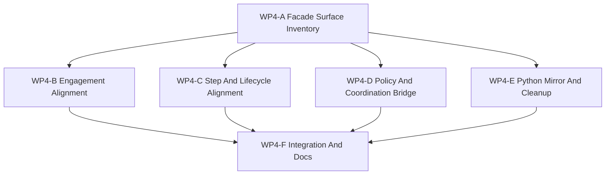

# WP4 Facade 对齐

状态：`2026-05-19` facade 对齐已验收；WP5 validation 交接已完成。

语言版本：

- 英文主文：[facade_alignment_wp4_20260519.md](facade_alignment_wp4_20260519.md)
- 中文辅文：`facade_alignment_wp4_20260519.zh.md`

输入：

- [仿真系统架构设计](../../plan/architecture/simulation_system_architecture_design.zh.md)
- [WP2 契约冻结](contract_freeze_wp2_20260519.zh.md)
- [WP2.5 调度语义冻结](scheduler_semantics_wp25_20260519.zh.md)
- [WP2.5 调度语义验收审查](../review/wp25_scheduler_semantics_acceptance_review_20260519.zh.md)
- [WP3 交战试点验收审查](../review/wp3_engagement_pilot_acceptance_review_20260519.zh.md)
- [Temp-02 SCAL 架构愿景审查](../review/temp-02_review_20260519.zh.md)
- `src/runtime/facade/*` 中的现有 facade surface，以及
  `src/interfaces/python/bindings_runtime.cpp` 中的 Python bindings

WP4 的目标，是把已经通过 WP3 验收的交战试点，转成维护中的前端形态。
它不是为了发明新的仿真语义，而是为了让现有的仿真与交战行为可以通过
facade-shaped request/result API 到达；raw runtime access 只保留为明确的兼容或
诊断逃逸口。

WP4 现在位于已验收的 WP2.5 调度语义冻结之后。Facade 工作应引用 WP2.5 中的
event ordering、shard version、barrier visibility、clock-domain merge policy、
replay metadata 与 `StageNodeManifest` 词汇，而不是在 facade code 中临时定义新的
scheduler rules。

WP4 也吸收已验收的 Temp-02 SCAL 定位。Facade 不只是 runtime convenience layer；
它是 temporal execution projection、information graph、agency graph 与 evidence
graph 之间的维护中边界。尤其是，WP4 必须区分 `World Truth`、`ObservationPacket`
与 `DecisionBelief`。

当前实现备注：

- `RuntimeFacade` 已经暴露 batch setup/reset、observation export、
  execution-step result 与 engagement export 路径。
- `ObservationBatchRequest` / `ObservationBatchPacket`、
  `EngagementBatchRequest` / `EngagementEventPacket`，以及
  `ExecutionBatchStepRequest` / `ExecutionBatchStepResult`，就是当前维护中的
  request/result shell。
- `RuntimeFacade::runtime()` 与直接访问 `WorldBatchRuntime` 仍然只应作为兼容或
 诊断用途。
- Python bindings 已经镜像了大部分维护中 facade type，但 policy 与 orchestration
  adapter 仍需要清楚站在 facade 一侧，而不是 raw runtime 一侧。

## 一、Facade 论点

WP4 存在的原因，是 WP3 已经证明了跨领域交战切片，但项目仍然需要一条稳定的维护中
前端路径来承接它。

设计目标是：

1. 公共访问必须走 facade-shaped request/result API，
2. policy 和 test adapter 必须使用显式 compatibility adapter，而不是 raw runtime mutation，
3. observation、action、coordination、reward、termination 与 episode lifecycle 这些跨层契约
   都应当能在不依赖隐式 owner 的情况下到达，
4. engagement export 必须保持 facade-first，并且对多 world 安全，
5. observation 与 agent-facing 路径必须保持信息状态边界，而不是把 truth state 泄漏到 policy code，
6. 任何缺失 surface 都必须显式化，要么成为维护中的 request/result API，
   要么成为有文档记录的 compatibility adapter。

WP4 应优先收窄并命名既有 surface，而不是发明新的仿真行为。如果某个缺口无法用
facade contract 或 adapter 表达，就应该送回 `WP2` 作为 contract amendment，
而不是藏进 runtime 调用里。

## 二、非目标

- 重写 launch、guidance、effects 或 damage 行为。
- 替换 CPU exact 参考路径。
- 删除仓库中的 diagnostics escape hatch。
- 建立完整的 `WP5` validation harness。
- 为 air、naval 或 weapon 行为再开一条 runtime 路径。
- 把兼容 adapter 悄悄折叠成隐式调用。

## 三、Facade Surface Map

| Surface | 当前状态 | WP4 对齐决定 | 最小维护形态 | 验证闸门 |
|---------|----------|--------------|-------------|----------|
| `BatchWorldSetupRequest` / `BatchWorldSetupResult` | setup 与 spawn 已经经过 facade。 | 保持为维护中的 world-setup surface。 | 稳定的 setup 字段、seed 处理与 entity-id 结果。 | setup 必须仍然可见于 facade，不依赖 raw runtime handle。 |
| `ObservationBatchRequest` / `ObservationBatchPacket` | observation export 已经是 facade-shaped。 | 保持为维护中的 observation surface，并与 `ObservationViewSpec` 及 information-state provenance 对齐。 | snapshot version、source time、显式 include flag、view-spec schema metadata 与 declared source layer。 | policy/test adapter 可以查询 observation，而不碰 raw ECS，也不泄漏 truth state。 |
| `DecisionBelief` | 还不是一等 facade-adjacent contract。 | 视为从声明过的 observation input 派生出的 policy/agent-side belief layer，而不是从 world truth 派生。 | consumed observation packet id 或 snapshot version、inference source、estimator/model reference、uncertainty/confidence shape，以及 maintained/diagnostics-only label。 | 测试能区分 maintained belief 与 oracle/diagnostics-only truth-derived belief。 |
| `EngagementBatchRequest` / `EngagementEventPacket` | engagement export 已存在，包含 recent-event retagging 与明确的 packet shell。 | 保持为维护中的 engagement surface；决定未使用 slot 是兼容占位还是要补 producer。 | Track packet、launch event、effects event、damage report、diagnostics trace 与显式 world-safe ref。 | 多 world export 必须一致地保留或重标 `world_index`。 |
| `ExecutionBatchStepRequest` / `ExecutionBatchStepResult` | step、reward、termination 与 mirrored observation 已经通过 facade 流动。 | 保持为维护中的 execution surface。 | reward total、terminated/truncated、status vector、termination reason 与 observation snapshot。 | step consumer 不得依赖 raw runtime mutation 或隐藏 mirror。 |
| `ActionIntentPacket` / `ActionHoldPolicy` | 还不是一等 facade request surface。 | 定义 policy action cadence 与 `P3/P4/P5` 消费的显式 adapter 路径。 | effective time、validity window、hold/expiry policy、merge policy 与 action family。 | policy 代码可以表达 intent，而不直接写 raw runtime。 |
| `CoordinationIntentPacket` | 还不是一等 facade request surface。 | 为 scripted、learned 与 human coordination producer 定义显式 adapter 路径。 | source type/id、roster、target ref、update clock、merge policy、produced tasking field。 | coordination write 必须走 facade-compatible assignment path。 |
| `AgentRole` | 隐含在 policy、coordination 与 command/tasking adapter 中。 | 定义 role + authority + information + decision + action 的 facade-adjacent contract concept。 | role id/type、authority scope、information-state source、decision-model reference 与 action interface。 | learned、scripted、human 或 search-based decision model 都接入同一个 agent boundary。 |
| `RewardSpec` / `RewardReport` | reward total 与 breakdown 已经通过 execution-step result 和 Python fallback 路径可见。 | 把维护中的 result shape 对齐为显式 fact/shaping attribution。 | fact snapshot version、fact terms、shaping terms、reward total、breakdown JSON、term owner/source。 | reward consumer 必须能区分 simulation facts 与 shaping term。 |
| `TerminationSpec` / `EpisodeStatus` | termination 与 truncation 已经通过 execution-step result 与 adapter 流动。 | 把维护中的 result shape 对齐为显式 reason-source attribution。 | `terminated`、`truncated`、reason、reason source、snapshot version、mirrored phase。 | semantic termination 与 truncation 必须可分离。 |
| `EpisodeLifecycleContract` | episode phase 已经在 runtime 与 adapter 之间 mirror。 | 保持 compiled/facade state 为权威，adapter 只 mirror。 | phase、step count、reset transition id、mirrored status、authoritative source。 | adapter 不能推进私有权威 phase machine。 |
| `RuntimeFacade::runtime()` / raw `WorldBatchRuntime` | 作为 diagnostics 与 legacy escape hatch 存在。 | 保持为兼容用途。 | 明确文档化的 escape hatch，绝不能成为维护中的 engagement path。 | 维护中的前端代码不得依赖它。 |
| `ef_py` mirror | 已经暴露了大部分维护中 request/result type。 | 保持 Python binding 与维护中的 facade surface 对齐。 | 与 C++ 同名同义的 request/result type 与字段语义。 | Python 调用者可以留在 facade-shaped API 上。 |

## 四、对齐工作包

| 工作包 | 目标 | 主要写入范围 | 并行性 | 建议 agent 预算 | 退出产物 |
|--------|------|--------------|--------|-----------------|----------|
| `WP4-A Facade Surface Inventory` | 规范维护中的 facade surface，并记录哪些 API 是 canonical，同时纳入 `ObservationViewSpec` provenance 与 `DecisionBelief` 边界语言。 | `src/runtime/facade/*`、`src/interfaces/python/bindings_runtime.cpp`、`docs/task/simulation_architecture` 下的文档。 | 应首先开始；它定义共享 surface 词汇。 | 中等 worker；若 contract 命名变化则使用高预算。 | 一张统一的维护中 surface map，覆盖 setup、observation、engagement 与 step/result API，并写清 information-state provenance。 |
| `WP4-B Engagement Alignment` | 保持 engagement export 的 world-safe，并把 packet shell 说清楚。 | `src/runtime/facade/runtime_facade.cpp`、`runtime_facade_types.h`、engagement tests。 | 若 file ownership 分离，可以与 `WP4-C` 并行。 | 中等 worker。 | 稳定的 multi-world engagement export，以及每个 event family 的 producer 覆盖说明。 |
| `WP4-C Step And Lifecycle Alignment` | 对齐 execution-step result 形态、reward、termination 与 episode lifecycle 归属。 | `src/runtime/facade/*`、`python/rl/runtime/*`、`gym_envs/*`、step/result tests。 | 若写入范围不重叠，可与 `WP4-B` 并行。 | 若触及跨层 ownership，则需要高推理 worker。 | 通过 facade-shaped API 显式对齐 step/reward/termination。 |
| `WP4-D Policy And Coordination Bridge` | 让 policy 与 orchestration 输入通过显式 facade-compatible adapter 流动，并形式化 agent boundary。 | `python/rl/runtime/*`、`python/rl/control/*`、`gym_envs/*`，以及必要的轻量 adapter helper。 | 若 facade signature 已稳定，可与 `WP4-B` / `WP4-C` 并行。 | 中等到高，取决于 adapter churn；若 `AgentRole` 影响多层 adapter，则使用高推理预算。 | `ActionIntentPacket` / `CoordinationIntentPacket` adapter 或等价的 request surface，加 `AgentRole` contract sketch。 |
| `WP4-E Python Mirror And Cleanup` | 保持 Python bindings 与维护中的 facade surface 对齐。 | `src/interfaces/python/bindings_runtime.cpp`、Python helper layer、binding tests。 | 在 `WP4-A` 之后开始；若签名稳定，可与 `WP4-B` 并行。 | 中等 worker。 | 与维护中的 C++ facade 对齐的 Python surface，不再依赖隐式 raw-runtime 路径。 |
| `WP4-F Integration And Docs` | 解决跨文件冲突、更新任务状态，并发布对齐说明。 | 共享 facade 文件、文档与验证笔记。 | 串行 integration branch。 | 高推理 integration worker 或主线程。 | 更新后的文档、绿色的聚焦测试，以及通往 `WP5` 的清晰移交。 |

## 五、依赖图



并行规则：

- `WP4-A` 必须先做。
- `WP4-B`、`WP4-C`、`WP4-D` 只有在不编辑同一个 facade 文件时才可并行。
- `WP4-E` 应等维护中的 surface 命名稳定后再开始。
- `WP4-F` 为串行项，负责冲突处理。

## 六、证据锚点

| 领域 | 现有资产 | WP4 用途 |
|------|----------|----------|
| Facade API surface | `src/runtime/facade/runtime_facade.h`、`src/runtime/facade/runtime_facade_types.h`。 | 定义维护中的 request/result surface，并标明哪些调用是 canonical。 |
| Engagement export | `src/runtime/facade/runtime_facade.cpp`、`tests/runtime/engagement/test_facade_engagement_export.py`。 | 保持 engagement export 的 world-safe，并把 event family 覆盖说清楚。 |
| Execution result | `ExecutionBatchStepRequest` / `ExecutionBatchStepResult`、facade step tests。 | 对齐 reward、termination 与 observation mirror 的归属。 |
| Information-state boundary | `ObservationBatchRequest` / `ObservationBatchPacket`、`AgentObservation` 路径与 observation 相关 Python adapter。 | 区分 `World Truth`、`ObservationPacket` 与 `DecisionBelief`。 |
| Python exposure | `src/interfaces/python/bindings_runtime.cpp`、`tests/runtime/bindings/test_bindings_engagement_surface.py`。 | 让 `ef_py` 与维护中的 C++ facade surface 对齐。 |
| Policy/orchestration adapters | `python/rl/runtime/world_batch_vec_env.py`、`python/rl/runtime/world_batch/adapter.py`、`python/rl/runtime/multi_agent_runtime.py`。 | 让 facade-shaped request 显式化，并把 raw runtime 用法保留为兼容用途。 |
| Compatibility boundaries | `tests/architecture/runtime_facade`、`tests/runtime/facade/test_runtime_facade.py`。 | 防止维护中的路径依赖 raw runtime handle。 |

## 七、Subagent 写入范围规则

分发 implementation worker 时使用以下规则：

1. Facade worker 拥有 `src/runtime/facade/*` 与 facade tests。
2. Binding worker 拥有 `src/interfaces/python/bindings_runtime.cpp` 与
   binding tests。
3. Policy/adapter worker 拥有 `python/rl/runtime/*`、`python/rl/control/*`
   与 `gym_envs/*`，并且必须消费 facade-shaped API，而不是 raw runtime handle。
4. Validation worker 拥有 `tests/runtime/facade/`、`tests/runtime/engagement/`、
   `tests/runtime/bindings/`，以及 focused tests 稳定后的 smoke 提升。
5. Integration worker 拥有跨文件冲突解决和任务状态更新。
6. 除非 compatibility adapter 真的无法表达，`simulation_kernel_weapon_api.cpp`
   不应在 WP4 中被编辑；一旦必须触碰，就要由单一 integration owner 串行处理。

## 八、验收门槛

WP4 只有在满足以下条件时才算通过：

1. 公共访问走 facade request/result API 或已记录的 compatibility adapter。
2. 维护中的 policy/test 路径不再依赖 `RuntimeFacade::runtime()` 或 raw `WorldBatchRuntime`。
3. 维护中的 facade surface 清楚覆盖 setup、observation、engagement export 与 execution-step 归属。
4. engagement export 在多 world 下保持安全，并且 `world_index` 处理一致。
5. policy 与 orchestration producer 对 action、coordination、reward、termination 与 episode lifecycle 路径使用显式 facade-shaped adapter。
6. Python bindings 与维护中的 C++ surface 保持一致。
7. 本地验证不需要 RL 训练依赖。
8. diagnostics 能解释 command、launch、munition、effects、damage、observation、reward 与 termination 路径。
9. 维护中的 policy 或 orchestration path 不把 `World Truth` 当作 observation substitute 消费。
10. 任何 `DecisionBelief` path 都声明 maintained/diagnostics-only，并说明自己消费的 observation/source version。

## 九、验证命令

实现前的聚焦证据检查：

```powershell
.\tools\maintenance\cmo_env.ps1 python -m pytest -q tests\runtime\facade\test_runtime_facade.py tests\runtime\engagement\test_facade_engagement_export.py tests\runtime\bindings\test_bindings_engagement_surface.py
```

WP4 对齐工作落地后的维护中 smoke loop：

```powershell
.\tools\maintenance\cmo_env.ps1 validate
.\tools\maintenance\cmo_env.ps1 python -m pytest -q tests\runtime\facade tests\runtime\engagement tests\runtime\bindings
.\tools\maintenance\cmo_env.ps1 python -m pytest -q tests\architecture\test_runtime_facade_layering.py
.\tools\maintenance\cmo_env.ps1 python tools\runners\run_pytest_suite.py --suite tests\smoke\ci_smoke_suite.json
```

如果本地 artifact 过旧，使用干净构建窗口：

```powershell
cmake -S . -B build-local-win -G Ninja -DCMAKE_BUILD_TYPE=Release
cmake --build build-local-win --target ef_core ef_py -j2
.\tools\maintenance\cmo_env.ps1 validate
```

## 十、建议首轮分发

建议第一波 worker：

1. `WP4-A Facade Surface Inventory`：规范维护中的 surface map，并记录
   canonical request/result API，包括 observation provenance 与
   `DecisionBelief` 边界语言。
2. `WP4-B Engagement Alignment`：验证 multi-world engagement export 路径，
   并决定 packet shell 中的 placeholder 应如何处理。
3. `WP4-C Step And Lifecycle Alignment`：把 execution-step、reward 与
   termination ownership 对齐到 facade surface。

建议第二波 worker：

1. `WP4-D Policy And Coordination Bridge`。
2. `WP4-E Python Mirror And Cleanup`。
3. `WP4-F Integration And Docs`。

## 十一、退出标准

WP4 退出条件：

1. 维护中的 facade surface 已明确并记录。
2. Raw runtime access 只作为兼容用途保留。
3. engagement、observation 与 execution-step 路径都可以通过维护中的 facade API 到达。
4. policy 与 orchestration adapter 能使用显式 facade-shaped adapter，而不需要隐藏的 runtime mutation。
5. Python bindings 镜像维护中的 surface。
6. 后续 `WP5` validation harness 可以基于这些稳定 surface 构建，而不是从 raw runtime call 上长出来。
7. 后续 `WP5` validation harness 可以基于 facade artifact 测试 information/belief leakage，而不是依赖私有 runtime inspection。
