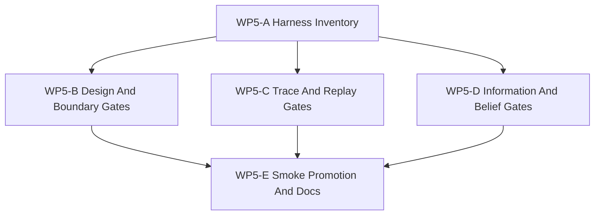

# WP5 Validation Harness

Status: `2026-05-19` accepted; maintained validation harness published.

Language:

- English canonical: `validation_harness_wp5_20260519.md`
- Chinese companion: [validation_harness_wp5_20260519.zh.md](validation_harness_wp5_20260519.zh.md)

Inputs:

- [simulation system architecture design](../../plan/architecture/simulation_system_architecture_design.md)
- [WP2 contract freeze](contract_freeze_wp2_20260519.md)
- [WP2.5 scheduler semantics freeze](scheduler_semantics_wp25_20260519.md)
- [WP3 engagement pilot](engagement_pilot_wp3_20260519.md)
- [WP4 facade alignment](facade_alignment_wp4_20260519.md)
- [Temp-02 SCAL architecture vision review](../review/temp-02_review_20260519.md)

WP5 turns the architecture and facade work into maintained evidence. It should
not invent new runtime semantics. It should prove that the semantic lifecycle,
causal-temporal execution model, information-state boundary, agency boundary,
and diagnostics/evidence path are all testable from maintained facade-shaped
artifacts.

## 1. Validation Thesis

The validation harness is the Evidence Graph entry point for `WP0-WP5`. It
answers a narrower question than RL training or scenario evaluation:

```text
Given a scenario, facade request stream, and deterministic seed,
can we prove which semantic stages ran,
which graph boundaries were crossed,
which information state was visible,
which agent/action boundary was used,
and which diagnostics make the result replayable?
```

WP5 should treat the temporal DAG as an execution projection. The harness must
also validate semantic, causal, information, agency, and evidence boundaries.
Learning-graph validation is explicitly deferred.

## 2. Validation Tiers

| Tier | Purpose | Evidence source | Failure examples |
|------|---------|-----------------|------------------|
| Design conformance | Prove implementation artifacts map to documented `P0-P10`, `StageNodeManifest`, contract, capability, and facade ownership. | Architecture tests, static scans, manifest/doc checks. | A maintained frontend imports raw `WorldBatchRuntime`; a new domain path lacks stage coverage. |
| Trace conformance | Prove command, launch, munition, effect, damage, observation, reward, and termination traces carry deterministic ids and ancestry. | `DiagnosticsTrace`, engagement packets, execution-step results. | A damage report has no launch/event ancestry; event tie-break order is not replayable. |
| Boundary conformance | Prove public paths use facade request/result APIs or documented compatibility adapters. | Facade tests, Python binding tests, architecture-layering tests. | Policy code mutates raw ECS; engagement export requires `RuntimeFacade::runtime()`. |
| Information/belief leakage | Prove maintained decision paths consume `ObservationPacket` or declared `DecisionBelief`, not `World Truth`. | Observation packets, agent/belief metadata, adapter tests. | RL observation includes privileged truth coordinates; a belief path lacks source observation versions. |
| Replay/evidence conformance | Prove seeds, event order, snapshot versions, barrier visibility, and facade exports are sufficient for deterministic replay comparison. | WP2.5 replay metadata, event logs, facade export packets. | Parallel producer order changes event order; an exported observation lacks snapshot provenance. |

## 3. Work Packages

| Work package | Goal | Primary write scope | Parallelism | Suggested agent budget | Exit artifact |
|--------------|------|---------------------|-------------|------------------------|---------------|
| `WP5-A Harness Inventory` | Map existing smoke, facade, engagement, binding, and architecture tests to the five validation tiers. | `docs/task/simulation_architecture`, test indexes, smoke suite metadata. | Starts first. | Medium worker. | A tiered inventory that identifies missing validation gates without editing runtime code. |
| `WP5-B Design And Boundary Gates` | Promote architecture/facade layering checks that prevent raw-runtime maintained paths and undocumented domain stacks. | `tests/architecture/`, `tests/runtime/facade/`, smoke suite metadata. | Can run beside `WP5-C` if test files do not overlap. | Medium worker. | Focused tests for facade-only maintained access and stage/contract ownership. |
| `WP5-C Trace And Replay Gates` | Validate deterministic event ancestry, snapshot versions, diagnostics trace ids, and replay metadata presence. | `tests/runtime/engagement/`, `tests/runtime/facade/`, diagnostics-focused fixtures. | Can run beside `WP5-B`; serialize if shared fixtures change. | High reasoning worker if event ancestry or replay ordering is changed. | Tests that catch missing trace ancestry or insufficient replay metadata. |
| `WP5-D Information And Belief Gates` | Add tests or fixtures that reject truth-state leakage into maintained observations and label `DecisionBelief` paths. | observation/facade tests, Python adapter tests, docs. | Can run after WP4-A/D define stable labels. | High reasoning worker because false positives can block legitimate diagnostics. | Leakage checks distinguishing maintained paths from diagnostics-only oracle paths. |
| `WP5-E Smoke Promotion And Docs` | Publish the maintained validation command set and update task/review indexes. | `tests/smoke/ci_smoke_suite.json`, docs, validation notes. | Serial integration pass. | Medium integration worker. | Local smoke loop that exercises design, boundary, trace, information, and replay tiers. |

## 4. Dependency Graph



WP5-D depends on the WP4-A/WP4-D information-state labels being stable enough
to test. If WP4 only publishes documentation labels, WP5-D should start as
docs-backed architecture tests and defer runtime metadata enforcement.

## 5. Acceptance Gates

WP5 is accepted only when:

1. A maintained local smoke command covers architecture layering, facade,
   engagement, binding, and diagnostics/evidence tests without RL training
   dependencies.
2. At least one test or documented gate exists for each validation tier:
   design, trace, boundary, information/belief leakage, and replay/evidence.
3. Maintained facade paths can be validated without direct raw runtime access.
4. Engagement evidence links track, launch, munition/effects, damage,
   observation, reward, and termination where current producers exist.
5. `ObservationPacket` and `DecisionBelief` boundaries are testable or
   explicitly marked as pending runtime metadata.
6. Diagnostics-only oracle paths remain available for tests but cannot be
   mistaken for maintained policy inputs.
7. Smoke-suite membership documents why each promoted test belongs in the
   maintained validation harness.

## 6. Non-Goals

- Full RL training or policy performance evaluation.
- Learning Graph, curriculum, scenario generation, or capability profiling.
- Multi-fidelity backend parity validation.
- Worldline or counterfactual branching.
- Replacing WP4 facade work or adding new public runtime semantics.

## 7. Suggested First Dispatch

Recommended first worker wave after WP4 surface labels stabilize:

1. `WP5-A Harness Inventory`: inventory current tests and smoke-suite coverage
   against the five validation tiers.
2. `WP5-B Design And Boundary Gates`: strengthen facade-only and layering
   checks.
3. `WP5-C Trace And Replay Gates`: check trace ancestry and replay metadata
   coverage for engagement/facade artifacts.

Recommended second worker wave:

1. `WP5-D Information And Belief Gates`.
2. `WP5-E Smoke Promotion And Docs`.

## 8. Validation Commands

Initial target command shape:

```powershell
.\tools\maintenance\cmo_env.ps1 validate
.\tools\maintenance\cmo_env.ps1 python -m pytest -q tests\architecture tests\runtime\facade tests\runtime\engagement tests\runtime\bindings
.\tools\maintenance\cmo_env.ps1 python tools\runners\run_pytest_suite.py --suite tests\smoke\ci_smoke_suite.json
```

WP5 may narrow or split these commands if local runtime cost becomes too high,
but the final task sheet should preserve the five-tier evidence coverage.
