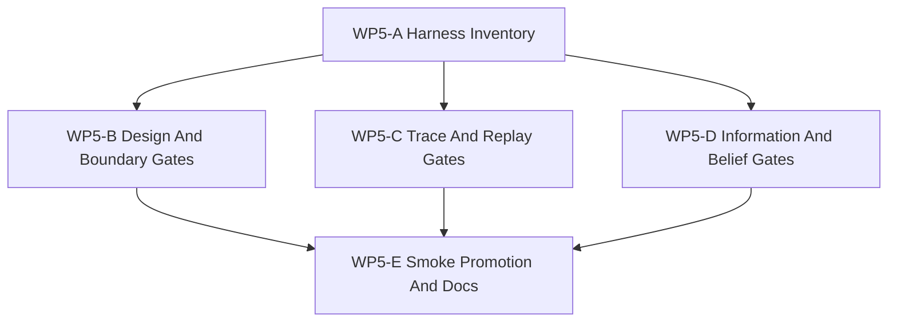

# WP5 验证套件

状态：`2026-05-19` 已验收；维护中的 validation harness 已发布。

语言版本：

- 英文主文：[validation_harness_wp5_20260519.md](validation_harness_wp5_20260519.md)
- 中文辅文：`validation_harness_wp5_20260519.zh.md`

输入：

- [仿真系统架构设计](../../plan/architecture/simulation_system_architecture_design.zh.md)
- [WP2 契约冻结](contract_freeze_wp2_20260519.zh.md)
- [WP2.5 调度语义冻结](scheduler_semantics_wp25_20260519.zh.md)
- [WP3 交战试点](engagement_pilot_wp3_20260519.zh.md)
- [WP4 facade 对齐](facade_alignment_wp4_20260519.zh.md)
- [Temp-02 SCAL 架构愿景审查](../review/temp-02_review_20260519.zh.md)

WP5 把架构与 facade 工作转化为维护中的证据。它不应发明新的 runtime 语义，而应证明语义生命周期、因果-时序执行模型、信息状态边界、智能体边界与 diagnostics/evidence 路径，都能从维护中的 facade-shaped artifact 得到验证。

## 一、验证论点

验证套件是 `WP0-WP5` 的 Evidence Graph 入口。它回答的问题比 RL 训练或 scenario 评估更窄：

```text
给定 scenario、facade request stream 与 deterministic seed，
我们能否证明哪些 semantic stage 运行过，
哪些 graph boundary 被跨越，
哪些 information state 可见，
使用了哪个 agent/action boundary，
以及哪些 diagnostics 让结果可 replay？
```

WP5 应把 temporal DAG 视为执行投影。验证套件还必须验证 semantic、causal、information、agency 与 evidence 边界。Learning Graph 验证明确推迟。

## 二、验证层级

| 层级 | 目的 | 证据来源 | 失败示例 |
|------|------|----------|----------|
| Design conformance | 证明实现 artifact 能映射到已记录的 `P0-P10`、`StageNodeManifest`、contract、capability 与 facade ownership。 | 架构测试、静态扫描、manifest/doc 检查。 | 维护中的 frontend import raw `WorldBatchRuntime`；新领域路径缺少 stage coverage。 |
| Trace conformance | 证明 command、launch、munition、effect、damage、observation、reward 与 termination trace 携带 deterministic id 与 ancestry。 | `DiagnosticsTrace`、engagement packet、execution-step result。 | damage report 没有 launch/event ancestry；event tie-break order 不可 replay。 |
| Boundary conformance | 证明公开路径使用 facade request/result API 或已记录 compatibility adapter。 | Facade test、Python binding test、architecture-layering test。 | policy code 直接 mutate raw ECS；engagement export 依赖 `RuntimeFacade::runtime()`。 |
| Information/belief leakage | 证明维护中的决策路径消费 `ObservationPacket` 或声明过的 `DecisionBelief`，而不是 `World Truth`。 | Observation packet、agent/belief metadata、adapter test。 | RL observation 包含 privileged truth coordinates；belief path 缺失 source observation version。 |
| Replay/evidence conformance | 证明 seed、event order、snapshot version、barrier visibility 与 facade export 足以做 deterministic replay comparison。 | WP2.5 replay metadata、event log、facade export packet。 | 并行 producer 顺序改变 event order；导出的 observation 缺少 snapshot provenance。 |

## 三、工作包

| 工作包 | 目标 | 主要写入范围 | 并行性 | 建议 agent 预算 | 退出产物 |
|--------|------|--------------|--------|-----------------|----------|
| `WP5-A Harness Inventory` | 把现有 smoke、facade、engagement、binding 与 architecture test 映射到五个验证层级。 | `docs/task/simulation_architecture`、test index、smoke suite metadata。 | 最先开始。 | 中等 worker。 | 分层 inventory，识别缺失 validation gate，且不编辑 runtime code。 |
| `WP5-B Design And Boundary Gates` | 提升 architecture/facade layering 检查，阻止 raw-runtime 维护路径和未记录领域栈。 | `tests/architecture/`、`tests/runtime/facade/`、smoke suite metadata。 | 若 test 文件不重叠，可与 `WP5-C` 并行。 | 中等 worker。 | 针对 facade-only maintained access 与 stage/contract ownership 的聚焦测试。 |
| `WP5-C Trace And Replay Gates` | 验证 deterministic event ancestry、snapshot version、diagnostics trace id 与 replay metadata 存在性。 | `tests/runtime/engagement/`、`tests/runtime/facade/`、diagnostics-focused fixture。 | 可与 `WP5-B` 并行；若共享 fixture 变化则串行。 | 若改变 event ancestry 或 replay ordering，使用高推理 worker。 | 能捕获缺失 trace ancestry 或 replay metadata 不足的测试。 |
| `WP5-D Information And Belief Gates` | 添加测试或 fixture，拒绝 truth-state 泄漏进入维护中 observation，并标记 `DecisionBelief` 路径。 | observation/facade test、Python adapter test、docs。 | 在 WP4-A/D 定义稳定 label 后启动。 | 高推理 worker，因为误报会挡住合法 diagnostics。 | 区分 maintained path 与 diagnostics-only oracle path 的 leakage check。 |
| `WP5-E Smoke Promotion And Docs` | 发布维护中的 validation command set，并更新 task/review index。 | `tests/smoke/ci_smoke_suite.json`、docs、validation notes。 | 串行 integration pass。 | 中等 integration worker。 | 覆盖 design、boundary、trace、information 与 replay 层级的本地 smoke loop。 |

## 四、依赖图



WP5-D 依赖 WP4-A/WP4-D 中 information-state label 足够稳定。如果 WP4 只发布文档标签，WP5-D 应先做 docs-backed architecture test，把 runtime metadata enforcement 推迟。

## 五、验收门槛

WP5 只有在满足以下条件时才算通过：

1. 一条维护中的本地 smoke command 覆盖 architecture layering、facade、engagement、binding 与 diagnostics/evidence test，且不需要 RL training dependency。
2. 每个验证层级至少有一个 test 或文档 gate：design、trace、boundary、information/belief leakage 与 replay/evidence。
3. 维护中 facade path 可以在不直接访问 raw runtime 的情况下被验证。
4. 在当前 producer 已存在的范围内，engagement evidence 能连接 track、launch、munition/effects、damage、observation、reward 与 termination。
5. `ObservationPacket` 与 `DecisionBelief` 边界可测试，或被明确标记为 pending runtime metadata。
6. Diagnostics-only oracle path 仍可用于测试，但不能被误认为维护中的 policy input。
7. Smoke-suite membership 记录每个提升测试为何属于维护中的 validation harness。

## 六、非目标

- 完整 RL 训练或策略性能评估。
- Learning Graph、curriculum、scenario generation 或 capability profiling。
- 多保真后端 parity validation。
- Worldline 或 counterfactual branching。
- 替代 WP4 facade 工作，或新增 public runtime semantics。

## 七、建议首轮分发

WP4 surface label 稳定后，建议第一波 worker：

1. `WP5-A Harness Inventory`：按五个验证层级盘点当前测试与 smoke-suite 覆盖。
2. `WP5-B Design And Boundary Gates`：强化 facade-only 与 layering 检查。
3. `WP5-C Trace And Replay Gates`：检查 engagement/facade artifact 的 trace ancestry 与 replay metadata 覆盖。

建议第二波 worker：

1. `WP5-D Information And Belief Gates`。
2. `WP5-E Smoke Promotion And Docs`。

## 八、验证命令

初始目标命令形态：

```powershell
.\tools\maintenance\cmo_env.ps1 validate
.\tools\maintenance\cmo_env.ps1 python -m pytest -q tests\architecture tests\runtime\facade tests\runtime\engagement tests\runtime\bindings
.\tools\maintenance\cmo_env.ps1 python tools\runners\run_pytest_suite.py --suite tests\smoke\ci_smoke_suite.json
```

如果本地运行成本过高，WP5 可以收窄或拆分这些命令，但最终任务单应保留五层证据覆盖。
