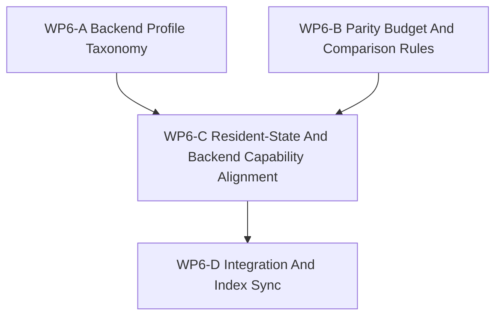

# WP6 后端配置文件策略

状态：`2026-05-19` 后端配置文件策略工作包，已对齐 WP6 面向实现的
capability projection 工作波次。

语言版本：

- 英文主文：[backend_profile_policy_wp6_20260519.md](backend_profile_policy_wp6_20260519.md)
- 中文辅文：`backend_profile_policy_wp6_20260519.zh.md`

输入：

- [仿真系统架构设计](../../plan/architecture/simulation_system_architecture_design.zh.md)
- [架构与性能路线进一步调研](../../plan/architecture/architecture_and_performance_research_followup.zh.md)
- [架构计划审查](../review/architecture_plan_review_20260519.zh.md)
- [Temp-02 SCAL 架构愿景审查](../review/temp-02_review_20260519.zh.md)
- [WP2.5 调度语义冻结](scheduler_semantics_wp25_20260519.zh.md)
- [WP4 facade 对齐](facade_alignment_wp4_20260519.zh.md)
- [WP5 验证套件](validation_harness_wp5_20260519.zh.md)

WP6 是后端配置文件策略工作包。它负责把已维护的 CPU exact 基线与后续 accelerated、resident-state 与 approximate 后端之间的空档收口，冻结 profile 词汇、parity 义务、host/device ownership 规则与发布边界。

对于本轮实现工作，WP6 还定义 capability projection 规则：`RuntimeCapabilities`
镜像已声明的 backend/profile 元数据和可探测的部署事实，但不创造新的语义声明。
exact GPU 执行、resident state 与 shadow 风格的 capability 声明默认保持 false，除非维护中的 profile 显式声明了对应的 ownership、sync、parity 与 validation gate。

Projection trigger 规则：

- 在至少一个 non-reference backend profile 本身进入 maintained 之前，
  richer `RuntimeCapabilities` projection MUST NOT 启动。
- 仅有 helper/probe 可用性，或 candidate registry row，均不足以触发。
- 在该 trigger 满足前，只有当前 CPU-backed facade/runtime truth 可以投影为 `true`。

命名说明：

- 有些后续笔记和审查把后端配置文件线标成 `WP7`。
- 在当前活线里，`WP6` 才是规范名称。`WP7` 只应视为历史命名，
  不应让它重新开出第二条活线。

## 1. 策略主张

仓库不需要为了更快的后端再开一条语义路径。它需要的是同一条维护中的语义生命周期，并把后端 profile 放在契约之后。

CPU exact 执行仍然是参考路径。任何 accelerated 或 device-resident 后端，都必须先声明 profile 类别、comparison reference、sync policy、parity budget 与 diagnostics 义务，才能被视为维护中的实现。

因此，`RuntimeCapabilities` 是面向实现的 profile 元数据投影，而不是权威来源。
它可以暴露已声明字段，以及 backend 是否可用、编译特性是否存在、运行时部署约束等可探测事实。它不能因为存在 accelerator、helper 或 diagnostics path，就推断 exactness、resident-state ownership 或 shadow execution。

因此 WP6 需要文档化：

1. profile 类别及其维护状态，
2. parity budget 规则与比较域，
3. host-owned 与 backend-owned 状态边界，
4. resident-state 与 device-resident sync policy，
5. backend capability 暴露规则，
6. 后续发布所需的集成与索引同步。

## 2. 后端配置文件模型

| profile 类别 | WP6 默认判断 | 维护状态 | 默认 ownership | parity 预期 | 典型示例 |
|-------------|--------------|----------|---------------|------------|---------|
| `reference` | 规范基线。 | 维护中。 | host-owned state。 | exact。 | CPU exact 路径。 |
| `accelerated_exact` | 语义相同但实现更快。 | 仅在保持 exact 时才维护。 | host-owned 或 hybrid，但 host truth 必须显式。 | exact event order 与 exact committed state。 | 通过契约挂接的 CUDA helper。 |
| `resident_state` | 后端保留部分运行状态。 | 受门控；在 sync 与 parity 显式化前不算维护中；capability flag 在声明前保持 false。 | backend-owned partial state，并显式说明 host 可见性。 | 需要声明 parity budget。 | device-resident observation 或 physics helper。 |
| `approximate` | 故意近似。 | 默认是实验态。 | backend-owned 或 hybrid。 | 只接受显式容差。 | surrogate 或 fidelity 降级后端。 |
| `diagnostics_only` | 只用于检查或调试。 | 永远不是维护中的真值。 | 按 helper 声明。 | 不宣称维护中的 parity。 | trace 导出或 probe helper。 |

### 必需 profile 元数据

每个维护中的 backend profile 条目 MUST 声明：

| 字段 | 规则 |
|------|------|
| `backend_profile_id` | 供文档、审查、replay 和 diagnostics 使用的稳定 id。 |
| `profile_class` | `reference`、`accelerated_exact`、`resident_state`、`approximate`、`diagnostics_only` 之一。 |
| `comparison_reference` | 用作语义比较锚点的后端或路径。 |
| `host_state_owner` | 仍然由 host 拥有的状态 shard 或输出。 |
| `backend_state_owner` | 可以驻留在后端的状态 shard 或输出。 |
| `sync_policy` | host-owned、backend-owned、partial sync、observation-only sync 或 explicit export。 |
| `state_scope` | 该 profile 覆盖的状态族。 |
| `parity_budget_ref` | 关联的 parity budget 或 comparison budget。 |
| `observability_scope` | 哪些内容可以作为维护中的输出暴露。 |
| `compatibility_rule` | 旧调用方或 diagnostics-only helper 的行为。 |
| `deprecation_rule` | 何时该 profile 不再维护或必须收窄。 |
| `validation_gate` | 证明该 profile 安全的审查或测试门。 |

## 3. 非目标

- 实现 backend 选择逻辑。
- 重写 GPU 或 resident-state 代码。
- 修改调度语义。
- 把 `RuntimeCapabilities` 提升成新的语义路径。
- 在没有维护中 profile 声明时，用 `RuntimeCapabilities` 推断 exact GPU、
  resident-state 或 shadow 支持。
- 把性能档位名称当成 profile 类别。
- 把兼容性 helper 收编成维护中的真值。

## 4. 工作包

| 工作包 | 状态 | 目标 | 产出 |
|--------|------|------|------|
| `WP6-A Backend Profile Taxonomy` | complete | 冻结 profile 词汇与维护/实验边界。 | [backend profile taxonomy cluster](wp6_backend_profile_taxonomy_cluster_20260519.zh.md)、[backend profile 注册表](wp6_backend_profile_registry_20260519.zh.md) |
| `WP6-B Parity Budget And Comparison Rules` | complete | 冻结 parity budget 模板与比较语义。 | [parity budget cluster](wp6_parity_budget_cluster_20260519.zh.md)、[parity budget 注册表](wp6_parity_budget_registry_20260519.zh.md) |
| `WP6-C Resident-State And Backend Capability Alignment` | complete | 定义 host/device ownership、sync policy、resident-state 边界规则与 backend capability projection 策略，同时不宣称未支持的 exact、resident 或 shadow capability。 | [resident-state 边界规则](wp6_resident_state_boundary_rules_20260519.zh.md)、[integration and index sync](wp6_integration_and_index_sync_20260519.zh.md) |
| `WP6-D Integration And Index Sync` | complete | 统一命名、收敛文档交叉引用，并发布已验收的 WP6 线。 | [integration and index sync](wp6_integration_and_index_sync_20260519.zh.md)、[验收审查](../review/wp6_backend_profile_policy_acceptance_review_20260519.zh.md) |

## 5. 依赖图



并行规则：

- `WP6-A` 与 `WP6-B` 可以并行。
- `WP6-C` 应等待 taxonomy 与 parity 词汇稳定后再引用。
- `WP6-D` 为串行收口步骤。

## 6. 证据锚点

| 领域 | 来源 | WP6 用法 |
|------|------|---------|
| 后端与性能策略 | [仿真系统架构设计](../../plan/architecture/simulation_system_architecture_design.zh.md)。 | 确认 CPU exact 为基线，并把 device-resident state 放到契约之后。 |
| 多保真后续 | [架构与性能路线进一步调研](../../plan/architecture/architecture_and_performance_research_followup.zh.md)。 | 指出 backend profiles、resident-state 对齐与未来进入条件。 |
| backend profile 缺口 | [架构计划审查](../review/architecture_plan_review_20260519.zh.md)。 | 记录需要 backend profile taxonomy 与 parity budget。 |
| SCAL 后续 | [Temp-02 SCAL 架构愿景审查](../review/temp-02_review_20260519.zh.md)。 | 把 backend profiles 放入更大的 graph-of-graphs 视角。 |
| 调度语义 | [WP2.5 调度语义冻结](scheduler_semantics_wp25_20260519.zh.md)。 | 提供事件顺序、snapshot 与 replay 词汇，parity budget 必须服从它。 |
| facade 对齐 | [WP4 facade 对齐](facade_alignment_wp4_20260519.zh.md)。 | 说明 backend capability 暴露必须保持 facade 形状。 |
| 验证套件 | [WP5 验证套件](validation_harness_wp5_20260519.zh.md)。 | 为后续 backend profile 验收提供证据思路。 |

## 7. 子代理写作规则

分发 WP6 时使用这些规则：

1. taxonomy worker 负责 `wp6_backend_profile_taxonomy_cluster_20260519.md` 与其中文版。
2. parity worker 负责 `wp6_parity_budget_cluster_20260519.md` 与其中文版。
3. integration worker 负责 `wp6_integration_and_index_sync_20260519.md` 与其中文版。
4. 任何 worker 都不应在 WP6 里重开调度语义或 facade 语义。
5. 任何 worker 都不应在写文档时去改 runtime backend 代码。
6. 需要新运行时语义的建议应先放到后续实现包。

## 8. 验收门

WP6 只有在以下条件满足时才算接受：

1. 文档区分 `reference`、`accelerated_exact`、`resident_state`、`approximate` 与 `diagnostics_only`。
2. 每个维护中的 profile 都写明 host/device ownership、sync policy 与 parity 义务。
3. parity budget 被视为 profile-owned 元数据，而不是单独的标量开关。
4. CPU exact 保持维护中的参考路径。
5. backend capability 暴露被描述为策略，而不是隐藏实现真值。
6. `RuntimeCapabilities` 被描述为已声明 profile 元数据与可探测部署事实的投影；
   exact GPU、resident-state 与 shadow 风格声明默认 false，除非维护中的 profile 元数据显式声明。
7. integration sheet 统一 WP6 命名与发布顺序，且任何旧 `WP7`
   表述都只保留为历史命名。
8. 中文辅文与英文主文保持一致。

## 9. 验证命令

```bash
git diff --check
rg -n "WP6|WP7|backend profile|parity budget|resident-state|BackendCapability|RuntimeCapabilities|index sync" docs/task/simulation_architecture docs/plan/architecture docs/task/review
```

## 10. 建议首轮分发

建议第一波 worker：

1. `WP6-A Backend Profile Taxonomy`。
2. `WP6-B Parity Budget And Comparison Rules`。

建议第二波 worker：

1. `WP6-C Resident-State And Backend Capability Alignment`。
2. `WP6-D Integration And Index Sync`。

如果还有额外并行能力，`WP6-C` 可以拆成两条仅文档流：

- resident-state 边界规则，
- backend capability 暴露策略。

`WP6-D` 保持串行，这样它就能负责旧 `WP7` 规范化、交叉引用清理与最终发布文案。
