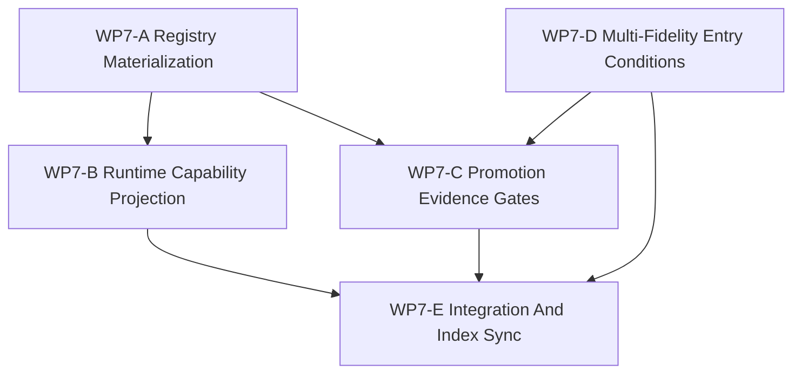

# WP7 后端能力物化

状态：`2026-05-19` WP6 之后的实现准备任务族计划。

语言版本：

- 英文主文：[backend_capability_materialization_wp7_20260519.md](backend_capability_materialization_wp7_20260519.md)
- 中文辅文：`backend_capability_materialization_wp7_20260519.zh.md`

输入：

- [仿真系统架构设计](../../plan/architecture/simulation_system_architecture_design.zh.md)
- [架构与性能路线进一步调研](../../plan/architecture/architecture_and_performance_research_followup.zh.md)
- [Temp-02 SCAL 架构愿景审查](../review/temp-02_review_20260519.zh.md)
- [WP2.5 调度语义冻结](scheduler_semantics_wp25_20260519.zh.md)
- [WP5 验证套件](validation_harness_wp5_20260519.zh.md)
- [WP6 后端配置文件策略](backend_profile_policy_wp6_20260519.zh.md)
- [WP6-A 后端配置文件注册表](wp6_backend_profile_registry_20260519.zh.md)
- [WP6-B parity budget 注册表](wp6_parity_budget_registry_20260519.zh.md)
- [WP6-C1 resident-state 边界规则](wp6_resident_state_boundary_rules_20260519.zh.md)
- [WP6 后端配置文件策略验收审查](../review/wp6_backend_profile_policy_acceptance_review_20260519.zh.md)

命名说明：

- 较早的来源评审曾用 `WP7` 指代 backend profile policy。
- 该策略线已经作为 `WP6` 关闭。
- 本文档开启新的活跃 `WP7` 线：把已验收的 WP6 policy 物化为实现可用的
  registry、projection、evidence 与 multi-fidelity 入口任务。

## 1. 论点

WP7 把已验收的后端配置文件策略转化为面向 runtime 的能力物化计划。

它不把 exact GPU execution、resident-state ownership、device observation
view、shadow comparison、adaptive fidelity 或 reduced-fidelity execution
提升为维护中能力。它定义的是这些能力未来能安全晋级之前必须存在的实现任务：

1. 从 WP6 文档注册表派生可机器检查的 registry materialization；
2. 从声明的 metadata 与可探测部署事实保守投影 `RuntimeCapabilities`；
3. 为 exact GPU、resident-state 与 shadow 风格候选项定义晋级证据门；
4. 定义 multi-fidelity entry conditions，使 fidelity profile 绑定到 backend
   profile，而不是创建第二条语义路径；
5. 在实现准备产物稳定后完成发布与索引同步。

WP7 继承 WP6 的核心规则：

```text
能力支持由已验收的 profile metadata 与验证证据声明，
不能从 helper/probe 是否存在推断出来。
```

Trigger 说明：

- richer projection 必须保持休眠，直到至少一个 non-reference backend profile
  本身进入 maintained。
- registry materialization、helper/probe binding 与 diagnostics export
  单独都不足以满足这个 trigger。

## 2. 范围边界

WP7 可以：

1. 创建从 WP6 profile 与 parity registry 派生的可机器读取 registry seed 或 validation schema；
2. 添加证明 registry/projection 行为保持保守的测试；
3. 定义 capability projection adapter 或 facade-facing projection contract；
4. 定义候选 profile 晋级所需的证据 checklist；
5. 定义 multi-fidelity profile entry conditions 与 profile request grammar；
6. 在 WP7 线稳定后更新任务、架构与评审索引。

WP7 不可以：

1. 声称维护中的 exact GPU world-step 支持；
2. 声称维护中的 resident-state ownership；
3. 声称维护中的 shadow execution 或 shadow fallback；
4. 让 GPU helper/probe 是否存在暗示维护中支持；
5. 为 accelerated 或 reduced-fidelity 路径添加第二条语义生命周期；
6. 绕过 WP2.5 event order、snapshot、barrier 与 replay 语义；
7. 绕过 WP5 design、trace、boundary、information 或 replay/evidence gate。

## 3. 工作包

| 工作包 | 状态 | 目标 | 产出 |
|--------|------|------|------|
| `WP7-A Registry Materialization` | planned | 把 WP6 文档注册表转化为可机器检查的 source 或 schema seed，同时保持文档权威。 | [registry materialization 任务簇](wp7_registry_materialization_cluster_20260519.zh.md) |
| `WP7-B Runtime Capability Projection` | planned | 把 runtime capability projection 绑定到已声明 registry metadata 与部署事实，避免隐藏 GPU/helper 推断。 | [runtime capability projection 任务簇](wp7_runtime_capability_projection_cluster_20260519.zh.md) |
| `WP7-C Promotion Evidence Gates` | planned | 定义 exact GPU、resident-state 或 shadow 候选项晋级前所需测试、评审与证据。 | [promotion evidence gates 任务簇](wp7_promotion_evidence_gates_cluster_20260519.zh.md) |
| `WP7-D Multi-Fidelity Entry Conditions` | planned | 定义 fidelity profile 与 backend profile、model provider、validation budget 的关系，但不启用 adaptive fidelity。 | [multi-fidelity entry conditions 任务簇](wp7_multifidelity_entry_conditions_cluster_20260519.zh.md) |
| `WP7-E Integration And Index Sync` | planned | A-D 证据完成评审后发布 WP7 实现准备线，并同步引用。 | [integration and index sync 任务簇](wp7_integration_and_index_sync_cluster_20260519.zh.md) |

## 4. 依赖图



并行规则：

- `WP7-A` 先启动，因为它拥有共享词汇和 schema shape。
- `WP7-D` 可以和 `WP7-A` 并行，因为它主要是架构与任务设计工作，但不能在
  WP6/WP7-A 之外发明 profile id。
- `WP7-B` 应等待 registry materialization 形状稳定。
- `WP7-C` 应消费 registry materialization 与 multi-fidelity entry 词汇。
- `WP7-E` 串行执行，只应在 A-D 稳定后启动。

## 5. 分发计划

| 流 | 主要写入范围 | 思考预算 | 可并行对象 |
|----|--------------|----------|------------|
| `WP7-A Registry Materialization` | registry schema 文档、生成/seed registry 文件提案、validation test 或 doc check | 高 | `WP7-D` |
| `WP7-B Runtime Capability Projection` | `RuntimeCapabilities` projection 笔记、facade 测试、architecture layering guard | 高 | 等 `WP7-A` 稳定前不并行 |
| `WP7-C Promotion Evidence Gates` | promotion gate 文档、候选测试计划、WP5 harness 映射 | 高 | 有限；依赖 A/D 词汇 |
| `WP7-D Multi-Fidelity Entry Conditions` | multi-fidelity 任务文档、profile request grammar、ModelProvider 推迟说明 | 高 | `WP7-A` |
| `WP7-E Integration And Index Sync` | README/index/review sync 与最终交接 | 中 | 无 |

## 6. 验收门槛

WP7 只有在以下条件满足后才能验收：

1. 可机器检查的 registry shape 命名 WP6 要求的每个 profile 字段，并保持
   `cpu_exact.reference` 是唯一维护中的 exact baseline。
2. runtime capability projection 对 exact GPU、resident-state、device
   observation 与 shadow support 仍保持 false，除非维护中 profile 声明这些能力。
3. GPU helper 与 probe 仍只是 diagnostics 或 deployment facts，不能单独晋级能力。
4. exact GPU、resident-state 与 shadow 晋级门引用 profile metadata、parity budget、
   ownership/sync policy 与 WP5 validation evidence。
5. multi-fidelity profile 被描述为绑定到 backend profile 与 validation budget 的
   compilation/configuration request，而不是第二条语义路径。
6. 架构与任务索引指向新的 WP7 线，并且不重新打开 WP6 前旧评审里的 WP7 命名。
7. 中文辅文与英文主文保持对齐。

## 7. 验证命令

初始验证形状：

```bash
git diff --check
rg -n "WP7|backend capability|registry materialization|RuntimeCapabilities|promotion|multi-fidelity|fidelity profile" docs/task/simulation_architecture docs/plan/architecture docs/task/review
python -m pytest tests/runtime/facade/test_runtime_facade.py tests/test_gpu_runtime_bindings.py tests/architecture/runtime_facade/test_layering.py -q
```

实现阶段可以收窄或扩展 pytest 目标，但必须保留 capability projection、GPU helper
不晋级能力、facade/core layering 这几类覆盖。
