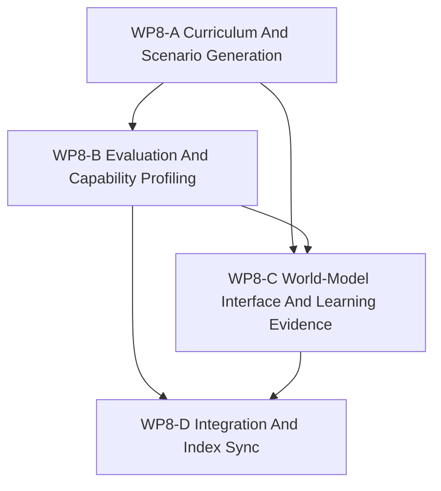

# WP8 SCAL Learning Face

Status: `2026-05-20` complete / accepted follow-on task family for the SCAL
learning face.

Language:

- English canonical: `learning_face_wp8_20260520.md`
- Chinese companion:
  [learning_face_wp8_20260520.zh.md](learning_face_wp8_20260520.zh.md)

Inputs:

- [simulation system architecture design](../../../plan/architecture/simulation_system_architecture_design.md)
- [architecture and performance research follow-up](../../../plan/architecture/architecture_and_performance_research_followup.md)
- [Temp-02 SCAL architecture vision review](../../review/temp-02_review_20260519.md)
- [Architecture Plan Review response](../../review/architecture_plan_review_20260519.md)
- [WP5 validation harness](../wp5_validation_harness/validation_harness_wp5_20260519.md)
- [WP7 backend capability materialization](../wp7_backend_capability_materialization/backend_capability_materialization_wp7_20260519.md)
- [WP7.5 training path facade bridge](../wp75_training_path_facade_bridge/training_path_facade_bridge_wp75_20260520.md)
- [WP8-A curriculum and scenario generation](wp8_curriculum_scenario_generation_cluster_20260520.md)
- [WP8-B evaluation and capability profiling](wp8_evaluation_capability_profiling_cluster_20260520.md)
- [WP8-C world-model interface and learning evidence](wp8_world_model_interface_and_learning_evidence_cluster_20260520.md)
- [WP8 acceptance review](../../review/wp8_learning_face_acceptance_review_20260520.md)

Naming note:

- WP8 is not a request to move full RL training onto the local machine.
- It is the separate follow-on line for the SCAL Learning face.
- The maintained training-path migration from `RuntimeFacade.runtime()` to
  facade-shaped execution and observation APIs belongs to `WP7.5`, not to
  `WP8`.
- Keep simulation authority in the simulation layer; keep learning artifacts in
  explicit experiment, evaluation, and evidence contracts.

## 1. Purpose

The architecture baseline already names Learning as one of the SCAL faces, but
it deliberately defers the learning graph. WP8 gives that deferred face a
bounded task family so future work can extend the platform ceiling without
reopening the simulation/policy/orchestration closure.

WP8 should answer:

1. How are curriculum and scenario generation requested and versioned?
2. How do evaluation and benchmark runs consume facade-shaped observations and
   evidence?
3. How are capability profiles produced, compared, and revised without becoming
   hidden truth?
4. How does the world-model / learning evidence boundary stay explicit?

## 2. Scope Boundary

WP8 can:

1. Define learning-facing request/result contracts and supporting docs.
2. Define curriculum, scenario generation, and evaluation vocabularies.
3. Define capability profiling and learning evidence schemas.
4. Define world-model interface boundaries and evidence provenance rules.
5. Update task, review, and architecture indexes so the Learning face has a
   clear home.

WP8 cannot:

1. Add a second authoritative simulation lifecycle.
2. Make learned artifacts the owner of world truth.
3. Require local RL training to validate the task family.
4. Collapse evaluation, reward shaping, and simulation facts into one layer.
5. Reopen the simulation/policy/orchestration closure from the architecture
   baseline.

## 3. Work Packages

| Work package | Status | Goal | Output |
|--------------|--------|------|--------|
| `WP8-A Curriculum And Scenario Generation` | complete / accepted | Define how scenario selection, seed policy, curriculum phases, and generation requests are versioned. | [curriculum / scenario generation task slice](wp8_curriculum_scenario_generation_cluster_20260520.md) |
| `WP8-B Evaluation And Capability Profiling` | complete / accepted | Define benchmark protocol, profile schema, score attribution, and capability evidence. | [evaluation / capability profiling task slice](wp8_evaluation_capability_profiling_cluster_20260520.md) |
| `WP8-C World-Model Interface And Learning Evidence` | complete / accepted | Define how learning consumes facade-shaped observations and records evidence without becoming a truth source. | [world-model / evidence task slice](wp8_world_model_interface_and_learning_evidence_cluster_20260520.md) |
| `WP8-D Integration And Index Sync` | complete / accepted | Update task/review indexes, cross references, and bilingual alignment. | [acceptance review](../../review/wp8_learning_face_acceptance_review_20260520.md) |

## 4. Dependency Map



Parallel rule:

- `WP8-A` and `WP8-B` may run in parallel once they share the same learning
  vocabulary.
- `WP8-C` should wait until `WP8-A/B` settle the request, observation, and
  evidence terms.
- `WP8-D` is serial and should only run after the other streams stabilize.

Bridge prerequisite:

- `WP8` may define learning-facing contract vocabulary before `WP7.5` lands in
  code.
- Any maintained claim that the training mainline already consumes
  facade-shaped execution or observation surfaces should cite `WP7.5`, not
  redefine that migration inside `WP8`.

`WP8-B` and `WP8-C` are the highest-reasoning streams because they must keep
learning outputs comparable without drifting into hidden truth ownership.

## 5. Dispatch Plan

| Stream | Main concern | Notes |
|--------|--------------|-------|
| `WP8-A Curriculum And Scenario Generation` | Scenario selection, curriculum phases, seed/reset policy, generation requests. | Good first stream for vocabulary and request shape. |
| `WP8-B Evaluation And Capability Profiling` | Benchmark protocol, profile schema, score attribution, evidence shape. | Needs the strongest boundary discipline. |
| `WP8-C World-Model Interface And Learning Evidence` | Observation consumption, learning evidence, provenance, replayability. | Must stay separate from World Truth. |
| `WP8-D Integration And Index Sync` | Index links, cross references, review hygiene, bilingual alignment. | Serial publication pass. |

## 6. Required Acceptance Artifacts

No `WP8` gate may be reported as passed unless the acceptance packet includes
all required artifacts below.

| Artifact | Required status | Purpose |
|----------|-----------------|---------|
| `docs/task/simulation_architecture/wp8_learning_face/learning_face_wp8_20260520.md` | required | Normative English definition of the Learning-face task family and gate rules. |
| `docs/task/simulation_architecture/wp8_learning_face/learning_face_wp8_20260520.zh.md` | required | Chinese companion for the same normative rules. |
| `docs/task/simulation_architecture/wp8_learning_face/wp8_curriculum_scenario_generation_cluster_20260520.md` | required | English WP8-A curriculum/scenario-generation contract and gate evidence surface. |
| `docs/task/simulation_architecture/wp8_learning_face/wp8_curriculum_scenario_generation_cluster_20260520.zh.md` | required | Chinese WP8-A companion. |
| `docs/task/simulation_architecture/wp8_learning_face/wp8_evaluation_capability_profiling_cluster_20260520.md` | required | English WP8-B benchmark/profile/evidence contract and gate evidence surface. |
| `docs/task/simulation_architecture/wp8_learning_face/wp8_evaluation_capability_profiling_cluster_20260520.zh.md` | required | Chinese WP8-B companion. |
| `docs/task/simulation_architecture/wp8_learning_face/wp8_world_model_interface_and_learning_evidence_cluster_20260520.md` | required | English WP8-C world-model/evidence boundary contract and gate evidence surface. |
| `docs/task/simulation_architecture/wp8_learning_face/wp8_world_model_interface_and_learning_evidence_cluster_20260520.zh.md` | required | Chinese WP8-C companion. |
| `docs/task/review/wp8_learning_face_acceptance_review_20260520.md` | required | English acceptance decision record with gate-by-gate evidence and final verdict. |
| `docs/task/review/wp8_learning_face_acceptance_review_20260520.zh.md` | required | Chinese acceptance decision record. |

Artifact rule:

- If any required artifact is missing, the acceptance result is `fail`.
- If an artifact exists but does not contain the gate verdict and required
  evidence for the gate it claims to cover, the acceptance result is `fail`.
- A planning note, chat reply, or benchmark summary outside the required review
  artifact does not count as a completed acceptance packet.

## 7. Strict Gate Rules

Each gate below must be evaluated independently in the acceptance review. A
gate may end only as `pass`, `fail`, or `blocked`.

| Gate | Required evidence | Pass rule | Fail rule | Blocked-environment downgrade |
|------|-------------------|-----------|-----------|-------------------------------|
| `WP8-A Curriculum And Scenario Generation` | The acceptance review must name the curriculum and scenario-generation documents checked, list the request/versioning fields the task line requires, and cite the exact validation commands or document checks used to confirm those requests stay explicit and versioned. | Pass only if curriculum and scenario-generation flows are documented as explicit requests with versioned inputs, and no hidden simulation authority is introduced. | Fail if request fields are implicit, versioning is absent, scenario generation becomes informal process text instead of a request/result contract, or the evidence is missing. | If runtime or dataset-dependent validation cannot run locally, record `blocked` and include the exact command, exact blocker, and the limited doc-only claim that remains. Do not upgrade a doc-only check into a runtime pass. |
| `WP8-B Evaluation And Capability Profiling` | The acceptance review must identify the benchmark/profile artifacts checked, state how score attribution and capability evidence are represented, and cite the exact validation commands or review checks used to prove profiles remain metadata rather than hidden support claims. | Pass only if benchmark protocol, profile schema, and score attribution are explicit, evidence-backed, and do not infer backend support from helper or probe presence. | Fail if capability profiles are treated as authoritative truth, if score attribution is underspecified, if evidence cannot be traced, or if support claims are inferred from implementation presence alone. | If benchmark validation is blocked by missing local training or evaluation prerequisites, record `blocked` with the exact command, exact blocker, and the next environment needed. `Blocked` does not allow capability conclusions to be promoted. |
| `WP8-C World-Model Interface And Learning Evidence` | The acceptance review must name the observation/evidence boundary documents checked, state how `ObservationPacket`, `DecisionBelief`, and `World Truth` remain distinct, and include the exact validation commands or document checks used to verify evidence provenance and replay/diagnostics ancestry. | Pass only if learning consumption is documented as facade-shaped observation/evidence use without becoming a truth source, and the evidence boundary remains explicit and traceable. | Fail if learning artifacts mutate authoritative simulation state, if `ObservationPacket`, `DecisionBelief`, and `World Truth` collapse into one layer, or if provenance and replay ancestry are absent. | If evidence-line validation is blocked by missing replay data, diagnostics data, or runtime setup, record `blocked` with the exact command, exact blocker, and the limited static claim that remains. |
| `WP8-D Integration And Index Sync` | The acceptance review must confirm that all required artifacts exist, that cross references point to `WP7.5` for maintained training-path migration, and that the bilingual pair stays aligned. | Pass only if artifact publication is complete, cross references are internally consistent, and `WP8` does not redefine the maintained migration that belongs to `WP7.5`. | Fail if required artifacts are missing, links are broken, bilingual alignment drifts, or `WP8` reopens simulation-layer closure or restates the `WP7.5` migration as its own accepted implementation. | If integration checks are blocked by environment-specific validation gaps, record `blocked` and keep the gate open with explicit next steps. Missing integration evidence must not be rephrased as acceptance. |

Decision rule:

- `pass` requires all required evidence for that gate and no contradictory
  evidence in the same review packet.
- `fail` is mandatory when required evidence is missing, contradicted, or
  replaced by intention-only wording.
- `blocked` is allowed only for environment or machine limitations and must
  preserve the gate as unresolved.

## 8. Validation Commands

```bash
git diff --check
rg -n "WP8|Learning face|curriculum|evaluation|capability profiling|scenario generation|world-model|learning evidence" docs/plan/architecture docs/task/simulation_architecture docs/task/review
```

Validation wording rule:

- If a command runs and passes, the acceptance review should say `passed` and
  include the exact command.
- If a command runs and fails, the acceptance review should say `failed` and
  include the exact command plus the failing symptom.
- If a command cannot run, the acceptance review should say `blocked` and
  include the exact command, exact blocker, and next environment needed.

## 9. Non-Goals

- Full RL training on the local Windows machine.
- A new runtime path that bypasses the simulation layer.
- Treating learning outputs as authoritative simulation truth.
- Introducing backend capability claims through learning docs.
