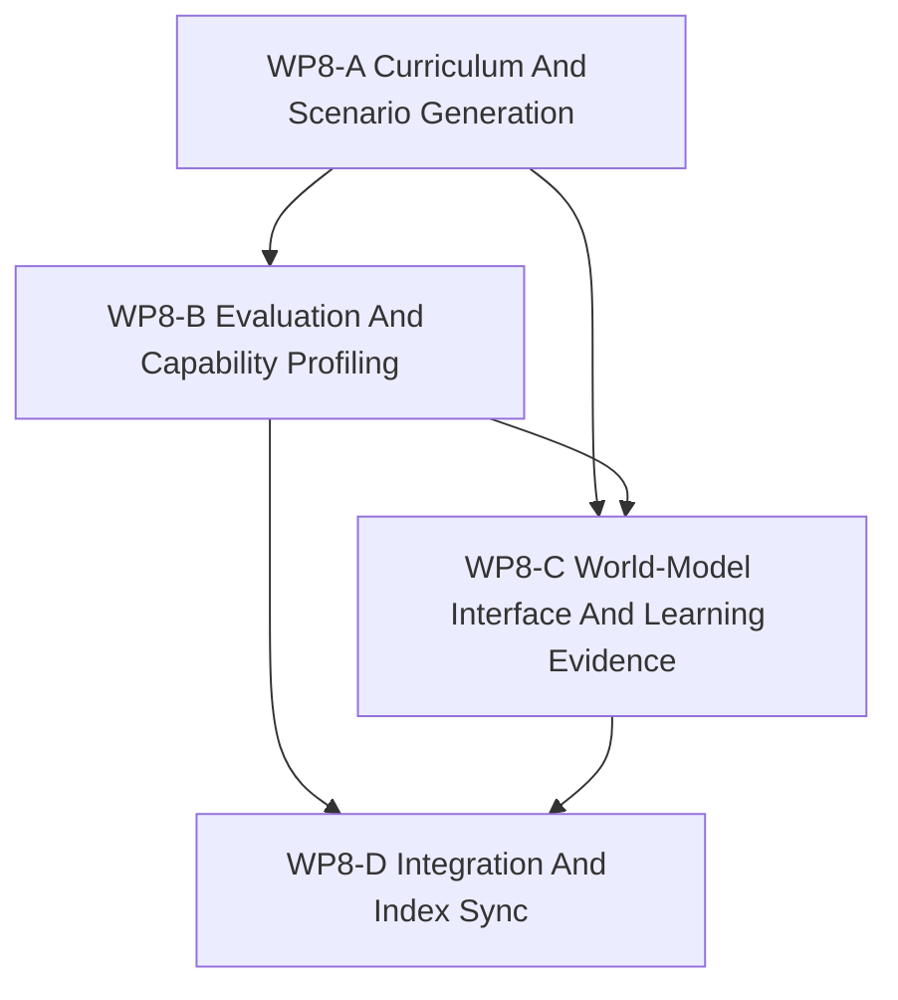

# WP8 SCAL 学习面

状态：`2026-05-20` 的 SCAL 学习面后续任务族，已完成 / 已验收。

语言版本：

- 英文主文：[learning_face_wp8_20260520.md](learning_face_wp8_20260520.md)
- 中文辅文：`learning_face_wp8_20260520.zh.md`

输入：

- [仿真系统架构设计](../../../plan/architecture/simulation_system_architecture_design.zh.md)
- [架构与性能路线进一步调研](../../../plan/architecture/architecture_and_performance_research_followup.zh.md)
- [Temp-02 SCAL 架构愿景审查](../../review/temp-02_review_20260519.zh.md)
- [Architecture Plan Review response](../../review/architecture_plan_review_20260519.zh.md)
- [WP5 验证套件](../wp5_validation_harness/validation_harness_wp5_20260519.zh.md)
- [WP7 后端能力物化](../wp7_backend_capability_materialization/backend_capability_materialization_wp7_20260519.zh.md)
- [WP7.5 训练路径 facade 桥接](../wp75_training_path_facade_bridge/training_path_facade_bridge_wp75_20260520.zh.md)
- [WP8-A 课程与场景生成](wp8_curriculum_scenario_generation_cluster_20260520.zh.md)
- [WP8-B evaluation 与 capability profiling](wp8_evaluation_capability_profiling_cluster_20260520.zh.md)
- [WP8-C world-model 接口与学习证据](wp8_world_model_interface_and_learning_evidence_cluster_20260520.zh.md)
- [WP8 验收审查](../../review/wp8_learning_face_acceptance_review_20260520.zh.md)

命名说明：

- WP8 不是把完整 RL 训练搬到本机。
- 它是 SCAL 学习面的独立后续任务族。
- 把训练主路径从 `RuntimeFacade.runtime()` 迁到 facade-shaped execution /
  observation API 的工作属于 `WP7.5`，不属于 `WP8`。
- 仿真权威仍在仿真层；学习产物应落在显式的实验、评估与证据契约中。

## 1. 目的

架构基线已经把 Learning 作为 SCAL 的一个面，但它有意把 learning graph
推迟了。WP8 给这个被推迟的面一个有边界的任务族，使未来工作能够抬高项目
上限，而不会重新打开仿真/策略/编排闭合。

WP8 需要回答：

1. 课程与场景生成如何被请求并版本化？
2. 评估与 benchmark 如何消费 facade-shaped observation 与证据？
3. 能力画像如何生成、比较与修订，而不变成隐式真值？
4. world-model / 学习证据边界如何保持显式？

## 2. 范围边界

WP8 可以：

1. 定义学习侧 request/result 契约与支持文档。
2. 定义课程、场景生成与评估词汇。
3. 定义能力画像与学习证据 schema。
4. 定义 world-model 接口边界与证据溯源规则。
5. 更新 task、review 与 architecture 索引，让 Learning 面有明确归属。

WP8 不可以：

1. 添加第二条权威仿真生命周期。
2. 让 learned artifact 成为 world truth 的 owner。
3. 把本机默认前提改成必须具备完整 RL 训练。
4. 把评估、reward shaping 与仿真事实揉成同一层。
5. 从架构基线重新打开仿真/策略/编排闭合。

## 3. 工作包

| 工作包 | 状态 | 目标 | 产出 |
|--------|------|------|------|
| `WP8-A Curriculum And Scenario Generation` | complete / accepted | 定义场景选择、seed policy、curriculum phase 与 generation request 如何版本化。 | [课程 / 场景生成子切片](wp8_curriculum_scenario_generation_cluster_20260520.zh.md) |
| `WP8-B Evaluation And Capability Profiling` | complete / accepted | 定义 benchmark protocol、profile schema、score 归因与能力证据。 | [评估 / 能力画像子切片](wp8_evaluation_capability_profiling_cluster_20260520.zh.md) |
| `WP8-C World-Model Interface And Learning Evidence` | complete / accepted | 定义学习如何消费 facade-shaped observation，并记录证据而不成为真值源。 | [world-model / 证据子切片](wp8_world_model_interface_and_learning_evidence_cluster_20260520.zh.md) |
| `WP8-D Integration And Index Sync` | complete / accepted | 更新任务/评审索引、交叉引用与中英对齐。 | [验收审查](../../review/wp8_learning_face_acceptance_review_20260520.zh.md) |

## 4. 依赖图



并行规则：

- `WP8-A` 与 `WP8-B` 在共享学习词汇后可以并行。
- `WP8-C` 应等待 `WP8-A/B` 稳定 request、observation 与 evidence 术语。
- `WP8-D` 串行执行，只应在其他流稳定后启动。

桥接前提：

- `WP8` 可以先定义 learning-facing contract vocabulary。
- 但任何“训练主线已经消费 facade-shaped execution / observation surface”的
  maintained claim，都应引用 `WP7.5`，而不是在 `WP8` 内部重新定义迁移线。

`WP8-B` 与 `WP8-C` 是思考预算最高的两个工作流，因为它们必须保持学习输出
可比较，同时避免滑向隐式真值 ownership。

## 5. 分发计划

| 流 | 主要关注点 | 备注 |
|----|------------|------|
| `WP8-A Curriculum And Scenario Generation` | 场景选择、课程 phase、seed/reset policy、generation request。 | 适合作为第一批词汇与请求形状工作。 |
| `WP8-B Evaluation And Capability Profiling` | benchmark protocol、profile schema、score attribution、evidence shape。 | 边界纪律要求最高。 |
| `WP8-C World-Model Interface And Learning Evidence` | observation 消费、learning evidence、溯源、可 replay 性。 | 必须与 World Truth 保持分离。 |
| `WP8-D Integration And Index Sync` | 索引链接、交叉引用、审查卫生、中英对齐。 | 串行发布步骤。 |

## 6. 必需验收产物

任何 `WP8` gate 若要报告为通过，验收包必须包含下列全部产物。

| 产物 | 必需状态 | 作用 |
|------|----------|------|
| `docs/task/simulation_architecture/wp8_learning_face/learning_face_wp8_20260520.md` | required | 英文 Learning-face 任务族主文与 gate 规则。 |
| `docs/task/simulation_architecture/wp8_learning_face/learning_face_wp8_20260520.zh.md` | required | 中文规范辅文。 |
| `docs/task/simulation_architecture/wp8_learning_face/wp8_curriculum_scenario_generation_cluster_20260520.md` | required | 英文 WP8-A 课程 / 场景生成契约与 gate 证据面。 |
| `docs/task/simulation_architecture/wp8_learning_face/wp8_curriculum_scenario_generation_cluster_20260520.zh.md` | required | 中文 WP8-A 辅文。 |
| `docs/task/simulation_architecture/wp8_learning_face/wp8_evaluation_capability_profiling_cluster_20260520.md` | required | 英文 WP8-B benchmark / profile / evidence 契约与 gate 证据面。 |
| `docs/task/simulation_architecture/wp8_learning_face/wp8_evaluation_capability_profiling_cluster_20260520.zh.md` | required | 中文 WP8-B 辅文。 |
| `docs/task/simulation_architecture/wp8_learning_face/wp8_world_model_interface_and_learning_evidence_cluster_20260520.md` | required | 英文 WP8-C world-model / evidence boundary 契约与 gate 证据面。 |
| `docs/task/simulation_architecture/wp8_learning_face/wp8_world_model_interface_and_learning_evidence_cluster_20260520.zh.md` | required | 中文 WP8-C 辅文。 |
| `docs/task/review/wp8_learning_face_acceptance_review_20260520.md` | required | 英文验收决定记录，必须逐 gate 写明证据与最终判定。 |
| `docs/task/review/wp8_learning_face_acceptance_review_20260520.zh.md` | required | 中文验收决定记录。 |

产物规则：

- 任一必需产物缺失，则验收结果必须为 `fail`。
- 产物存在但没有覆盖其声称 gate 的 verdict 与 required evidence，也必须为
  `fail`。
- 独立于必需 review 文档之外的 planning note、聊天回复或 benchmark summary，
  不能算作完整的 acceptance packet。

## 7. 严格 gate 规则

下表中的每个 gate 都必须在 acceptance review 中独立判定。每个 gate 只能以
`pass`、`fail` 或 `blocked` 收束。

| Gate | Required evidence | Pass 口径 | Fail 口径 | 环境阻塞降级表述 |
|------|-------------------|-----------|-----------|------------------|
| `WP8-A Curriculum And Scenario Generation` | 验收审查必须点名受检的 curriculum / scenario-generation 文档，列出任务线要求的 request/versioning 字段，并写出用于确认这些请求保持显式且可版本化的精确验证命令或文档检查。 | 只有当课程与场景生成流程被文档化为显式 request、输入具备版本化，并且没有引入隐藏仿真 authority 时，才能 `pass`。 | 如果请求字段仍然隐式、没有版本化、场景生成只是流程描述而不是 request/result contract，或证据缺失，则必须 `fail`。 | 如果依赖运行时或数据集的验证在本机无法运行，必须记为 `blocked`，并写出精确命令、精确阻塞点，以及还能保留的有限 doc-only 结论。文档检查不能被升级为运行时 `pass`。 |
| `WP8-B Evaluation And Capability Profiling` | 验收审查必须标明所检查的 benchmark / profile artifact，说明 score attribution 与 capability evidence 的表达方式，并写出用于证明 profile 仍是元数据而不是隐藏 support claim 的精确验证命令或审查检查。 | 只有当 benchmark protocol、profile schema 与 score attribution 显式、证据化，并且不会从 helper / probe 存在性推断 backend support 时，才能 `pass`。 | 如果能力画像被当成权威真值、score attribution 描述不足、证据不可追溯，或 support claim 只是从实现存在性推出，则必须 `fail`。 | 如果 benchmark 验证因本机缺少训练或评估前提而被阻塞，必须记为 `blocked`，并写出精确命令、精确阻塞点和下一环境。`Blocked` 不能晋级能力结论。 |
| `WP8-C World-Model Interface And Learning Evidence` | 验收审查必须点名受检的 observation/evidence 边界文档，说明 `ObservationPacket`、`DecisionBelief` 与 `World Truth` 如何保持区分，并写出用于验证 evidence provenance 与 replay/diagnostics ancestry 的精确命令或文档检查。 | 只有当学习消费被文档化为 facade-shaped observation/evidence use，而不是新的 truth source，并且证据边界显式且可追踪时，才能 `pass`。 | 如果学习产物会修改权威仿真状态、`ObservationPacket` / `DecisionBelief` / `World Truth` 被揉成一层，或缺失 provenance 与 replay ancestry，则必须 `fail`。 | 如果证据线验证因缺少 replay 数据、diagnostics 数据或运行时搭建而被阻塞，必须记为 `blocked`，并写出精确命令、精确阻塞点以及仍可保留的有限静态结论。 |
| `WP8-D Integration And Index Sync` | 验收审查必须确认全部必需产物存在，确认交叉引用把 maintained training-path migration 指向 `WP7.5`，并确认中英双文保持对齐。 | 只有当产物发布完整、交叉引用自洽，并且 `WP8` 没有重写本应归属于 `WP7.5` 的 maintained migration 时，才能 `pass`。 | 如果必需产物缺失、链接损坏、中英漂移，或 `WP8` 重新打开 simulation-layer closure / 把 `WP7.5` 迁移改写成自己的已验收实现，则必须 `fail`。 | 如果集成检查因环境特定验证缺口而被阻塞，必须记为 `blocked`，并保持 gate 未决且写出下一步。缺少集成证据时不能改写成已验收。 |

判定总规则：

- `pass` 要求该 gate 的全部 required evidence 到位，且同一份 review 中没有相互
  矛盾的证据。
- 只要 required evidence 缺失、被反证、或被“意图性表述”替代，就必须 `fail`。
- `blocked` 只允许用于环境或机器限制，并且必须保持 gate 处于未解决状态。

## 8. 验证命令

```bash
git diff --check
rg -n "WP8|Learning face|curriculum|evaluation|capability profiling|scenario generation|world-model|learning evidence" docs/plan/architecture docs/task/simulation_architecture docs/task/review
```

验证表述规则：

- 命令执行并通过时，acceptance review 应写 `passed`，并附精确命令。
- 命令执行并失败时，acceptance review 应写 `failed`，并附精确命令与失败现象。
- 命令无法执行时，acceptance review 应写 `blocked`，并附精确命令、精确阻塞点和
  所需的下一环境。

## 9. 非目标

- 在本机上完成完整 RL 训练。
- 建立绕过仿真层的新运行时路径。
- 把学习输出当作权威仿真真值。
- 通过学习文档引入 backend capability claim。
