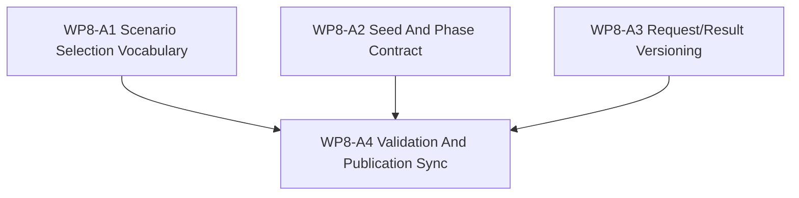

# WP8-A Dispatch Sheet: Curriculum And Scenario Generation

Status: `2026-05-20` complete / accepted WP8 learning-face dispatch sheet.

Language:

- English canonical: `wp8_curriculum_scenario_generation_cluster_20260520.md`
- Chinese companion:
  [wp8_curriculum_scenario_generation_cluster_20260520.zh.md](wp8_curriculum_scenario_generation_cluster_20260520.zh.md)

Inputs:

- [WP8 SCAL Learning Face](learning_face_wp8_20260520.md)
- [WP7.5 training path facade bridge](../wp75_training_path_facade_bridge/training_path_facade_bridge_wp75_20260520.md)
- [WP5 validation harness](../wp5_validation_harness/validation_harness_wp5_20260519.md)
- [WP7 backend capability materialization](../wp7_backend_capability_materialization/backend_capability_materialization_wp7_20260519.md)
- [WP8 acceptance review](../../review/wp8_learning_face_acceptance_review_20260520.md)

Naming note:

- `WP8-A` is the curriculum and scenario-generation slice inside the broader
  `WP8` learning-face family.
- It defines request/result vocabulary for learning scenarios, not a new
  simulation authority.
- Any maintained training-path claim that depends on facade-shaped execution or
  observation should cite `WP7.5` as the bridge reference, not re-state the
  bridge here.

## 1. Purpose

`WP8-A` defines how learning scenarios are selected, seeded, phased, requested,
and returned as versioned artifacts. The goal is to make curriculum generation
explicit enough that future evaluation and evidence work can consume it without
guessing at hidden policy.

`WP8-A` should answer:

1. Which scenarios are in scope for a curriculum slice, and how are they
   selected?
2. Which seed policy governs repeatability, variation, and replayability?
3. Which curriculum phase is being requested, and what changes between phases?
4. Which request/result/version fields are mandatory so scenario generation can
   be reproduced and compared?
5. How do `WP8` and `WP7.5` stay aligned without turning this slice into a
   runtime implementation plan?

## 2. Scope Boundary

`WP8-A` can:

1. Define curriculum, scenario selection, and generation request/result
   vocabulary.
2. Define seed policy rules, phase progression rules, and versioning rules.
3. Define explicit traceability fields for requests, results, and revisions.
4. Define doc-only acceptance checks for the curriculum/scenario-generation
   contract.
5. Prepare the vocabulary that `WP8-B/C/D` may consume later.

`WP8-A` cannot:

1. Add a second authoritative simulation lifecycle.
2. Turn scenario generation into hidden policy or implicit truth.
3. Reopen the maintained training-path migration owned by `WP7.5`.
4. Require local RL training or runtime data generation to validate the doc
   slice.
5. Collapse selection policy, seed policy, phase policy, and result policy into
   one unnamed process.

## 3. Work Packages

| Work package | Status | Worker role | Reasoning budget | Goal | Output |
|--------------|--------|-------------|------------------|------|--------|
| `WP8-A1 Scenario Selection Vocabulary` | complete / accepted | Doc author | High | Define which scenario families, inclusion/exclusion rules, and scenario-set ids a curriculum request may name. | scenario-selection slice |
| `WP8-A2 Seed And Phase Contract` | complete / accepted | Doc author | High | Define seed policy, reset behavior, curriculum phases, and phase-transition rules. | seed/phase slice |
| `WP8-A3 Request/Result Versioning` | complete / accepted | Doc author | High | Define required request/result/version fields and explain why they matter for reproducibility and comparison. | request/result schema slice |
| `WP8-A4 Validation And Publication Sync` | complete / accepted | Integrator | Medium | Add doc-only validation gates, align the bilingual pair, and cross-check the bridge reference to `WP8` / `WP7.5`. | validation / sync slice |

Parallel rule:

- `WP8-A1`, `WP8-A2`, and `WP8-A3` may proceed in parallel once they share the
  same scenario and curriculum vocabulary.
- `WP8-A4` is serial and should only run after the other slices stabilize.

## 4. Dependency Map



Bridge rule:

- `WP8-A` may define learning-facing request and result vocabulary before the
  bridge is exercised in implementation.
- Any claim that the maintained training path already consumes facade-shaped
  execution or observation belongs to `WP7.5`, not to `WP8-A`.

## 5. Request / Result Contract

The contract below is the minimum vocabulary `WP8-A` must keep explicit.

| Field group | Required fields | Why it matters |
|-------------|-----------------|----------------|
| Request identity | `request_id`, `request_version`, `contract_version` | Makes the request referable, reviewable, and safe to evolve without silent breakage. |
| Scenario selection | `scenario_set_id`, `scenario_family_id`, `selection_policy_id`, `selection_constraints` | Separates what is requested from how it was chosen, so selection cannot hide policy. |
| Seed policy | `seed_policy_id`, `seed_mode`, `seed_source`, `seed_scope` | Keeps repeatability and diversity explicit, and avoids pretending all generated cases came from the same seed treatment. |
| Curriculum phase | `curriculum_phase_id`, `phase_order`, `entry_condition`, `exit_condition` | Makes progression visible so phase drift cannot be mistaken for a stable curriculum. |
| Generation request | `generation_request_version`, `requested_output_shape`, `input_refs` | Captures the shape of what is being asked for and preserves upstream references. |
| Generation result | `result_id`, `result_version`, `status`, `generated_scenario_set_id`, `result_refs` | Lets downstream work compare outputs, trace revisions, and tell success from partial or failed generation. |

Request rule:

- A generation request is a request, not a hidden guarantee that the selected
  scenarios already exist.
- If a field changes meaning across revisions, its version must change too.

Result rule:

- A generation result must record what was produced, what version it uses, and
  what request it satisfies.
- A result that cannot state its request lineage is not acceptable as a stable
  contract artifact.

Versioning rule:

- Request and result version fields are required because curriculum generation
  will evolve faster than the surrounding task family.
- Versioning prevents later workers from inferring meaning from field names
  alone.

## 6. Dispatch Plan

| Stream | Main concern | Notes |
|--------|--------------|-------|
| `WP8-A1 Scenario Selection Vocabulary` | Scenario families, inclusion/exclusion rules, and selected scenario-set ids. | Good first stream for the vocabulary that `WP8-B/C` will reuse. |
| `WP8-A2 Seed And Phase Contract` | Seed policy, reset policy, phase entry/exit rules, and curriculum progression. | Highest-risk slice for reproducibility and phase drift. |
| `WP8-A3 Request/Result Versioning` | Request/result ids, schema versioning, and lineage fields. | Needed before any later generation evidence can be trusted. |
| `WP8-A4 Validation And Publication Sync` | Doc-only gates, bilingual alignment, and bridge cross-checks. | Serial publication pass. |

## 7. Required Acceptance Artifacts

No `WP8-A` gate may be reported as passed unless the acceptance packet
contains all required artifacts below.

| Artifact | Required status | Purpose |
|----------|-----------------|---------|
| `docs/task/simulation_architecture/wp8_learning_face/wp8_curriculum_scenario_generation_cluster_20260520.md` | required | Normative English definition of the WP8-A curriculum/scenario-generation slice. |
| `docs/task/simulation_architecture/wp8_learning_face/wp8_curriculum_scenario_generation_cluster_20260520.zh.md` | required | Chinese companion for the same normative rules. |
| `docs/task/review/wp8_learning_face_acceptance_review_20260520.md` | required | English acceptance record with gate-by-gate evidence and final verdict. |
| `docs/task/review/wp8_learning_face_acceptance_review_20260520.zh.md` | required | Chinese acceptance record. |

Artifact rule:

- If any required artifact is missing, the acceptance result is `fail`.
- If an artifact exists but does not state the request/result/version fields
  it claims to cover, the acceptance result is `fail`.
- A summary outside the required review artifact does not count as a completed
  acceptance packet.

## 8. Strict Gate Rules

Each gate below must be evaluated independently in the acceptance review. A
gate may end only as `pass`, `fail`, or `blocked`.

| Gate | Required evidence | Pass rule | Fail rule | Blocked-environment downgrade |
|------|-------------------|-----------|-----------|-------------------------------|
| `WP8-A1 Scenario Selection Vocabulary` | The acceptance review must name the curriculum/scenario-selection section checked, list the scenario-set and selection-policy fields, and cite the exact document checks used to confirm selection is explicit rather than implied. | Pass only if scenario families, selection rules, and inclusion/exclusion boundaries are written as explicit request vocabulary and do not become hidden policy. | Fail if scenario selection is vague, implied, or collapsed into a prose-only workflow without explicit fields. | If the local review cannot verify cross references, record `blocked` and include the exact check, the exact blocker, and the limited static claim that remains. |
| `WP8-A2 Seed And Phase Contract` | The acceptance review must name the seed and phase sections checked, list the required seed-policy and phase fields, and cite the exact document checks used to confirm repeatability and phase progression are explicit. | Pass only if seed policy, reset behavior, and phase boundaries are versioned and independently readable. | Fail if seed policy is implicit, phase progression is unversioned, or repeatability is only suggested in narrative text. | If local validation is blocked by missing supporting docs or an unavailable reference file, record `blocked` with the exact check and blocker. |
| `WP8-A3 Request/Result Versioning` | The acceptance review must name the request/result schema sections checked, list the required identity and version fields, and cite the exact document checks used to confirm lineage and version evolution are explicit. | Pass only if request/result/version fields are present, stable, and sufficient to trace a generated scenario back to its request. | Fail if version fields are missing, ambiguous, or used only informally without lineage. | If schema review cannot be completed locally, record `blocked` with the exact check, exact blocker, and the limited doc-only claim that remains. |
| `WP8-A4 Validation And Publication Sync` | The acceptance review must confirm the bilingual pair is aligned, cross references point to `WP8` and `WP7.5` correctly, and the exact doc-only validation commands are listed. | Pass only if the pair is structurally aligned and the validation commands check only documentation. | Fail if the bilingual structure drifts, the bridge reference is wrong, or validation claims exceed doc-only checking. | If publication checks are blocked by environment limits, record `blocked` and keep the gate unresolved. |

Decision rule:

- `pass` requires all required evidence for that gate and no contradictory
  evidence in the same review packet.
- `fail` is mandatory when required evidence is missing, contradicted, or
  replaced by intention-only wording.
- `blocked` is allowed only for environment or machine limitations and must
  preserve the gate as unresolved.

## 9. Validation Commands

```bash
git diff --check
rg -n "WP8-A|curriculum|scenario selection|scenario-set|seed policy|curriculum phase|generation request|request/result|version" docs/task/simulation_architecture/wp8_learning_face docs/task/simulation_architecture/wp75_training_path_facade_bridge docs/task/review
```

Validation wording rule:

- If a command runs and passes, the acceptance review should say `passed` and
  include the exact command.
- If a command runs and fails, the acceptance review should say `failed` and
  include the exact command plus the failing symptom.
- If a command cannot run, the acceptance review should say `blocked` and
  include the exact command, exact blocker, and the limited doc-only claim that
  remains.

## 10. Non-Goals

- Full RL training on the local machine.
- A new runtime path that bypasses the simulation layer.
- Treating generated scenarios as authoritative simulation truth.
- Hiding scenario selection, seed choice, or phase progression behind unnamed
  process text.
- Rewriting the maintained training-path bridge that belongs to `WP7.5`.
