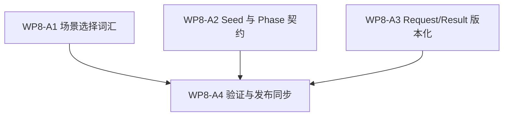

# WP8-A 分发单：课程与场景生成

状态：`2026-05-20` 的 WP8 学习面分发单，已完成 / 已验收。

语言版本：

- 英文主文：
  [wp8_curriculum_scenario_generation_cluster_20260520.md](wp8_curriculum_scenario_generation_cluster_20260520.md)
- 中文辅文：`wp8_curriculum_scenario_generation_cluster_20260520.zh.md`

输入：

- [WP8 SCAL 学习面](learning_face_wp8_20260520.zh.md)
- [WP7.5 训练路径 facade 桥接](../wp75_training_path_facade_bridge/training_path_facade_bridge_wp75_20260520.zh.md)
- [WP5 验证套件](../wp5_validation_harness/validation_harness_wp5_20260519.zh.md)
- [WP7 后端能力物化](../wp7_backend_capability_materialization/backend_capability_materialization_wp7_20260519.zh.md)
- [WP8 验收审查](../../review/wp8_learning_face_acceptance_review_20260520.zh.md)

命名说明：

- `WP8-A` 是更大 `WP8` 学习面任务族中的课程与场景生成切片。
- 它定义学习场景的 request/result 词汇，不定义新的仿真权威。
- 任何依赖 facade-shaped execution 或 observation 的维护中训练路径声明，
  都应引用 `WP7.5` 作为桥接参考，而不是在这里重新写桥接。

## 1. 目的

`WP8-A` 定义学习场景如何被选择、如何被 seed、如何按 phase 推进、如何被
请求，以及如何以版本化产物返回。目标是让课程生成足够显式，使后续评估与
证据工作可以直接消费，而不必猜测隐藏 policy。

`WP8-A` 需要回答：

1. 哪些 scenario family 属于课程切片，以及如何选择？
2. 哪种 seed policy 约束可复现性、变化性与 replayability？
3. 这次请求的是哪一个 curriculum phase，phase 之间改变了什么？
4. 哪些 request/result/version 字段是必需的，以便生成可复现、可比较？
5. `WP8` 与 `WP7.5` 如何保持对齐，而不把本切片变成运行时实现计划？

## 2. 范围边界

`WP8-A` 可以：

1. 定义 curriculum、scenario selection 与 generation request/result 词汇。
2. 定义 seed policy 规则、phase 规则与版本化规则。
3. 定义 request、result 与修订的显式追踪字段。
4. 定义课程/场景生成契约的 doc-only 验收检查。
5. 为后续 `WP8-B/C/D` 准备可复用词汇。

`WP8-A` 不可以：

1. 添加第二条权威仿真生命周期。
2. 把场景生成变成隐藏 policy 或隐式真值。
3. 重新打开由 `WP7.5` 负责的维护中训练路径迁移。
4. 依赖本地 RL 训练或运行时数据生成来验证此文档切片。
5. 把 selection policy、seed policy、phase policy 与 result policy 混成一段
   无名流程。

## 3. 工作包

| 工作包 | 状态 | Worker 角色 | 推理预算 | 目标 | 产出 |
|--------|------|-------------|----------|------|------|
| `WP8-A1 场景选择词汇` | complete / accepted | 文档作者 | 高 | 定义课程请求可命名的 scenario family、包含/排除规则与 scenario-set id。 | 场景选择切片 |
| `WP8-A2 Seed 与 Phase 契约` | complete / accepted | 文档作者 | 高 | 定义 seed policy、reset 行为、curriculum phase 与 phase 迁移规则。 | seed/phase 切片 |
| `WP8-A3 Request/Result 版本化` | complete / accepted | 文档作者 | 高 | 定义必需的 request/result/version 字段，并解释它们为何影响可复现性与可比较性。 | request/result schema 切片 |
| `WP8-A4 验证与发布同步` | complete / accepted | 集成人员 | 中 | 添加 doc-only 验收 gate、对齐双语版本，并交叉检查 `WP8` / `WP7.5` 桥接引用。 | 验证 / 同步切片 |

并行规则：

- `WP8-A1`、`WP8-A2` 与 `WP8-A3` 在共享同一套 scenario 与 curriculum 词汇后
  可以并行。
- `WP8-A4` 为串行步骤，只应在其他切片稳定后执行。

## 4. 依赖图



桥接规则：

- `WP8-A` 可以先定义 learning-facing request 与 result 词汇，哪怕桥接仍在实现前
  阶段。
- 任何声称维护中训练路径已经消费 facade-shaped execution 或 observation 的说法，
  都属于 `WP7.5`，不属于 `WP8-A`。

## 5. Request / Result 契约

下表是 `WP8-A` 必须保持显式的最小词汇。

| 字段组 | 必需字段 | 作用 |
|--------|----------|------|
| Request 标识 | `request_id`, `request_version`, `contract_version` | 让请求可引用、可审查，并且可在不静默破坏的前提下演进。 |
| 场景选择 | `scenario_set_id`, `scenario_family_id`, `selection_policy_id`, `selection_constraints` | 将“请求什么”与“如何选出”分离，避免 selection 变成隐藏 policy。 |
| Seed policy | `seed_policy_id`, `seed_mode`, `seed_source`, `seed_scope` | 保持可复现性与多样性显式，避免假定所有生成都来自同一 seed 处理。 |
| Curriculum phase | `curriculum_phase_id`, `phase_order`, `entry_condition`, `exit_condition` | 让 progression 可见，避免 phase drift 被误认为稳定课程。 |
| Generation request | `generation_request_version`, `requested_output_shape`, `input_refs` | 记录所请求产物的形状，并保留上游引用。 |
| Generation result | `result_id`, `result_version`, `status`, `generated_scenario_set_id`, `result_refs` | 让下游可以比较输出、追踪修订，并区分成功、部分成功与失败。 |

请求规则：

- generation request 是请求，不是已经存在场景的隐式保证。
- 如果字段语义在修订中变化，则版本必须变化。

结果规则：

- generation result 必须记录产出了什么、使用什么版本，以及它满足哪一个请求。
- 无法说明请求 lineage 的 result 不能作为稳定契约产物。

版本化规则：

- request 与 result 的版本字段是必需的，因为课程生成的演进速度会快于外围任务族。
- 版本化可以防止后续 worker 只凭字段名猜含义。

## 6. 分发计划

| 流 | 主要关注点 | 备注 |
|----|------------|------|
| `WP8-A1 场景选择词汇` | scenario family、包含/排除规则、被选中的 scenario-set id。 | 适合作为 `WP8-B/C` 将复用的第一批词汇。 |
| `WP8-A2 Seed 与 Phase 契约` | seed policy、reset policy、phase 进入/退出规则、课程推进。 | 在可复现性和 phase 漂移上风险最高。 |
| `WP8-A3 Request/Result 版本化` | request/result id、schema 版本与 lineage 字段。 | 在后续生成证据可信之前必须先稳定。 |
| `WP8-A4 验证与发布同步` | doc-only gates、双语对齐与 bridge 交叉检查。 | 串行发布步骤。 |

## 7. 必需验收产物

任何 `WP8-A` gate 若要报告为通过，验收包必须包含下列全部产物。

| 产物 | 必需状态 | 作用 |
|------|----------|------|
| `docs/task/simulation_architecture/wp8_learning_face/wp8_curriculum_scenario_generation_cluster_20260520.md` | required | `WP8-A` 课程 / 场景生成切片的英文规范定义。 |
| `docs/task/simulation_architecture/wp8_learning_face/wp8_curriculum_scenario_generation_cluster_20260520.zh.md` | required | 同一套规则的中文辅文。 |
| `docs/task/review/wp8_learning_face_acceptance_review_20260520.md` | required | 英文验收记录，必须逐 gate 写明证据与最终判定。 |
| `docs/task/review/wp8_learning_face_acceptance_review_20260520.zh.md` | required | 中文验收记录。 |

产物规则：

- 任一必需产物缺失，则验收结果必须为 `fail`。
- 产物存在但没有写明其声称覆盖的 request/result/version 字段，也必须为 `fail`。
- 产物摘要不等于完整的 acceptance packet。

## 8. 严格 gate 规则

下表中的每个 gate 都必须在 acceptance review 中独立判定。每个 gate 只能以
`pass`、`fail` 或 `blocked` 收束。

| Gate | Required evidence | Pass 口径 | Fail 口径 | 环境阻塞降级表述 |
|------|-------------------|-----------|-----------|------------------|
| `WP8-A1 场景选择词汇` | 验收审查必须点名受检的 curriculum / scenario-selection 部分，列出 scenario-set 与 selection-policy 字段，并写出用于确认选择显式而非隐含的精确文档检查。 | 只有当 scenario family、selection rule 与包含/排除边界写成显式 request 词汇，而不是隐藏 policy 时，才能 `pass`。 | 如果场景选择模糊、被暗示化，或退化为没有显式字段的纯流程散文，则必须 `fail`。 | 如果本地审查无法验证交叉引用，必须记为 `blocked`，并写出精确检查、精确阻塞点以及仍然成立的有限静态结论。 |
| `WP8-A2 Seed 与 Phase 契约` | 验收审查必须点名 seed 与 phase 部分，列出必需的 seed-policy 与 phase 字段，并写出用于确认可复现性与 phase 推进显式化的精确文档检查。 | 只有当 seed policy、reset 行为与 phase 边界都已版本化并且可独立阅读时，才能 `pass`。 | 如果 seed policy 仍然隐式、phase 推进没有版本，或可复现性只存在于叙述文字中，则必须 `fail`。 | 如果本地验证因缺少支撑文档或参考文件而受阻，必须记为 `blocked`，并写出精确检查与阻塞点。 |
| `WP8-A3 Request/Result 版本化` | 验收审查必须点名 request/result schema 部分，列出必需的 identity 与 version 字段，并写出用于确认 lineage 与版本演进显式化的精确文档检查。 | 只有当 request/result/version 字段齐全、稳定，并足以追溯生成场景回其请求时，才能 `pass`。 | 如果版本字段缺失、含义模糊，或只以非正式方式使用而没有 lineage，则必须 `fail`。 | 如果 schema 审查无法本地完成，必须记为 `blocked`，并写出精确检查、精确阻塞点与仍可成立的有限文档结论。 |
| `WP8-A4 验证与发布同步` | 验收审查必须确认双语版本对齐，交叉引用正确指向 `WP8` 与 `WP7.5`，并列出精确的 doc-only 验证命令。 | 只有当双语结构对齐且验证命令只检查文档时，才能 `pass`。 | 如果双语结构漂移、桥接引用错误，或验证声明超出 doc-only 检查范围，则必须 `fail`。 | 如果发布检查因环境限制而受阻，必须记为 `blocked`，并保持该 gate 未决。 |

判定总规则：

- `pass` 要求该 gate 的全部 required evidence 到位，且同一份 review 中没有相互矛盾的证据。
- 只要 required evidence 缺失、被反证、或被“意图性表述”替代，就必须 `fail`。
- `blocked` 只允许用于环境或机器限制，并且必须保持 gate 处于未解决状态。

## 9. 验证命令

```bash
git diff --check
rg -n "WP8-A|curriculum|scenario selection|scenario-set|seed policy|curriculum phase|generation request|request/result|version" docs/task/simulation_architecture/wp8_learning_face docs/task/simulation_architecture/wp75_training_path_facade_bridge docs/task/review
```

验证表述规则：

- 命令执行并通过时，acceptance review 应写 `passed`，并附精确命令。
- 命令执行并失败时，acceptance review 应写 `failed`，并附精确命令与失败现象。
- 命令无法执行时，acceptance review 应写 `blocked`，并附精确命令、精确阻塞点以及仍可保留的有限文档结论。

## 10. 非目标

- 在本机上完成完整 RL 训练。
- 建立绕过仿真层的新运行时路径。
- 把生成场景当作权威仿真真值。
- 把 scenario selection、seed choice 或 phase progression 藏进无名流程文字里。
- 重写属于 `WP7.5` 的维护中训练路径桥接。
