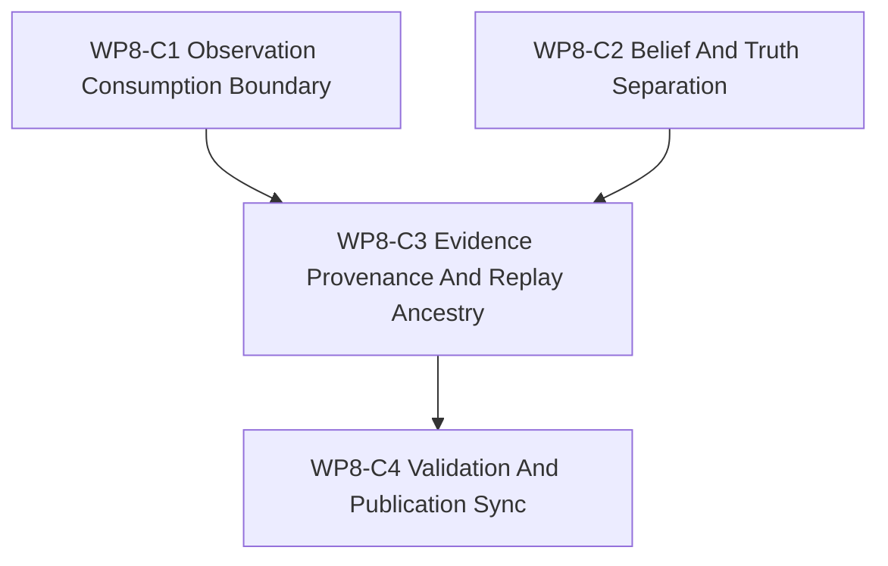

# WP8-C World-Model Interface And Learning Evidence

Status: `2026-05-20` complete / accepted WP8 learning-face dispatch sheet.

Language:

- English canonical: `wp8_world_model_interface_and_learning_evidence_cluster_20260520.md`
- Chinese companion:
  [wp8_world_model_interface_and_learning_evidence_cluster_20260520.zh.md](wp8_world_model_interface_and_learning_evidence_cluster_20260520.zh.md)

Inputs:

- [WP8 SCAL Learning Face](learning_face_wp8_20260520.md)
- [WP8-A curriculum and scenario generation](wp8_curriculum_scenario_generation_cluster_20260520.md)
- [WP8-B evaluation and capability profiling](wp8_evaluation_capability_profiling_cluster_20260520.md)
- [WP7.5 training path facade bridge](../wp75_training_path_facade_bridge/training_path_facade_bridge_wp75_20260520.md)
- [WP5 validation harness](../wp5_validation_harness/validation_harness_wp5_20260519.md)
- [WP8 acceptance review](../../review/wp8_learning_face_acceptance_review_20260520.md)

Naming note:

- `WP8-C` is the world-model interface and learning-evidence slice inside the
  broader `WP8` learning-face family.
- It defines how learning consumes facade-shaped observations and records
  evidence. It does not define a second world truth.
- Any maintained training-path claim that depends on facade-shaped execution or
  observation should cite `WP7.5` as the bridge reference.

## 1. Purpose

`WP8-C` defines the boundary between learning-facing observation consumption,
derived belief, authoritative simulation truth, and learning evidence. The goal
is to let future world-model and learning work consume explicit facade-shaped
inputs without turning learned artifacts into hidden truth owners.

`WP8-C` should answer:

1. How does learning consume `ObservationPacket` data without bypassing the
   facade?
2. How does `DecisionBelief` remain derived belief rather than `World Truth`?
3. What provenance must a learning-evidence bundle carry?
4. Which replay and diagnostics ancestry fields are required before evidence
   can be compared or reviewed?
5. How does this slice depend on `WP8-A/B` vocabulary while leaving the
   maintained training-path bridge in `WP7.5`?

## 2. Scope Boundary

`WP8-C` can:

1. Define observation-consumption vocabulary for learning-facing contracts.
2. Define the explicit boundary among `ObservationPacket`, `DecisionBelief`,
   and `World Truth`.
3. Define learning-evidence identity, provenance, replay ancestry, diagnostics
   ancestry, and claim-scope fields.
4. Define doc-only acceptance checks for the evidence-boundary contract.
5. Prepare stable vocabulary for later world-model, experiment-generation, and
   learning-evidence implementation work.

`WP8-C` cannot:

1. Make learned artifacts authoritative simulation state.
2. Let learning code mutate `World Truth` outside the simulation layer.
3. Treat oracle, debug, or diagnostics-only truth access as maintained learning
   input.
4. Reopen the maintained training-path migration owned by `WP7.5`.
5. Require local RL training, replay data, or benchmark runs to validate this
   documentation slice.

## 3. Work Packages

| Work package | Status | Worker role | Reasoning budget | Goal | Output |
|--------------|--------|-------------|------------------|------|--------|
| `WP8-C1 Observation Consumption Boundary` | complete / accepted | Boundary doc author | High | Define how learning consumes facade-shaped `ObservationPacket` values, including packet refs, snapshot/barrier provenance, and view/schema refs. | observation-consumption slice |
| `WP8-C2 Belief And Truth Separation` | complete / accepted | Information-state author | High | Define how `DecisionBelief` is derived from observations, memory, or estimator state while staying separate from `World Truth`. | belief/truth boundary slice |
| `WP8-C3 Evidence Provenance And Replay Ancestry` | complete / accepted | Evidence author | High | Define learning-evidence bundles, replay ancestry, diagnostics ancestry, claim scope, and reviewability fields. | evidence/provenance slice |
| `WP8-C4 Validation And Publication Sync` | complete / accepted | Integrator | Medium | Add doc-only validation gates, align the bilingual pair, and cross-check `WP8`, `WP8-A/B`, and `WP7.5` references. | validation / sync slice |

Parallel rule:

- `WP8-C1` and `WP8-C2` may proceed in parallel once they share the same
  observation and belief terms.
- `WP8-C3` should wait until the observation and belief boundary can name the
  consumed packet and derived-belief fields.
- `WP8-C4` is serial and should only run after the other slices stabilize.

## 4. Dependency Map



Bridge rule:

- `WP8-C` may define learning-facing evidence vocabulary before world-model
  implementation exists.
- Maintained claims about training consumption of facade-shaped execution or
  observation belong to `WP7.5`, not to `WP8-C`.

## 5. Boundary Contract

The boundary below is the minimum vocabulary `WP8-C` must keep explicit.

| Layer or artifact | Owner | Allowed learning use | Must not become |
|-------------------|-------|----------------------|-----------------|
| `ObservationPacket` | Facade-exported observation surface. | Read-only learning input with declared packet id, schema/view ref, snapshot or barrier provenance, and source time. | A direct world-state mutation path or an implicit truth snapshot without provenance. |
| `DecisionBelief` | Policy, agent, estimator, or learning-side derived state. | Derived belief that names consumed observation packets, estimator or memory refs, derivation method, and belief version. | `World Truth`, oracle state, or an unlabeled shortcut around observation contracts. |
| `World Truth` | Authoritative simulation layer. | May be referenced only through approved facade exports, replay diagnostics, or explicitly labeled diagnostics-only review material. | A learning-owned fact store or a hidden source for maintained decision/evaluation claims. |
| `LearningEvidenceBundle` | Learning/evaluation evidence contract. | Reviewable bundle tying observation refs, belief refs, replay refs, diagnostics refs, scenario/curriculum refs, and claim scope together. | A support claim, benchmark pass, or truth mutation by itself. |

Observation rule:

- Learning consumes observation packets by reference and provenance. It does
  not consume raw runtime world state as a maintained input.

Belief rule:

- `DecisionBelief` must name what it consumed and how it was derived. If it
  cannot name observation, memory, or estimator ancestry, it is not a stable
  maintained belief artifact.

Truth rule:

- `World Truth` remains simulation-owned. A learning artifact can describe
  evidence about truth-adjacent diagnostics only when the diagnostic path is
  labeled and traceable.

Evidence rule:

- A learning-evidence bundle records reviewable evidence. It does not promote
  support, mutate state, or make a capability claim without the relevant
  `WP8-B` profile/evidence gate.

## 6. Learning Evidence Contract

Every learning-evidence bundle should preserve these field groups.

| Field group | Required fields | Why it matters |
|-------------|-----------------|----------------|
| Evidence identity | `evidence_id`, `evidence_version`, `contract_version`, `status` | Makes evidence referable, reviewable, and safe to revise. |
| Observation consumption | `observation_packet_ref`, `observation_view_ref`, `snapshot_version`, `barrier_id`, `source_time_s` | Keeps learning input tied to facade-shaped observation provenance. |
| Belief derivation | `decision_belief_ref`, `belief_version`, `derivation_method`, `estimator_ref`, `memory_refs` | Shows how derived belief was created and prevents belief from masquerading as truth. |
| Truth boundary | `truth_access_mode`, `truth_reference_policy`, `diagnostics_truth_ref` | Forces any truth-adjacent material to be labeled as facade export, replay, or diagnostics-only. |
| Replay ancestry | `replay_run_id`, `scenario_request_ref`, `seed_policy_ref`, `curriculum_phase_ref`, `event_ancestry_ref` | Lets reviewers reconstruct the scenario and event lineage behind the evidence. |
| Diagnostics ancestry | `diagnostics_trace_ref`, `trace_digest_ref`, `diagnostics_scope`, `diagnostics_label` | Separates review diagnostics from maintained learning input. |
| Learning output | `learning_artifact_ref`, `artifact_version`, `claim_scope`, `evaluation_profile_ref` | Keeps learned outputs bound to reviewable scope and `WP8-B` capability-profile evidence. |

Fail-closed rule:

- If an evidence bundle cannot name its observation, belief, replay, and
  diagnostics ancestry, it may remain an exploratory note. It cannot be treated
  as accepted learning evidence.

Diagnostics rule:

- Diagnostics-only truth-adjacent material may explain an evaluation or replay.
  It must not become maintained policy input, maintained training input, or a
  support claim.

Replay rule:

- Replay ancestry must be explicit enough for a reviewer to identify the
  scenario request, seed policy, curriculum phase, and event lineage involved.
  A success log without ancestry is not sufficient evidence.

## 7. Dispatch Plan

| Stream | Main concern | Notes |
|--------|--------------|-------|
| `WP8-C1 Observation Consumption Boundary` | Observation packet refs, view refs, snapshot/barrier metadata, and read-only facade consumption. | Depends on `WP7.5` for the maintained facade-shaped observation bridge. |
| `WP8-C2 Belief And Truth Separation` | `DecisionBelief` derivation, memory/estimator ancestry, and truth ownership boundaries. | Highest-risk slice for hidden truth leakage. |
| `WP8-C3 Evidence Provenance And Replay Ancestry` | Evidence bundle fields, replay lineage, diagnostics trace refs, and claim scope. | Should consume `WP8-A` scenario/seed vocabulary and `WP8-B` profile/evidence vocabulary. |
| `WP8-C4 Validation And Publication Sync` | Doc-only gates, bilingual alignment, and bridge cross-checks. | Serial publication pass. |

## 8. Required Acceptance Artifacts

No `WP8-C` gate may be reported as passed unless the acceptance packet contains
all required artifacts below.

| Artifact | Required status | Purpose |
|----------|-----------------|---------|
| `docs/task/simulation_architecture/wp8_learning_face/wp8_world_model_interface_and_learning_evidence_cluster_20260520.md` | required | Normative English definition of the WP8-C world-model/evidence boundary slice. |
| `docs/task/simulation_architecture/wp8_learning_face/wp8_world_model_interface_and_learning_evidence_cluster_20260520.zh.md` | required | Chinese companion for the same normative rules. |
| `docs/task/simulation_architecture/wp8_learning_face/wp8_curriculum_scenario_generation_cluster_20260520.md` | required | Upstream scenario, seed, and curriculum request vocabulary. |
| `docs/task/simulation_architecture/wp8_learning_face/wp8_evaluation_capability_profiling_cluster_20260520.md` | required | Upstream benchmark, profile, score, and evidence vocabulary. |
| `docs/task/review/wp8_learning_face_acceptance_review_20260520.md` | required | English acceptance record with gate-by-gate evidence and final verdict. |
| `docs/task/review/wp8_learning_face_acceptance_review_20260520.zh.md` | required | Chinese acceptance record. |

Artifact rule:

- If any required artifact is missing, the acceptance result is `fail`.
- If an artifact exists but collapses `ObservationPacket`, `DecisionBelief`,
  and `World Truth`, the acceptance result is `fail`.
- A success log, benchmark score, or chat summary does not replace a traceable
  learning-evidence bundle.

## 9. Strict Gate Rules

Each gate below must be evaluated independently in the acceptance review. A
gate may end only as `pass`, `fail`, or `blocked`.

| Gate | Required evidence | Pass rule | Fail rule | Blocked-environment downgrade |
|------|-------------------|-----------|-----------|-------------------------------|
| `WP8-C1 Observation Consumption Boundary` | The acceptance review must name the observation-consumption sections checked, list the packet/view/provenance fields, and cite the exact document checks used to confirm learning consumes facade-shaped observations by reference. | Pass only if learning consumption is documented as read-only facade-shaped observation use with packet, snapshot/barrier, and source-time provenance. | Fail if learning consumes raw world state as maintained input, if observation provenance is absent, or if facade consumption is only implied. | If local cross-reference validation is blocked, record `blocked` with the exact check, exact blocker, and limited static claim that remains. |
| `WP8-C2 Belief And Truth Separation` | The acceptance review must name the belief/truth boundary sections checked, state how `ObservationPacket`, `DecisionBelief`, and `World Truth` remain distinct, and cite the exact document checks used to confirm the separation. | Pass only if `DecisionBelief` is explicitly derived from observation, memory, or estimator ancestry and `World Truth` remains simulation-owned. | Fail if belief is treated as truth, if learned artifacts mutate authoritative state, or if diagnostics-only truth material becomes maintained input. | If a supporting reference file is missing, record `blocked` with the exact check and blocker. |
| `WP8-C3 Evidence Provenance And Replay Ancestry` | The acceptance review must name the evidence contract sections checked, list the provenance, replay, and diagnostics fields, and cite the exact document checks used to verify ancestry. | Pass only if evidence bundles record observation refs, belief refs, replay ancestry, diagnostics ancestry, and claim scope without becoming support claims by themselves. | Fail if evidence lacks ancestry, if success logs stand in for provenance, or if evidence is used to promote support without `WP8-B` gates. | If replay or diagnostics data is unavailable, record `blocked` only for runtime data validation and preserve the doc-only claim separately. |
| `WP8-C4 Validation And Publication Sync` | The acceptance review must confirm the bilingual pair is aligned, cross references point to `WP8-A/B` and `WP7.5`, and the exact doc-only validation commands are listed. | Pass only if the pair is structurally aligned and validation claims stay doc-only. | Fail if bilingual structure drifts, bridge references are missing, or validation wording implies runtime evidence that was not run. | If publication checks are blocked by environment limits, record `blocked` and keep the gate unresolved. |

Decision rule:

- `pass` requires all required evidence for that gate and no contradictory
  evidence in the same review packet.
- `fail` is mandatory when required evidence is missing, contradicted, or
  replaced by intention-only wording.
- `blocked` is allowed only for environment or machine limitations and must
  preserve the gate as unresolved.

## 10. Validation Commands

```bash
git diff --check
rg -n "WP8-C|world-model|World Truth|ObservationPacket|DecisionBelief|learning evidence|provenance|replay|diagnostics ancestry|WP7.5" docs/task/simulation_architecture/wp8_learning_face/wp8_world_model_interface_and_learning_evidence_cluster_20260520*.md docs/task/simulation_architecture/wp8_learning_face/learning_face_wp8_20260520*.md docs/task/simulation_architecture/wp75_training_path_facade_bridge/training_path_facade_bridge_wp75_20260520*.md docs/task/review
```

Validation wording rule:

- If a command runs and passes, the acceptance review should say `passed` and
  include the exact command.
- If a command runs and fails, the acceptance review should say `failed` and
  include the exact command plus the failing symptom.
- If a command cannot run, the acceptance review should say `blocked` and
  include the exact command, exact blocker, and the limited doc-only claim that
  remains.

## 11. Non-Goals

- Full RL training on the local machine.
- A world-model implementation or benchmark runner.
- A new runtime path that bypasses the simulation layer.
- Treating `DecisionBelief` or learned artifacts as authoritative `World Truth`.
- Using diagnostics-only truth material as maintained learning input.
- Rewriting the maintained training-path bridge that belongs to `WP7.5`.
