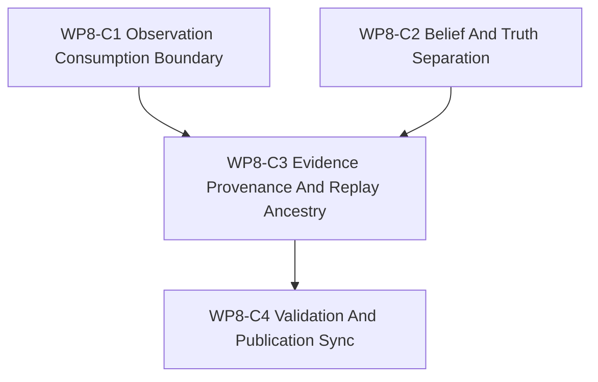

# WP8-C World-Model 接口与学习证据

状态：`2026-05-20` 的 WP8 学习面分发单，已完成 / 已验收。

语言版本：

- 英文主文：
  [wp8_world_model_interface_and_learning_evidence_cluster_20260520.md](wp8_world_model_interface_and_learning_evidence_cluster_20260520.md)
- 中文辅文：`wp8_world_model_interface_and_learning_evidence_cluster_20260520.zh.md`

输入：

- [WP8 SCAL 学习面](learning_face_wp8_20260520.zh.md)
- [WP8-A 课程与场景生成](wp8_curriculum_scenario_generation_cluster_20260520.zh.md)
- [WP8-B evaluation 与 capability profiling](wp8_evaluation_capability_profiling_cluster_20260520.zh.md)
- [WP7.5 训练路径 facade 桥接](../wp75_training_path_facade_bridge/training_path_facade_bridge_wp75_20260520.zh.md)
- [WP5 验证套件](../wp5_validation_harness/validation_harness_wp5_20260519.zh.md)
- [WP8 验收审查](../../review/wp8_learning_face_acceptance_review_20260520.zh.md)

命名说明：

- `WP8-C` 是更大 `WP8` 学习面任务族中的 world-model 接口与学习证据切片。
- 它定义学习如何消费 facade-shaped observation 并记录 evidence，不定义第二套
  world truth。
- 任何依赖 facade-shaped execution 或 observation 的维护中训练路径声明，都应
  引用 `WP7.5` 作为桥接参考。

## 1. 目的

`WP8-C` 定义 learning-facing observation consumption、derived belief、权威
simulation truth 与 learning evidence 之间的边界。目标是让未来 world-model 与
学习工作能够消费显式的 facade-shaped 输入，而不会把 learned artifact 变成隐藏
truth owner。

`WP8-C` 需要回答：

1. learning 如何消费 `ObservationPacket`，同时不绕过 facade？
2. `DecisionBelief` 如何保持为 derived belief，而不是 `World Truth`？
3. learning-evidence bundle 必须携带哪些 provenance？
4. evidence 可比较或可审查之前，必须有哪些 replay 与 diagnostics ancestry 字段？
5. 本切片如何依赖 `WP8-A/B` 词汇，同时把维护中训练路径桥接留在 `WP7.5`？

## 2. 范围边界

`WP8-C` 可以：

1. 定义 learning-facing contract 的 observation-consumption 词汇。
2. 定义 `ObservationPacket`、`DecisionBelief` 与 `World Truth` 的显式边界。
3. 定义 learning-evidence identity、provenance、replay ancestry、diagnostics
   ancestry 与 claim-scope 字段。
4. 定义 evidence-boundary contract 的 doc-only 验收检查。
5. 为后续 world-model、experiment-generation 与 learning-evidence 实现准备稳定词汇。

`WP8-C` 不可以：

1. 让 learned artifact 成为权威仿真状态。
2. 让 learning code 在仿真层之外修改 `World Truth`。
3. 把 oracle、debug 或 diagnostics-only truth access 当作维护中的 learning input。
4. 重新打开由 `WP7.5` 负责的维护中训练路径迁移。
5. 依赖本地 RL 训练、replay 数据或 benchmark run 来验证本文档切片。

## 3. 工作包

| 工作包 | 状态 | Worker 角色 | 推理预算 | 目标 | 产出 |
|--------|------|-------------|----------|------|------|
| `WP8-C1 Observation Consumption Boundary` | complete / accepted | 边界文档作者 | 高 | 定义 learning 如何消费 facade-shaped `ObservationPacket`，包括 packet ref、snapshot/barrier provenance 与 view/schema ref。 | observation-consumption 切片 |
| `WP8-C2 Belief And Truth Separation` | complete / accepted | 信息状态作者 | 高 | 定义 `DecisionBelief` 如何从 observation、memory 或 estimator state 派生，同时与 `World Truth` 分离。 | belief/truth boundary 切片 |
| `WP8-C3 Evidence Provenance And Replay Ancestry` | complete / accepted | 证据作者 | 高 | 定义 learning-evidence bundle、replay ancestry、diagnostics ancestry、claim scope 与 reviewability 字段。 | evidence/provenance 切片 |
| `WP8-C4 Validation And Publication Sync` | complete / accepted | 集成人员 | 中 | 添加 doc-only 验收 gate、对齐双语版本，并交叉检查 `WP8`、`WP8-A/B` 与 `WP7.5` 引用。 | 验证 / 同步切片 |

并行规则：

- `WP8-C1` 与 `WP8-C2` 在共享同一套 observation 与 belief 术语后可以并行。
- `WP8-C3` 应等待 observation 与 belief 边界能够命名 consumed packet 与
  derived-belief 字段。
- `WP8-C4` 为串行步骤，只应在其他切片稳定后执行。

## 4. 依赖图



桥接规则：

- `WP8-C` 可以先定义 learning-facing evidence 词汇，哪怕 world-model 实现尚不存在。
- 有关训练消费 facade-shaped execution 或 observation 的维护中声明属于 `WP7.5`，
  不属于 `WP8-C`。

## 5. 边界契约

下表是 `WP8-C` 必须保持显式的最小词汇。

| 层或产物 | Owner | 允许的 learning 用法 | 不得变成 |
|----------|-------|----------------------|----------|
| `ObservationPacket` | Facade-exported observation surface。 | 带有 packet id、schema/view ref、snapshot 或 barrier provenance 与 source time 的只读 learning input。 | 直接 world-state mutation path，或没有 provenance 的隐式 truth snapshot。 |
| `DecisionBelief` | Policy、agent、estimator 或 learning-side derived state。 | Derived belief，必须命名 consumed observation packet、estimator 或 memory ref、derivation method 与 belief version。 | `World Truth`、oracle state，或绕过 observation contract 的未标注捷径。 |
| `World Truth` | 权威仿真层。 | 只能通过已批准的 facade export、replay diagnostics 或明确标注为 diagnostics-only 的 review material 引用。 | learning-owned fact store，或维护中 decision/evaluation claim 的隐藏来源。 |
| `LearningEvidenceBundle` | Learning/evaluation evidence contract。 | 将 observation ref、belief ref、replay ref、diagnostics ref、scenario/curriculum ref 与 claim scope 绑定在一起的可审查 bundle。 | 它自身不能成为 support claim、benchmark pass 或 truth mutation。 |

Observation 规则：

- Learning 通过引用与 provenance 消费 observation packet，不把 raw runtime world
  state 作为维护中输入。

Belief 规则：

- `DecisionBelief` 必须命名它消费了什么以及如何派生。如果它不能命名
  observation、memory 或 estimator ancestry，就不是稳定的维护中 belief artifact。

Truth 规则：

- `World Truth` 仍由 simulation 拥有。learning artifact 只有在 diagnostic path
  已标注且可追踪时，才可以描述 truth-adjacent diagnostics 的 evidence。

Evidence 规则：

- learning-evidence bundle 记录可审查 evidence。它不晋级 support、不修改 state，
  也不能在缺少相关 `WP8-B` profile/evidence gate 时产生 capability claim。

## 6. Learning Evidence 契约

每个 learning-evidence bundle 都应保留下列字段组。

| 字段组 | 必需字段 | 作用 |
|--------|----------|------|
| Evidence 标识 | `evidence_id`, `evidence_version`, `contract_version`, `status` | 让 evidence 可引用、可审查，并且可以安全修订。 |
| Observation consumption | `observation_packet_ref`, `observation_view_ref`, `snapshot_version`, `barrier_id`, `source_time_s` | 将 learning input 绑定到 facade-shaped observation provenance。 |
| Belief derivation | `decision_belief_ref`, `belief_version`, `derivation_method`, `estimator_ref`, `memory_refs` | 展示 derived belief 如何生成，并防止 belief 冒充 truth。 |
| Truth boundary | `truth_access_mode`, `truth_reference_policy`, `diagnostics_truth_ref` | 强制任何 truth-adjacent material 被标注为 facade export、replay 或 diagnostics-only。 |
| Replay ancestry | `replay_run_id`, `scenario_request_ref`, `seed_policy_ref`, `curriculum_phase_ref`, `event_ancestry_ref` | 让 reviewer 能重建 evidence 背后的 scenario 与 event lineage。 |
| Diagnostics ancestry | `diagnostics_trace_ref`, `trace_digest_ref`, `diagnostics_scope`, `diagnostics_label` | 将 review diagnostics 与维护中 learning input 分离。 |
| Learning output | `learning_artifact_ref`, `artifact_version`, `claim_scope`, `evaluation_profile_ref` | 让 learned output 绑定到可审查 scope 与 `WP8-B` capability-profile evidence。 |

Fail-closed 规则：

- 如果 evidence bundle 不能命名 observation、belief、replay 与 diagnostics
  ancestry，它可以保留为 exploratory note，但不能被视为已验收 learning evidence。

Diagnostics 规则：

- diagnostics-only truth-adjacent material 可以解释 evaluation 或 replay。它不得成为
  维护中的 policy input、维护中的 training input 或 support claim。

Replay 规则：

- replay ancestry 必须足够显式，使 reviewer 能识别涉及的 scenario request、seed
  policy、curriculum phase 与 event lineage。没有 ancestry 的 success log 不足以
  成为 evidence。

## 7. 分发计划

| 流 | 主要关注点 | 备注 |
|----|------------|------|
| `WP8-C1 Observation Consumption Boundary` | observation packet ref、view ref、snapshot/barrier metadata 与只读 facade consumption。 | 依赖 `WP7.5` 作为维护中的 facade-shaped observation bridge。 |
| `WP8-C2 Belief And Truth Separation` | `DecisionBelief` 派生、memory/estimator ancestry 与 truth ownership 边界。 | 对 hidden truth leakage 风险最高。 |
| `WP8-C3 Evidence Provenance And Replay Ancestry` | evidence bundle 字段、replay lineage、diagnostics trace ref 与 claim scope。 | 应消费 `WP8-A` scenario/seed 词汇与 `WP8-B` profile/evidence 词汇。 |
| `WP8-C4 Validation And Publication Sync` | doc-only gates、双语对齐与 bridge 交叉检查。 | 串行发布步骤。 |

## 8. 必需验收产物

任何 `WP8-C` gate 若要报告为通过，验收包必须包含下列全部产物。

| 产物 | 必需状态 | 作用 |
|------|----------|------|
| `docs/task/simulation_architecture/wp8_learning_face/wp8_world_model_interface_and_learning_evidence_cluster_20260520.md` | required | `WP8-C` world-model/evidence boundary 切片的英文规范定义。 |
| `docs/task/simulation_architecture/wp8_learning_face/wp8_world_model_interface_and_learning_evidence_cluster_20260520.zh.md` | required | 同一套规则的中文辅文。 |
| `docs/task/simulation_architecture/wp8_learning_face/wp8_curriculum_scenario_generation_cluster_20260520.md` | required | 上游 scenario、seed 与 curriculum request 词汇。 |
| `docs/task/simulation_architecture/wp8_learning_face/wp8_evaluation_capability_profiling_cluster_20260520.md` | required | 上游 benchmark、profile、score 与 evidence 词汇。 |
| `docs/task/review/wp8_learning_face_acceptance_review_20260520.md` | required | 英文验收记录，必须逐 gate 写明证据与最终判定。 |
| `docs/task/review/wp8_learning_face_acceptance_review_20260520.zh.md` | required | 中文验收记录。 |

产物规则：

- 任一必需产物缺失，则验收结果必须为 `fail`。
- 产物存在但把 `ObservationPacket`、`DecisionBelief` 与 `World Truth` 混成一层，
  也必须为 `fail`。
- success log、benchmark score 或聊天摘要不能替代可追踪的 learning-evidence
  bundle。

## 9. 严格 Gate 规则

下表中的每个 gate 都必须在 acceptance review 中独立判定。每个 gate 只能以
`pass`、`fail` 或 `blocked` 收束。

| Gate | Required evidence | Pass 口径 | Fail 口径 | 环境阻塞降级表述 |
|------|-------------------|-----------|-----------|------------------|
| `WP8-C1 Observation Consumption Boundary` | 验收审查必须点名 observation-consumption 部分，列出 packet/view/provenance 字段，并写出用于确认 learning 通过引用消费 facade-shaped observation 的精确文档检查。 | 只有当 learning consumption 被文档化为只读 facade-shaped observation 使用，并携带 packet、snapshot/barrier 与 source-time provenance 时，才能 `pass`。 | 如果 learning 把 raw world state 作为维护中输入、缺少 observation provenance，或只暗示 facade consumption，则必须 `fail`。 | 如果本地交叉引用验证受阻，必须记为 `blocked`，并写出精确检查、精确阻塞点以及剩余的有限静态结论。 |
| `WP8-C2 Belief And Truth Separation` | 验收审查必须点名 belief/truth boundary 部分，说明 `ObservationPacket`、`DecisionBelief` 与 `World Truth` 如何保持区分，并写出用于确认分离关系的精确文档检查。 | 只有当 `DecisionBelief` 明确从 observation、memory 或 estimator ancestry 派生，且 `World Truth` 仍由 simulation 拥有时，才能 `pass`。 | 如果 belief 被当成 truth、learned artifact 修改权威状态，或 diagnostics-only truth material 变成维护中输入，则必须 `fail`。 | 如果缺少支撑参考文件，必须记为 `blocked`，并写出精确检查与阻塞点。 |
| `WP8-C3 Evidence Provenance And Replay Ancestry` | 验收审查必须点名 evidence contract 部分，列出 provenance、replay 与 diagnostics 字段，并写出用于验证 ancestry 的精确文档检查。 | 只有当 evidence bundle 记录 observation ref、belief ref、replay ancestry、diagnostics ancestry 与 claim scope，且自身不变成 support claim 时，才能 `pass`。 | 如果 evidence 缺少 ancestry、success log 代替 provenance，或 evidence 绕过 `WP8-B` gate 晋级 support，则必须 `fail`。 | 如果 replay 或 diagnostics data 不可用，只能把运行时数据验证记为 `blocked`，并把 doc-only 结论分开保留。 |
| `WP8-C4 Validation And Publication Sync` | 验收审查必须确认双语版本对齐，交叉引用正确指向 `WP8-A/B` 与 `WP7.5`，并列出精确的 doc-only 验证命令。 | 只有当双语结构对齐且验证声明保持 doc-only 时，才能 `pass`。 | 如果双语结构漂移、桥接引用缺失，或验证措辞暗示未实际运行的 runtime evidence，则必须 `fail`。 | 如果发布检查因环境限制而受阻，必须记为 `blocked`，并保持该 gate 未决。 |

判定总规则：

- `pass` 要求该 gate 的全部 required evidence 到位，且同一份 review 中没有相互矛盾的证据。
- 只要 required evidence 缺失、被反证、或被“意图性表述”替代，就必须 `fail`。
- `blocked` 只允许用于环境或机器限制，并且必须保持 gate 处于未解决状态。

## 10. 验证命令

```bash
git diff --check
rg -n "WP8-C|world-model|World Truth|ObservationPacket|DecisionBelief|learning evidence|provenance|replay|diagnostics ancestry|WP7.5" docs/task/simulation_architecture/wp8_learning_face/wp8_world_model_interface_and_learning_evidence_cluster_20260520*.md docs/task/simulation_architecture/wp8_learning_face/learning_face_wp8_20260520*.md docs/task/simulation_architecture/wp75_training_path_facade_bridge/training_path_facade_bridge_wp75_20260520*.md docs/task/review
```

验证表述规则：

- 命令执行并通过时，acceptance review 应写 `passed`，并附精确命令。
- 命令执行并失败时，acceptance review 应写 `failed`，并附精确命令与失败现象。
- 命令无法执行时，acceptance review 应写 `blocked`，并附精确命令、精确阻塞点以及
  仍可保留的有限文档结论。

## 11. 非目标

- 在本机上完成完整 RL 训练。
- world-model 实现或 benchmark runner。
- 建立绕过仿真层的新运行时路径。
- 把 `DecisionBelief` 或 learned artifact 当作权威 `World Truth`。
- 把 diagnostics-only truth material 作为维护中 learning input。
- 重写属于 `WP7.5` 的维护中训练路径桥接。
