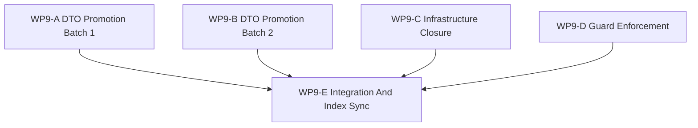

# WP9 Contract And Infrastructure Closure

Status: `2026-05-20` complete / accepted closure package.

Language:

- English canonical: `contract_infrastructure_closure_wp9_20260520.md`
- Chinese companion:
  [contract_infrastructure_closure_wp9_20260520.zh.md](contract_infrastructure_closure_wp9_20260520.zh.md)

Inputs:

- [consolidated remaining work and roadmap](../../review/consolidated_remaining_work_and_roadmap_20260520.md)
- [simulation system architecture design](../../../plan/architecture/simulation_system_architecture_design.md)
- [WP2.5 scheduler semantics freeze](../wp25_scheduler_semantics/scheduler_semantics_wp25_20260519.md)
- [WP3 engagement pilot](../wp3_engagement_pilot/engagement_pilot_wp3_20260519.md)
- [WP4 facade alignment acceptance review](../../review/archive/wp-acceptance/wp4_facade_alignment_acceptance_review_20260519.md)
- [WP5 validation harness acceptance review](../../review/archive/wp-acceptance/wp5_validation_harness_acceptance_review_20260519.md)
- [WP6 backend profile policy acceptance review](../../review/archive/wp-acceptance/wp6_backend_profile_policy_acceptance_review_20260519.md)
- [WP7.5 training path facade bridge acceptance review](../../review/archive/wp-acceptance/wp75_training_path_facade_bridge_acceptance_review_20260520.md)
- [WP8 learning face acceptance review](../../review/archive/wp-acceptance/wp8_learning_face_acceptance_review_20260520.md)
- [Subagent Usage Policy](../../../standards/governance/subagent_usage_policy.md)

## 1. Purpose

WP9 closes the deferred contract and infrastructure items that accumulated
across accepted `WP3-WP8` reviews. It is not a new architecture discovery
phase. It promotes known DTOs, patches small infrastructure gaps, and turns
guard follow-up items into maintained tests.

WP9 should answer:

1. Which deferred DTOs are now typed C++/facade/Python contracts?
2. Which infrastructure residuals are closed by docs, registry entries, or a
   narrow facade method?
3. Which raw or compatibility surfaces remain allowed, and under what
   allowlist labels?
4. Which indexes, bilingual docs, and acceptance records prove the closure?

## 2. Scope Boundary

WP9 can:

1. Add typed request/result DTOs for reward, termination, observation view,
   action intent, coordination intent, agent role, and decision belief.
2. Add provenance metadata to existing observation packet surfaces.
3. Add focused facade/query surfaces for diagnostics where accepted reviews
   already identified a gap.
4. Patch architecture/task docs for naming, capability trigger, manifest
   registry, facade split threshold, and WP3 event capture residuals.
5. Add or promote tests that enforce the accepted boundaries.
6. Publish a final integration and acceptance packet.

WP9 cannot:

1. Reopen accepted `WP0-WP8` architecture decisions.
2. Promote exact GPU, resident-state, shadow, or multi-fidelity candidates.
3. Add a second runtime lifecycle or make learning artifacts truth sources.
4. Replace later scheduler implementation work; it may only close deferred
   scheduler-contract wording and examples.
5. Hide broad bans behind brittle tests without a documented allowlist.

## 3. Work Packages

| Work package | Status | Goal | Output |
|--------------|--------|------|--------|
| `WP9-A DTO Promotion Batch 1` | complete / accepted | Promote reward, termination, observation batch metadata, and observation view contracts. | [DTO batch 1 task slice](wp9_dto_promotion_batch1_cluster_20260520.md) |
| `WP9-B DTO Promotion Batch 2` | complete / accepted | Promote action intent, coordination intent, agent role, and decision belief contracts. | [DTO batch 2 task slice](wp9_dto_promotion_batch2_cluster_20260520.md) |
| `WP9-C Infrastructure Closure` | complete / accepted with tracked residual | Close naming, diagnostics, capability trigger, manifest registry, facade split, and WP3 event residuals. | [infrastructure closure task slice](wp9_infrastructure_closure_cluster_20260520.md) |
| `WP9-D Guard Enforcement` | complete / accepted | Add the documented `sim.*` allowlist guard and promote binding surface smoke. | [guard enforcement task slice](wp9_guard_enforcement_cluster_20260520.md), [guard allowlist evidence](wp9_guard_allowlist_evidence_20260520.md) |
| `WP9-E Integration And Index Sync` | complete / accepted | Reconcile cross references, bilingual alignment, review evidence, and final acceptance. | [integration task slice](wp9_integration_and_index_sync_cluster_20260520.md), [acceptance review](../../review/wp9_contract_infrastructure_closure_acceptance_review_20260520.md) |

## 4. Dependency Map



Parallel rule:

- `WP9-A`, `WP9-B`, `WP9-C`, and `WP9-D` may run in parallel if their write
  scopes remain disjoint.
- `WP9-E` is serial and owns final binding/index reconciliation.
- If two workers need the same file, the earlier worker must stop at notes or
  tests and leave the shared edit to `WP9-E`.

## 5. Dispatch Plan

| Stream | Main concern | Write-scope rule | Budget |
|--------|--------------|------------------|--------|
| `WP9-A` | DTO-1 through DTO-4: `RewardReport`, `TerminationSpec`, observation metadata, `ObservationViewSpec`. | Prefer new or clearly owned contract headers/tests; avoid editing `bindings_runtime.cpp` concurrently with `WP9-B` unless acting as the integration owner. | High / xhigh. |
| `WP9-B` | DTO-5 through DTO-8: `ActionIntentPacket`, `CoordinationIntentPacket`, `AgentRole`, `DecisionBelief`. | Prefer separate intent/decision contract headers/tests; leave shared binding glue to `WP9-E` if `WP9-A` is active. | High / xhigh. |
| `WP9-C` | INF-1 through INF-7. | Own docs, scheduler manifest examples, diagnostics facade method, and WP3 event-capture/event-storage implementation if touched. | High. |
| `WP9-D` | GUA-1/GUA-2 allowlist and smoke promotion. | Own architecture guard tests, allowlist docs, and binding smoke test updates only. | Medium-high. |
| `WP9-E` | Final publication. | Own README/review/index/bilingual sync and any shared binding or CMake glue left by A/B. | High. |

Worker rule:

- Use the project [Subagent Usage Policy](../../../standards/governance/subagent_usage_policy.md).
- Keep one writer per file unless the main thread explicitly grants the
  integration role.
- Return touched files, commands run, blockers, and any unmerged integration
  notes.

## 6. Required Acceptance Artifacts

No `WP9` gate may be reported as accepted unless the acceptance packet includes
all required artifacts below.

| Artifact | Required status | Purpose |
|----------|-----------------|---------|
| `docs/task/simulation_architecture/wp9_contract_infrastructure_closure/contract_infrastructure_closure_wp9_20260520.md` | required | Normative English definition of WP9 scope, streams, and gate rules. |
| `docs/task/simulation_architecture/wp9_contract_infrastructure_closure/contract_infrastructure_closure_wp9_20260520.zh.md` | required | Chinese companion for the same normative rules. |
| `docs/task/simulation_architecture/wp9_contract_infrastructure_closure/wp9_dto_promotion_batch1_cluster_20260520.md` | required | English WP9-A DTO batch 1 task slice. |
| `docs/task/simulation_architecture/wp9_contract_infrastructure_closure/wp9_dto_promotion_batch1_cluster_20260520.zh.md` | required | Chinese WP9-A companion. |
| `docs/task/simulation_architecture/wp9_contract_infrastructure_closure/wp9_dto_promotion_batch2_cluster_20260520.md` | required | English WP9-B DTO batch 2 task slice. |
| `docs/task/simulation_architecture/wp9_contract_infrastructure_closure/wp9_dto_promotion_batch2_cluster_20260520.zh.md` | required | Chinese WP9-B companion. |
| `docs/task/simulation_architecture/wp9_contract_infrastructure_closure/wp9_infrastructure_closure_cluster_20260520.md` | required | English WP9-C infrastructure closure task slice. |
| `docs/task/simulation_architecture/wp9_contract_infrastructure_closure/wp9_infrastructure_closure_cluster_20260520.zh.md` | required | Chinese WP9-C companion. |
| `docs/task/simulation_architecture/wp9_contract_infrastructure_closure/wp9_guard_enforcement_cluster_20260520.md` | required | English WP9-D guard enforcement task slice. |
| `docs/task/simulation_architecture/wp9_contract_infrastructure_closure/wp9_guard_enforcement_cluster_20260520.zh.md` | required | Chinese WP9-D companion. |
| `docs/task/simulation_architecture/wp9_contract_infrastructure_closure/wp9_integration_and_index_sync_cluster_20260520.md` | required | English WP9-E integration task slice. |
| `docs/task/simulation_architecture/wp9_contract_infrastructure_closure/wp9_integration_and_index_sync_cluster_20260520.zh.md` | required | Chinese WP9-E companion. |
| `docs/task/review/wp9_contract_infrastructure_closure_acceptance_review_20260520.md` | required before acceptance | English final acceptance decision record. |
| `docs/task/review/wp9_contract_infrastructure_closure_acceptance_review_20260520.zh.md` | required before acceptance | Chinese final acceptance decision record. |

Artifact rule:

- Missing artifacts keep WP9 open.
- Code-only changes without the acceptance review do not count as accepted.
- Documentation-only claims cannot promote an implementation gate unless the
  focused tests or explicit blocked evidence are included.

## 7. Strict Gate Rules

| Gate | Required evidence | Pass rule | Fail rule | Blocked-environment downgrade |
|------|-------------------|-----------|-----------|-------------------------------|
| `WP9-A DTO Promotion Batch 1` | The review names the DTO headers, facade/binding surfaces, and focused tests checked for `RewardReport`, `TerminationSpec`, observation metadata, and `ObservationViewSpec`. | Pass only if typed C++ fields, Python access, and tests exist or the review explicitly records a blocked binding environment. | Fail if any DTO remains string-only/implicit without a documented compatibility reason. | If bindings cannot be rebuilt locally, record exact command, blocker, and static checks that still passed. |
| `WP9-B DTO Promotion Batch 2` | The review names the typed intent/role/belief contracts, facade/binding surfaces, and focused tests. | Pass only if action/coordination intent, role, and belief boundaries are typed and do not grant raw state mutation. | Fail if `DecisionBelief` consumes truth state as maintained or if intent merge semantics are implicit. | If runtime validation is blocked, keep the implementation gate open and publish only static evidence. |
| `WP9-C Infrastructure Closure` | The review lists each INF-1 through INF-7 item and the exact patch/test/document that closes it. | Pass only if every infrastructure residual is either closed or explicitly deferred with a new owner and reason. | Fail if any residual disappears from tracking or is reworded as done without evidence. | Environment blockers may only apply to runtime/event-capture tests, not doc patches. |
| `WP9-D Guard Enforcement` | The review names the allowlist document/test and the binding smoke promotion test. | Pass only if the broad guard has an explicit allowlist and does not ban diagnostics/compatibility paths accidentally. | Fail if a brittle global ban lands without provenance labels or if binding smoke still misses the empty packet-shell case. | If extension import is blocked, record exact import command and retain static AST checks. |
| `WP9-E Integration And Index Sync` | The review confirms README, architecture cross references, bilingual pairs, and final validation commands. | Pass only after A-D are checked and the acceptance review is published in both languages. | Fail if indexes drift, bilingual docs disagree in status, or shared binding glue is unresolved. | Index and doc checks should not be blocked by runtime environment. |

Decision rule:

- `pass` requires evidence for all required outputs in that gate.
- `fail` is mandatory when required evidence is missing or contradicted.
- `blocked` is allowed only for environment limitations and must preserve the
  gate as unresolved.

## 8. Validation Commands

```bash
git diff --check
rg -n "WP9|Contract And Infrastructure Closure|RewardReport|TerminationSpec|ObservationViewSpec|ActionIntentPacket|CoordinationIntentPacket|AgentRole|DecisionBelief|DiagnosticsTrace|StageNodeManifest|sim\\.\\*" docs/task/simulation_architecture docs/task/review docs/plan/architecture
pytest tests/architecture tests/runtime/bindings tests/runtime/engagement tests/runtime/facade
```

Validation wording rule:

- If a command runs and passes, the acceptance review should say `passed` and
  include the exact command.
- If a command runs and fails, the acceptance review should say `failed` and
  include the exact command plus the failing symptom.
- If a command cannot run, the acceptance review should say `blocked` and
  include the exact command, exact blocker, and next environment needed.

## 9. Non-Goals

- Full scheduler implementation.
- Backend capability promotion.
- Full RL training or learning-loop execution.
- Large facade refactor before the documented split threshold is reached.
- Silent compatibility breaks for existing Python consumers.
