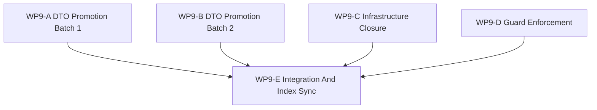

# WP9 Contract And Infrastructure Closure

状态：`2026-05-20` complete / accepted 闭合工作包。

语言版本：

- 英文主文：[contract_infrastructure_closure_wp9_20260520.md](contract_infrastructure_closure_wp9_20260520.md)
- 中文辅文：`contract_infrastructure_closure_wp9_20260520.zh.md`

输入：

- [剩余工作整合与路线图](../../review/consolidated_remaining_work_and_roadmap_20260520.zh.md)
- [仿真系统架构设计](../../../plan/architecture/simulation_system_architecture_design.zh.md)
- [WP2.5 调度语义冻结](../wp25_scheduler_semantics/scheduler_semantics_wp25_20260519.zh.md)
- [WP3 交战试点](../wp3_engagement_pilot/engagement_pilot_wp3_20260519.zh.md)
- [WP4 facade 对齐验收](../../review/archive/wp-acceptance/wp4_facade_alignment_acceptance_review_20260519.zh.md)
- [WP5 验证套件验收](../../review/archive/wp-acceptance/wp5_validation_harness_acceptance_review_20260519.zh.md)
- [WP6 后端配置文件策略验收](../../review/archive/wp-acceptance/wp6_backend_profile_policy_acceptance_review_20260519.zh.md)
- [WP7.5 训练路径 facade 桥接验收](../../review/archive/wp-acceptance/wp75_training_path_facade_bridge_acceptance_review_20260520.zh.md)
- [WP8 学习面验收](../../review/archive/wp-acceptance/wp8_learning_face_acceptance_review_20260520.zh.md)
- [Subagent 使用规范](../../../standards/governance/subagent_usage_policy.zh.md)

## 1. 目的

WP9 收口 `WP3-WP8` 已验收审查中累积的延后契约与基础设施事项。它不是新的架构探索阶段，而是把已知 DTO 晋升、补小型基础设施缺口，并把 guard follow-up 转成维护中的测试。

WP9 应回答：

1. 哪些延后 DTO 已经成为 typed C++ / facade / Python 契约？
2. 哪些基础设施残项已经由文档、registry entry 或窄 facade method 关闭？
3. 哪些 raw 或 compatibility surface 仍可保留，并且使用什么 allowlist 标签？
4. 哪些索引、双语文档与验收记录证明该闭合成立？

## 2. 范围边界

WP9 可以：

1. 为 reward、termination、observation view、action intent、coordination intent、agent role 与 decision belief 添加 typed request/result DTO。
2. 为现有 observation packet surface 添加 provenance metadata。
3. 为已在验收中识别的 diagnostics gap 添加聚焦 facade/query surface。
4. 修补命名、capability trigger、manifest registry、facade split threshold 与 WP3 event capture residual 相关的架构/任务文档。
5. 添加或提升测试来执行已验收边界。
6. 发布最终 integration 与 acceptance packet。

WP9 不能：

1. 重新打开已验收的 `WP0-WP8` 架构决定。
2. 提升 exact GPU、resident-state、shadow 或 multi-fidelity candidate。
3. 添加第二条 runtime lifecycle，或让 learning artifact 成为 truth source。
4. 替代后续 scheduler implementation；它只能关闭延后的 scheduler-contract wording 与示例。
5. 在没有文档化 allowlist 的情况下用脆弱测试隐藏 broad ban。

## 3. 工作包

| 工作包 | 状态 | 目标 | 产出 |
|--------|------|------|------|
| `WP9-A DTO Promotion Batch 1` | complete / accepted | 晋升 reward、termination、observation batch metadata 与 observation view 契约。 | [DTO batch 1 任务切片](wp9_dto_promotion_batch1_cluster_20260520.zh.md) |
| `WP9-B DTO Promotion Batch 2` | complete / accepted | 晋升 action intent、coordination intent、agent role 与 decision belief 契约。 | [DTO batch 2 任务切片](wp9_dto_promotion_batch2_cluster_20260520.zh.md) |
| `WP9-C Infrastructure Closure` | complete / accepted with tracked residual | 收口命名、diagnostics、capability trigger、manifest registry、facade split 与 WP3 event residual。 | [基础设施闭合任务切片](wp9_infrastructure_closure_cluster_20260520.zh.md) |
| `WP9-D Guard Enforcement` | complete / accepted | 添加带 allowlist 的 `sim.*` guard 并提升 binding surface smoke。 | [guard enforcement 任务切片](wp9_guard_enforcement_cluster_20260520.zh.md)、[guard allowlist evidence](wp9_guard_allowlist_evidence_20260520.md) |
| `WP9-E Integration And Index Sync` | complete / accepted | 对齐交叉引用、双语文档、review evidence 与最终验收。 | [integration 任务切片](wp9_integration_and_index_sync_cluster_20260520.zh.md)、[验收审查](../../review/wp9_contract_infrastructure_closure_acceptance_review_20260520.zh.md) |

## 4. 依赖图



并行规则：

- `WP9-A`、`WP9-B`、`WP9-C` 与 `WP9-D` 在写入范围互不冲突时可并行。
- `WP9-E` 是串行步骤，负责最终 binding / index 协调。
- 如果两个 worker 需要同一文件，较早 worker 应停在 notes 或 tests，把共享编辑留给 `WP9-E`。

## 5. 分发计划

| 流 | 主要关注点 | 写入范围规则 | 预算 |
|----|------------|--------------|------|
| `WP9-A` | DTO-1 至 DTO-4：`RewardReport`、`TerminationSpec`、observation metadata、`ObservationViewSpec`。 | 优先新增或独占 contract header/tests；不要在未获 integration owner 身份时与 `WP9-B` 同时编辑 `bindings_runtime.cpp`。 | High / xhigh. |
| `WP9-B` | DTO-5 至 DTO-8：`ActionIntentPacket`、`CoordinationIntentPacket`、`AgentRole`、`DecisionBelief`。 | 优先使用独立 intent/decision contract header/tests；共享 binding glue 留给 `WP9-E`。 | High / xhigh. |
| `WP9-C` | INF-1 至 INF-7。 | 拥有 docs、scheduler manifest examples、diagnostics facade method，以及需要时的 WP3 event-capture/event-storage 实现。 | High. |
| `WP9-D` | GUA-1/GUA-2 allowlist 与 smoke promotion。 | 只拥有 architecture guard tests、allowlist docs 与 binding smoke test 更新。 | Medium-high. |
| `WP9-E` | 最终发布。 | 拥有 README/review/index/bilingual sync，以及 A/B 留下的共享 binding 或 CMake glue。 | High. |

Worker 规则：

- 使用项目 [Subagent 使用规范](../../../standards/governance/subagent_usage_policy.zh.md)。
- 除非主线程明确授予 integration role，否则每个文件同一时间只有一个 writer。
- 返回 touched files、已运行命令、blocker 与未合并 integration notes。

## 6. 必需验收产物

除非验收包包含以下必需产物，否则不得报告 `WP9` 已验收。

| 产物 | 必需状态 | 目的 |
|------|----------|------|
| `docs/task/simulation_architecture/wp9_contract_infrastructure_closure/contract_infrastructure_closure_wp9_20260520.md` | required | WP9 范围、流与 gate 规则的英文规范定义。 |
| `docs/task/simulation_architecture/wp9_contract_infrastructure_closure/contract_infrastructure_closure_wp9_20260520.zh.md` | required | 同一规范规则的中文辅文。 |
| `docs/task/simulation_architecture/wp9_contract_infrastructure_closure/wp9_dto_promotion_batch1_cluster_20260520.md` | required | 英文 WP9-A DTO batch 1 任务切片。 |
| `docs/task/simulation_architecture/wp9_contract_infrastructure_closure/wp9_dto_promotion_batch1_cluster_20260520.zh.md` | required | 中文 WP9-A 辅文。 |
| `docs/task/simulation_architecture/wp9_contract_infrastructure_closure/wp9_dto_promotion_batch2_cluster_20260520.md` | required | 英文 WP9-B DTO batch 2 任务切片。 |
| `docs/task/simulation_architecture/wp9_contract_infrastructure_closure/wp9_dto_promotion_batch2_cluster_20260520.zh.md` | required | 中文 WP9-B 辅文。 |
| `docs/task/simulation_architecture/wp9_contract_infrastructure_closure/wp9_infrastructure_closure_cluster_20260520.md` | required | 英文 WP9-C 基础设施闭合任务切片。 |
| `docs/task/simulation_architecture/wp9_contract_infrastructure_closure/wp9_infrastructure_closure_cluster_20260520.zh.md` | required | 中文 WP9-C 辅文。 |
| `docs/task/simulation_architecture/wp9_contract_infrastructure_closure/wp9_guard_enforcement_cluster_20260520.md` | required | 英文 WP9-D guard enforcement 任务切片。 |
| `docs/task/simulation_architecture/wp9_contract_infrastructure_closure/wp9_guard_enforcement_cluster_20260520.zh.md` | required | 中文 WP9-D 辅文。 |
| `docs/task/simulation_architecture/wp9_contract_infrastructure_closure/wp9_integration_and_index_sync_cluster_20260520.md` | required | 英文 WP9-E integration 任务切片。 |
| `docs/task/simulation_architecture/wp9_contract_infrastructure_closure/wp9_integration_and_index_sync_cluster_20260520.zh.md` | required | 中文 WP9-E 辅文。 |
| `docs/task/review/wp9_contract_infrastructure_closure_acceptance_review_20260520.md` | 验收前 required | 英文最终验收决策记录。 |
| `docs/task/review/wp9_contract_infrastructure_closure_acceptance_review_20260520.zh.md` | 验收前 required | 中文最终验收决策记录。 |

产物规则：

- 缺少任一必需产物时，WP9 保持 open。
- 只有代码变更而没有 acceptance review，不算验收。
- 文档检查不能替代 implementation gate，除非明确记录 focused tests 或 blocked evidence。

## 7. 严格 Gate 规则

| Gate | 必需证据 | 通过规则 | 失败规则 | 环境阻塞降级 |
|------|----------|----------|----------|--------------|
| `WP9-A DTO Promotion Batch 1` | Review 命名 `RewardReport`、`TerminationSpec`、observation metadata 与 `ObservationViewSpec` 的 DTO header、facade/binding surface 与 focused tests。 | 只有 typed C++ fields、Python access 与 tests 存在，或明确记录 binding 环境 blocker 时才可通过。 | 若任一 DTO 仍是 string-only/implicit 且没有 compatibility reason，则失败。 | 若本地无法重建 bindings，记录准确命令、blocker 与仍通过的静态检查。 |
| `WP9-B DTO Promotion Batch 2` | Review 命名 intent/role/belief typed contract、facade/binding surface 与 focused tests。 | 只有 action/coordination intent、role 与 belief boundary typed 且不授权 raw state mutation 时才可通过。 | 若 `DecisionBelief` 把 truth state 当作 maintained 来源，或 intent merge semantics 隐式化，则失败。 | 若 runtime validation 阻塞，保持 implementation gate open，只发布静态证据。 |
| `WP9-C Infrastructure Closure` | Review 列出 INF-1 至 INF-7 每一项及其关闭 patch/test/document。 | 只有每个基础设施残项已关闭，或带新 owner 与原因显式延后时才可通过。 | 若任何 residual 从跟踪中消失，或无证据地改写成 done，则失败。 | 环境 blocker 只适用于 runtime/event-capture tests，不适用于 doc patch。 |
| `WP9-D Guard Enforcement` | Review 命名 allowlist document/test 与 binding smoke promotion test。 | 只有 broad guard 有显式 allowlist，且不会误伤 diagnostics/compatibility path 时才可通过。 | 若没有 provenance labels 的 brittle global ban 落地，或 binding smoke 仍漏掉 empty packet-shell case，则失败。 | 若 extension import 阻塞，记录准确 import 命令并保留 static AST checks。 |
| `WP9-E Integration And Index Sync` | Review 确认 README、架构交叉引用、双语 pair 与最终验证命令。 | 只有 A-D 均已检查，且中英文 acceptance review 均发布后才可通过。 | 若 index drift、双语状态不一致，或 shared binding glue 未解决，则失败。 | Index 与文档检查不应被 runtime 环境阻塞。 |

决策规则：

- `pass` 需要该 gate 所有必需输出的证据。
- 当必需证据缺失或被相反证据推翻时必须 `fail`。
- `blocked` 只允许用于环境限制，并且必须保持 gate 未解决。

## 8. 验证命令

```bash
git diff --check
rg -n "WP9|Contract And Infrastructure Closure|RewardReport|TerminationSpec|ObservationViewSpec|ActionIntentPacket|CoordinationIntentPacket|AgentRole|DecisionBelief|DiagnosticsTrace|StageNodeManifest|sim\\.\\*" docs/task/simulation_architecture docs/task/review docs/plan/architecture
pytest tests/architecture tests/runtime/bindings tests/runtime/engagement tests/runtime/facade
```

验证措辞规则：

- 命令运行并通过时，acceptance review 应写 `passed` 并包含准确命令。
- 命令运行并失败时，acceptance review 应写 `failed` 并包含准确命令与失败症状。
- 命令无法运行时，acceptance review 应写 `blocked` 并包含准确命令、准确 blocker 与所需下一环境。

## 9. 非目标

- 完整 scheduler implementation。
- Backend capability promotion。
- 完整 RL 训练或 learning-loop execution。
- 在达到文档化 split threshold 前进行大型 facade refactor。
- 对现有 Python consumer 做静默 compatibility break。
