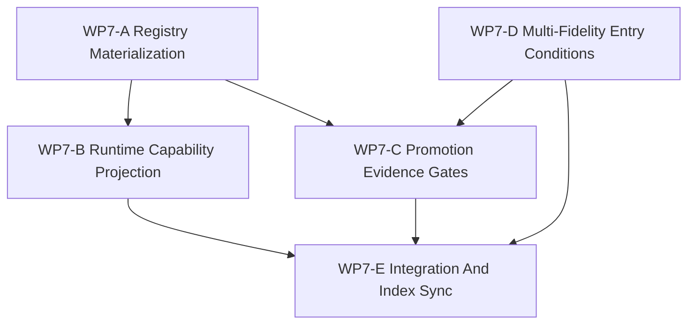

# WP7 Backend Capability Materialization

Status: `2026-05-19` planned task family for the post-WP6 implementation
preparation line.

Language:

- English canonical: `backend_capability_materialization_wp7_20260519.md`
- Chinese companion:
  [backend_capability_materialization_wp7_20260519.zh.md](backend_capability_materialization_wp7_20260519.zh.md)

Inputs:

- [simulation system architecture design](../../plan/architecture/simulation_system_architecture_design.md)
- [architecture and performance research followup](../../plan/architecture/architecture_and_performance_research_followup.md)
- [Temp-02 SCAL architecture vision review](../review/temp-02_review_20260519.md)
- [WP2.5 scheduler semantics freeze](scheduler_semantics_wp25_20260519.md)
- [WP5 validation harness](validation_harness_wp5_20260519.md)
- [WP6 backend profile policy](backend_profile_policy_wp6_20260519.md)
- [WP6-A backend profile registry](wp6_backend_profile_registry_20260519.md)
- [WP6-B parity budget registry](wp6_parity_budget_registry_20260519.md)
- [WP6-C1 resident-state boundary rules](wp6_resident_state_boundary_rules_20260519.md)
- [WP6 backend profile policy acceptance review](../review/wp6_backend_profile_policy_acceptance_review_20260519.md)

Naming note:

- Older source reviews used `WP7` as a name for backend profile policy.
- That policy line is now closed as `WP6`.
- This document starts the new active `WP7` line: materializing accepted WP6
  policy into implementation-ready registry, projection, evidence, and
  multi-fidelity entry tasks.

## 1. Thesis

WP7 turns the accepted backend profile policy into a runtime-facing capability
materialization plan.

It does not promote exact GPU execution, resident-state ownership, device
observation views, shadow comparison, adaptive fidelity, or reduced-fidelity
execution to maintained support. Instead, it defines the implementation tasks
that must exist before any of those capabilities can be promoted safely:

1. machine-checkable registry materialization from the WP6 documentation
   registries,
2. conservative `RuntimeCapabilities` projection from declared metadata plus
   probeable deployment facts,
3. promotion evidence gates for exact GPU, resident-state, and shadow-style
   candidates,
4. multi-fidelity entry conditions that connect fidelity profiles to backend
   profiles without creating a second semantic path,
5. publication and index sync after the implementation-preparation artifacts
   stabilize.

The key rule is inherited from WP6:

```text
Capability support is declared by accepted profile metadata and validation
evidence, not inferred from helper/probe availability.
```

## 2. Scope Boundary

WP7 is allowed to:

1. create machine-readable registry seeds or validation schemas derived from
   WP6 profile and parity registries,
2. add tests that prove registry/projection behavior stays conservative,
3. define a capability projection adapter or facade-facing projection contract,
4. define promotion evidence checklists for candidate profiles,
5. define multi-fidelity profile entry conditions and profile request grammar,
6. update task, architecture, and review indexes after the WP7 line stabilizes.

WP7 is not allowed to:

1. claim maintained exact GPU world-step support,
2. claim maintained resident-state ownership,
3. claim maintained shadow execution or shadow fallback,
4. make GPU helper/probe availability imply maintained support,
5. add a second semantic lifecycle for accelerated or reduced-fidelity paths,
6. bypass WP2.5 event order, snapshot, barrier, and replay semantics,
7. bypass WP5 design, trace, boundary, information, or replay/evidence gates.

## 3. Work Packages

| Work package | Status | Goal | Output |
|--------------|--------|------|--------|
| `WP7-A Registry Materialization` | planned | Turn WP6 documentation registries into a machine-checkable source or schema seed while preserving documentation authority. | [registry materialization cluster](wp7_registry_materialization_cluster_20260519.md) |
| `WP7-B Runtime Capability Projection` | planned | Bind runtime capability projection to declared registry metadata and deployment facts without hidden GPU/helper inference. | [runtime capability projection cluster](wp7_runtime_capability_projection_cluster_20260519.md) |
| `WP7-C Promotion Evidence Gates` | planned | Define tests, reviews, and evidence required before exact GPU, resident-state, or shadow candidates can be promoted. | [promotion evidence gates cluster](wp7_promotion_evidence_gates_cluster_20260519.md) |
| `WP7-D Multi-Fidelity Entry Conditions` | planned | Define how fidelity profiles relate to backend profiles, model providers, and validation budgets without enabling adaptive fidelity yet. | [multi-fidelity entry conditions cluster](wp7_multifidelity_entry_conditions_cluster_20260519.md) |
| `WP7-E Integration And Index Sync` | planned | Publish the WP7 implementation-preparation line after A-D evidence is reviewed, then synchronize references. | [integration and index sync cluster](wp7_integration_and_index_sync_cluster_20260519.md) |

## 4. Dependency Graph



Parallelization rule:

- `WP7-A` starts first because it owns the shared vocabulary and schema shape.
- `WP7-D` may run in parallel with `WP7-A` because it is mostly architecture
  and task-design work, but it must not invent profile ids outside WP6/WP7-A.
- `WP7-B` should wait for the registry materialization shape.
- `WP7-C` should consume both registry materialization and multi-fidelity entry
  terminology.
- `WP7-E` is serial and should run only after A-D are stable.

## 5. Dispatch Plan

| Stream | Primary write scope | Reasoning budget | Can run in parallel with |
|--------|---------------------|------------------|--------------------------|
| `WP7-A Registry Materialization` | registry schema docs, generated/seed registry file proposal, validation tests or doc checks | High | `WP7-D` |
| `WP7-B Runtime Capability Projection` | `RuntimeCapabilities` projection notes, facade tests, architecture layering guards | High | none until `WP7-A` stabilizes |
| `WP7-C Promotion Evidence Gates` | promotion gate docs, candidate test plan, WP5 harness mapping | High | limited; depends on A/D vocabulary |
| `WP7-D Multi-Fidelity Entry Conditions` | multi-fidelity task docs, profile request grammar, ModelProvider deferral note | High | `WP7-A` |
| `WP7-E Integration And Index Sync` | README/index/review sync and final handoff | Medium | none |

## 6. Acceptance Gates

WP7 can be accepted only when:

1. The machine-checkable registry shape names every WP6-required profile field
   and keeps `cpu_exact.reference` as the only maintained exact baseline.
2. Runtime capability projection remains false for exact GPU, resident-state,
   device observation, and shadow support unless a maintained profile declares
   those claims.
3. GPU helpers and probes remain diagnostics or deployment facts; they cannot
   promote capabilities by themselves.
4. Exact GPU, resident-state, and shadow promotion gates cite profile metadata,
   parity budget, ownership/sync policy, and WP5 validation evidence.
5. Multi-fidelity profiles are described as compilation or configuration
   requests bound to backend profiles and validation budgets, not as a second
   semantic path.
6. Architecture and task indexes point to the new WP7 line and do not reopen the
   old WP7 naming from pre-WP6 reviews.
7. The Chinese companion docs remain aligned with the English canonical docs.

## 7. Validation Commands

Initial validation shape:

```bash
git diff --check
rg -n "WP7|backend capability|registry materialization|RuntimeCapabilities|promotion|multi-fidelity|fidelity profile" docs/task/simulation_architecture docs/plan/architecture docs/task/review
python -m pytest tests/runtime/facade/test_runtime_facade.py tests/test_gpu_runtime_bindings.py tests/architecture/test_runtime_facade_layering.py -q
```

The implementation phase may narrow or expand the pytest target list, but it
must keep coverage for capability projection, GPU helper non-promotion, and
facade/core layering.
