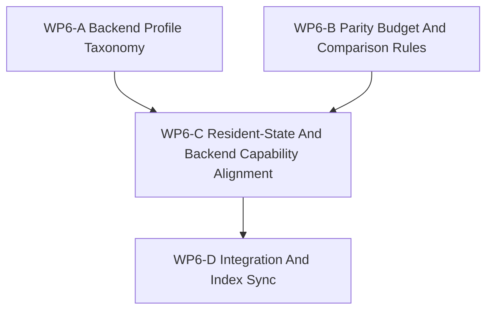

# WP6 Backend Profile Policy

Status: `2026-05-19` backend profile policy work package, aligned for the
WP6 implementation-oriented capability projection wave.

Language:

- English canonical: `backend_profile_policy_wp6_20260519.md`
- Chinese companion: [backend_profile_policy_wp6_20260519.zh.md](backend_profile_policy_wp6_20260519.zh.md)

Inputs:

- [simulation system architecture design](../../plan/architecture/simulation_system_architecture_design.md)
- [architecture and performance research followup](../../plan/architecture/architecture_and_performance_research_followup.md)
- [architecture plan review](../review/architecture_plan_review_20260519.md)
- [Temp-02 SCAL architecture vision review](../review/temp-02_review_20260519.md)
- [WP2.5 scheduler semantics freeze](scheduler_semantics_wp25_20260519.md)
- [WP4 facade alignment](facade_alignment_wp4_20260519.md)
- [WP5 validation harness](validation_harness_wp5_20260519.md)

WP6 is the backend profile policy work package. It closes the gap between the
maintained CPU exact baseline and later accelerated, resident-state, and
approximate backends by freezing the profile vocabulary, parity obligations,
host/device ownership rules, and publication boundaries.

For this implementation wave, WP6 also defines the capability projection rule:
`RuntimeCapabilities` mirrors declared backend/profile metadata plus probeable
deployment facts, but it does not create new semantic claims. Exact GPU
execution, resident state, and shadow-style capability claims remain false
unless a maintained profile explicitly declares the corresponding ownership,
sync, parity, and validation gates.

Naming note:

- Some follow-up notes and reviews refer to backend profiles as `WP7`.
- In the active workline, `WP6` is canonical. Treat `WP7` mentions as legacy
  naming only and do not let them reopen a second live line.

## 1. Policy Thesis

The repository does not need a second semantic path for faster backends. It
needs one maintained semantic lifecycle with explicit backend profiles behind
contracts.

CPU exact execution remains the reference path. Any accelerated or
device-resident backend must declare its profile class, comparison reference,
sync policy, parity budget, and diagnostics obligations before it can be
treated as maintained.

`RuntimeCapabilities` is therefore an implementation-facing projection of
profile metadata, not an authority source. It may expose declared fields and
probeable facts such as backend availability, compiled feature presence, or
runtime deployment constraints. It must not infer exactness, resident-state
ownership, or shadow execution from the presence of an accelerator, helper, or
diagnostics path.

WP6 therefore documents:

1. profile classes and their maintained status,
2. parity-budget rules and comparison domains,
3. host-owned versus backend-owned state boundaries,
4. resident-state and device-resident sync policy,
5. backend capability exposure rules,
6. integration and index synchronization for later publication.

## 2. Backend Profile Model

| Profile class | Default WP6 decision | Maintained status | Ownership default | Parity expectation | Typical example |
|---------------|----------------------|-------------------|-------------------|--------------------|-----------------|
| `reference` | The canonical baseline. | Maintained. | Host-owned state. | Exact. | CPU exact path. |
| `accelerated_exact` | Faster implementation of the same semantics. | Maintained only when exactness is preserved. | Host-owned or hybrid, but host truth must remain explicit. | Exact event order and exact committed state. | CUDA helper attached through contracts. |
| `resident_state` | Backend keeps some operational state resident. | Gated; not maintained until sync and parity are explicit; capability flags stay false until declared. | Backend-owned partial state with explicit host visibility rules. | Declared parity budget required. | Device-resident observation or physics helper. |
| `approximate` | Intentional approximation. | Experimental by default. | Backend-owned or hybrid. | Explicit tolerance only. | Surrogate or fidelity-reduced backend. |
| `diagnostics_only` | Inspection or debug path. | Never maintained truth. | As declared by helper. | No maintained parity claim. | Trace export or probe helper. |

### Required profile metadata

Every maintained backend profile entry MUST declare:

| Field | Rule |
|-------|------|
| `backend_profile_id` | Stable id used by docs, review, replay, and diagnostics. |
| `profile_class` | One of `reference`, `accelerated_exact`, `resident_state`, `approximate`, `diagnostics_only`. |
| `comparison_reference` | The backend or path used as the semantic comparison anchor. |
| `host_state_owner` | Which state shards or outputs remain host-owned. |
| `backend_state_owner` | Which state shards or outputs may live on the backend. |
| `sync_policy` | Host-owned, backend-owned, partial sync, observation-only sync, or explicit export. |
| `state_scope` | The state family covered by the profile. |
| `parity_budget_ref` | The attached parity budget or comparison budget. |
| `observability_scope` | What may be exported as maintained output. |
| `compatibility_rule` | How legacy callers or diagnostics-only helpers behave. |
| `deprecation_rule` | When the profile stops being maintained or must be narrowed. |
| `validation_gate` | The review or test gate that proves the profile is safe. |

## 3. Non-Goals

- Implementing exact GPU world-step as the maintained replacement.
- Migrating every backend path in one pass.
- Reopening WP0-WP5 architecture decisions.
- Rewriting scheduler semantics or facade semantics in WP6.
- Treating wall-clock performance as a parity metric.
- Treating `RuntimeCapabilities` as a profile class by itself.
- Using `RuntimeCapabilities` to infer exact GPU, resident-state, or shadow
  support without a maintained profile declaration.
- Introducing a new runtime semantic path just to support acceleration.

## 4. Work Packages

| Work package | Status | Goal | Output |
|--------------|--------|------|--------|
| `WP6-A Backend Profile Taxonomy` | complete | Freeze profile vocabulary and the maintained/experimental boundary. | [backend profile taxonomy cluster](wp6_backend_profile_taxonomy_cluster_20260519.md), [backend profile registry](wp6_backend_profile_registry_20260519.md) |
| `WP6-B Parity Budget And Comparison Rules` | complete | Freeze the parity-budget template and comparison semantics. | [parity budget cluster](wp6_parity_budget_cluster_20260519.md), [parity budget registry](wp6_parity_budget_registry_20260519.md) |
| `WP6-C Resident-State And Backend Capability Alignment` | complete | Define host/device ownership, sync policy, resident-state boundary rules, and backend capability projection policy without claiming unsupported exact, resident, or shadow capability. | [resident-state boundary rules](wp6_resident_state_boundary_rules_20260519.md), [integration and index sync](wp6_integration_and_index_sync_20260519.md) |
| `WP6-D Integration And Index Sync` | complete | Normalize naming, resolve document cross-references, and publish the accepted WP6 line. | [integration and index sync](wp6_integration_and_index_sync_20260519.md), [acceptance review](../review/wp6_backend_profile_policy_acceptance_review_20260519.md) |

## 5. Dependency Graph



Parallelization rule:

- `WP6-A` and `WP6-B` may run in parallel.
- `WP6-C` should wait until the taxonomy and parity vocabulary are stable enough
  to cite.
- `WP6-D` is serial and owns final wording alignment.

## 6. Evidence Anchors

| Area | Existing source | WP6 use |
|------|-----------------|---------|
| Backend and performance policy | [simulation system architecture design](../../plan/architecture/simulation_system_architecture_design.md). | Confirms CPU exact as baseline and places device-resident state behind contracts. |
| Multi-fidelity follow-up | [architecture and performance research followup](../../plan/architecture/architecture_and_performance_research_followup.md). | Identifies backend profiles, resident-state alignment, and future entry conditions. |
| Backend profile gap | [architecture plan review](../review/architecture_plan_review_20260519.md). | Records the need for a backend profile taxonomy and parity budget. |
| SCAL follow-up | [Temp-02 SCAL architecture vision review](../review/temp-02_review_20260519.md). | Frames backend profiles as part of the larger graph-of-graphs architecture. |
| Scheduler semantics | [WP2.5 scheduler semantics freeze](scheduler_semantics_wp25_20260519.md). | Provides event-order, snapshot, and replay vocabulary that parity budgets must respect. |
| Facade alignment | [WP4 facade alignment](facade_alignment_wp4_20260519.md). | Reminds WP6 that backend capability exposure must remain facade-shaped. |
| Validation harness | [WP5 validation harness](validation_harness_wp5_20260519.md). | Supplies the evidence mindset for later backend profile acceptance. |

## 7. Write-Scope Rules For Subagents

Use these rules when distributing WP6 work:

1. A taxonomy worker owns `wp6_backend_profile_taxonomy_cluster_20260519.md` and
   its Chinese companion.
2. A parity worker owns `wp6_parity_budget_cluster_20260519.md` and its Chinese
   companion.
3. An integration worker owns `wp6_integration_and_index_sync_20260519.md` and
   its Chinese companion.
4. No worker should reopen scheduler semantics or facade semantics in WP6.
5. No worker should edit runtime backend code while writing these documents.
6. Any proposal that requires new runtime semantics should be parked for a
   later implementation package.

## 8. Acceptance Gates

WP6 is accepted only when:

1. The docs distinguish `reference`, `accelerated_exact`, `resident_state`,
   `approximate`, and `diagnostics_only` profiles.
2. Each maintained profile names host/device ownership, sync policy, and parity
   obligations.
3. Parity budget is treated as profile-owned metadata rather than a free-
   floating scalar.
4. CPU exact remains the maintained reference path.
5. Backend capability exposure is described as policy, not hidden
   implementation truth.
6. `RuntimeCapabilities` is described as a projection of declared/profile
   metadata plus probeable deployment facts, with exact GPU, resident-state,
   and shadow-style claims false unless maintained profile metadata explicitly
   declares otherwise.
7. The integration sheet resolves the WP6 naming and publication order, and
   legacy `WP7` references remain historical only.
8. The Chinese companion docs stay aligned with the English canonical set.

## 9. Validation Commands

```bash
git diff --check
rg -n "WP6|WP7|backend profile|parity budget|resident-state|BackendCapability|RuntimeCapabilities|index sync" docs/task/simulation_architecture docs/plan/architecture docs/task/review
```

## 10. Suggested First Dispatch

Recommended first worker wave:

1. `WP6-A Backend Profile Taxonomy`.
2. `WP6-B Parity Budget And Comparison Rules`.

Recommended second worker wave:

1. `WP6-C Resident-State And Backend Capability Alignment`.
2. `WP6-D Integration And Index Sync`.

If extra parallel help is available, split `WP6-C` into two document-only
streams:

- resident-state boundary rules,
- backend capability exposure policy.

Keep `WP6-D` serial so it can own legacy `WP7` normalization, cross-reference
cleanup, and final publication wording.
