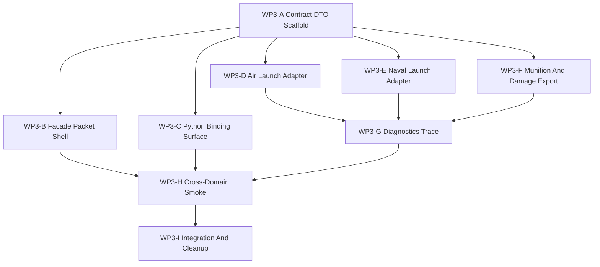

# WP3 Engagement Pilot Task Family

Status: `2026-05-19` active implementation pilot.

Language:

- English canonical: `engagement_pilot_wp3_20260519.md`
- Chinese companion: [engagement_pilot_wp3_20260519.zh.md](engagement_pilot_wp3_20260519.zh.md)

Inputs:

- [simulation system architecture design](../../plan/architecture/simulation_system_architecture_design.md)
- [WP1 pipeline inventory](pipeline_inventory_wp1_20260519.md)
- [WP2 contract freeze](contract_freeze_wp2_20260519.md)
- Read-only branch evidence for air launch, naval launch, facade/contracts,
  Python binding style, and validation harness placement.

WP3 turns the frozen engagement contracts into the first cross-domain
implementation pilot. The pilot should prove that air pylon launch and naval
mount or VLS launch share one semantic lifecycle, without forcing them into one
private implementation path.

Current implementation note:

- `src/runtime/contracts/engagement_contracts.h` owns the stable DTO vocabulary
  for the pilot.
- `src/core/engine/weapon_launch_adapter.h` is the shared header-only conversion
  seam from legacy launch observations into `LaunchRequest` and `LaunchEvent`.
- Air and naval workers should consume that seam or mirror its field semantics
  in tests, but should not edit `simulation_kernel_weapon_api.cpp` in parallel.
- `RuntimeFacade::export_engagement_event_packet()` is still an explicit packet
  shell; live launch behavior should not be wired through the facade until the
  air and naval event shapes converge.
- `tests/runtime/engagement/` now contains adapter-level validation for air
  launch acceptance/rejection, naval gun launch, munition lifecycle mirroring,
  synthetic effects, and damage reports. These tests prove contract vocabulary,
  not final event-bus ownership.

## 1. Pilot Thesis

Air and naval engagement behavior already exists. The gap is not missing
weapons. The gap is that launch, munition lifecycle, effects, damage, and
observation are not yet exposed through a narrow typed contract chain.

WP3 should therefore build a contract adapter and cross-domain validation
slice:

```text
TrackPacket
  -> LaunchRequest
  -> LaunchEvent
  -> MunitionLifecyclePacket
  -> EffectsEvent
  -> DamageReport
  -> DiagnosticsTrace
  -> ObservationPacket
```

The pilot is successful when the same contract vocabulary can explain:

1. aircraft pylon or hardpoint launch,
2. naval mount or VLS launch,
3. accepted and rejected fire-control decisions,
4. munition lifecycle progression,
5. effects and damage reporting,
6. observation and diagnostics trace export,
7. local non-RL validation on the Windows machine.

## 2. Non-Goals

- Rewriting all weapon systems in one pass.
- Merging air and naval launch internals into one implementation.
- Exposing full ECS component schemas as public contracts.
- Making `RuntimeFacade::runtime()` a maintained engagement API.
- Requiring RL training dependencies for validation.
- Solving full GPU/resident-state backend design.

## 3. Branch Map

| Branch | Goal | Primary write scope | Parallelism | Suggested agent budget | Exit artifact |
|--------|------|---------------------|-------------|------------------------|---------------|
| `WP3-A Contract DTO Scaffold` | Add the stable engagement DTO surface. | `src/runtime/contracts/engagement_contracts.h`; include plumbing only if needed. | Can start first; unblocks most other branches. | Medium worker; high only if field semantics change. | Header-only DTOs plus architecture/header hygiene tests. |
| `WP3-B Facade Packet Shell` | Add facade-shaped request/result or packet containers without raw runtime exposure. | `src/runtime/facade/runtime_facade_types.h`, `runtime_facade.h`, `runtime_facade.cpp`. | Starts after `WP3-A`; independent from Python binding. | Medium worker. | Facade types and stub/export path documented by tests. |
| `WP3-C Python Binding Surface` | Expose DTOs and facade packets to `ef_py` using existing nanobind style. | `src/interfaces/python/bindings_runtime.cpp`; binding tests. | Starts after `WP3-A`; can run beside `WP3-B` if method signatures are stable. | Lightweight or medium worker. | Field-surface binding tests. |
| `WP3-D Air Launch Adapter` | Map air pylon/hardpoint launch behavior to `LaunchRequest` and `LaunchEvent`. | Air-specific adapter code and air engagement tests, consuming or mirroring `weapon_launch_adapter.h`. Avoid sharing write ownership of `simulation_kernel_weapon_api.cpp` with `WP3-E`. | Parallel only if it stays test/adapter-local; serialize if editing shared kernel launch code. | Medium worker. | Complete at test-adapter level: air launch accepted/rejected events with station, ammo, cooldown, spawned munition. |
| `WP3-E Naval Launch Adapter` | Map naval mount/VLS launch behavior to the same `LaunchRequest` and `LaunchEvent`. | Naval-specific adapter code and naval engagement tests, consuming or mirroring `weapon_launch_adapter.h`. Avoid sharing write ownership of `simulation_kernel_weapon_api.cpp` with `WP3-D`. | Parallel only if it stays test/adapter-local; serialize if editing shared kernel launch code. | Medium worker. | Complete at test-adapter level for DDG gun launch; VLS remains follow-up. |
| `WP3-F Munition And Damage Export` | Expose minimal lifecycle, effects, and damage reports without leaking full components. | `src/runtime/contracts/engagement_contracts.h` if DTO additions remain; otherwise export/adapters and tests. | Starts after `WP3-A`; can run beside launch adapters if write scopes are separate. | Medium worker. | Started at test-adapter level: `MunitionLifecyclePacket`, `EffectsEvent`, and `DamageReport` mirror existing runtime/debug observations. |
| `WP3-G Diagnostics Trace` | Connect track, launch, lifecycle, effects, damage, and observation by ids. | Diagnostics/export code and trace tests. | Starts after events/reports exist. | Medium worker; high if trace ownership crosses facade and engine. | Minimal trace index, not a full logging framework. |
| `WP3-H Cross-Domain Smoke` | Add a stage-aligned local non-RL smoke path. | `tests/runtime/engagement/`, `tests/smoke/ci_smoke_suite.json` if promoted. | Starts once air/naval contract events are observable. | Lightweight worker for tests; medium if fixtures need adaptation. | One local smoke proving air and naval share lifecycle vocabulary. |
| `WP3-I Integration And Cleanup` | Resolve shared-file conflicts and update task docs/status. | Shared files touched by multiple branches, docs under `docs/task/simulation_architecture`. | Serial integration branch. | High reasoning integration worker or main thread. | Green focused tests and updated work-package status. |

## 4. Dependency Graph



Parallelization rule:

- `WP3-A` should be first.
- `WP3-B`, `WP3-C`, and test planning can run in parallel after DTO names are
  stable.
- `WP3-D` and `WP3-E` may run in parallel only if they do not both edit the
  same shared kernel file. If both need `simulation_kernel_weapon_api.cpp`, use
  one integration owner for the shared adapter seam.
- `WP3-G` and `WP3-H` should not start implementation until launch events and
  damage reports are observable.

## 5. Evidence Anchors

| Area | Existing assets | WP3 use |
|------|-----------------|---------|
| Air pylon launch | F-16 hardpoints and default loadout, child `Munition` entities, `PilotAction.weapon_select_id`, `fire_missile()`, `PilotWeaponRelease`. | Map station selection, ammo/cooldown, rejection gates, and spawned missile id into `LaunchEvent`. |
| Naval mount/VLS launch | `NavalWeaponMountDefinition`, DDG mount config, VLS selection inside `fire_missile()`, explicit `fire_naval_weapon()`. | Map mount id, ready count, cooldown, range gate, intercept or damage result into the same event shape. |
| Track and observation | `TrackDatabase` to `AgentObservation.contacts`, facade `ObservationBatchRequest` and `ObservationBatchPacket`. | Treat fused track export as `TrackPacket` equivalent until a narrow DTO exists. |
| Munition lifecycle | `Missile` component, guidance system, debug missile runtime state. | Export only minimal lifecycle fields and keep guidance tuning internal. |
| Effects and damage | Damage systems, effects model, platform damage state, naval damage degradation tests. | Produce `EffectsEvent` and `DamageReport` instead of relying on raw health/debug reads. |
| Validation | Air combat tests, naval ship database tests, facade tests, smoke suite runner. | Build `tests/runtime/engagement/` as the cross-domain smoke home. |

## 6. Write-Scope Rules For Subagents

Use these rules when distributing implementation workers:

1. A contract worker owns `src/runtime/contracts/engagement_contracts.h` and
   must not include `core/engine/*`.
2. A facade worker owns `src/runtime/facade/*` and must not make
   `RuntimeFacade::runtime()` the maintained engagement path.
3. A binding worker owns `src/interfaces/python/bindings_runtime.cpp` and
   binding tests only.
4. Air and naval launch workers should not both edit
   `src/core/engine/simulation_kernel_weapon_api.cpp` at the same time.
   During the first adapter wave, prefer test-local DTO construction or the
   header-only `weapon_launch_adapter.h` seam over live kernel integration.
5. A validation worker owns `tests/runtime/engagement/` and should only update
   `tests/smoke/ci_smoke_suite.json` after the focused test is stable.
6. A final integration worker owns cross-branch conflict resolution and task
   status updates.

## 7. Acceptance Gates

Each branch should satisfy the common architecture gates from the task entry.
WP3 as a whole must additionally satisfy:

1. Air pylon launch and naval mount/VLS launch emit or adapt to the same
   `LaunchEvent` shape.
2. Accepted and rejected launches carry explicit reasons and do not rely on
   implicit boolean return values as the maintained contract.
3. Ammo, cooldown, selected launcher, selected munition, and spawned munition
   ancestry are represented in event/report fields.
4. Munition lifecycle export does not expose full ECS component internals.
5. Damage visibility uses `DamageReport` rather than debug-only health reads.
6. `DiagnosticsTrace` can connect track, launch request/event, munition,
   effects, damage, and observation packet version.
7. Facade and Python access are explicit or documented as temporary
   compatibility adapters.
8. Local validation runs without RL training dependencies.

## 8. Validation Commands

Focused pre-implementation evidence checks:

```powershell
.\tools\maintenance\cmo_env.ps1 python -m pytest -q tests\runtime\air_combat\test_air_combat_1v1_fire_missile.py tests\runtime\air_combat\test_weapon_guidance_realism_guards.py tests\runtime\naval\test_naval_ship_database.py tests\runtime\facade\test_runtime_facade.py
```

Maintained smoke loop after WP3 tests are added:

```powershell
.\tools\maintenance\cmo_env.ps1 validate
.\tools\maintenance\cmo_env.ps1 python -m pytest -q tests\runtime\engagement
.\tools\maintenance\cmo_env.ps1 python tools\runners\run_pytest_suite.py --suite tests\smoke\ci_smoke_suite.json
```

Clean local build window if artifacts are stale:

```powershell
cmake -S . -B build-local-win -G Ninja -DCMAKE_BUILD_TYPE=Release
cmake --build build-local-win --target ef_core ef_py -j2
.\tools\maintenance\cmo_env.ps1 validate
```

## 9. Suggested First Dispatch

Recommended first worker wave:

1. `WP3-A Contract DTO Scaffold`: implement `engagement_contracts.h` and
   contract hygiene tests.
2. `WP3-H Validation Skeleton`: create `tests/runtime/engagement/` with
   skipped or xfail-free shape tests only if DTOs are available; otherwise
   write a test plan patch, not failing tests.
3. `WP3-B Facade Packet Shell`: add facade packet containers after DTO names
   stabilize.

Recommended second worker wave:

1. `WP3-D Air Launch Adapter`.
2. `WP3-E Naval Launch Adapter`.
3. `WP3-C Python Binding Surface`.

Second wave implementation status:

1. `WP3-D` validates legacy air `fire_missile()` accepted and rejected outcomes
   as `LaunchRequest` and `LaunchEvent`.
2. `WP3-E` validates legacy DDG Mk 45 `fire_naval_weapon()` as the same launch
   event shape; VLS coverage remains a follow-up.
3. `WP3-F` has begun with test-level lifecycle, effects, and damage DTO
   construction from existing observations.

Recommended third worker wave:

1. `WP3-F Munition And Damage Export`.
2. `WP3-G Diagnostics Trace`.
3. `WP3-I Integration And Cleanup`.

Immediate follow-up:

1. Add VLS-specific naval launch coverage so `fire_missile()` and
   `fire_naval_weapon()` are both represented for naval platforms.
2. Promote lifecycle/effects/damage construction from test-local adapter logic
   into a maintained conversion/export seam.
3. Add `DiagnosticsTrace` ids that connect track, launch request/event,
   munition lifecycle, effects, damage, and observation version.

## 10. Exit Criteria

WP3 exits when:

1. The cross-domain engagement lifecycle can be exercised locally without RL.
2. Air and naval launch paths share one typed contract vocabulary.
3. Facade-shaped access is available or a compatibility adapter is explicitly
   documented for each remaining gap.
4. Diagnostics can explain the chain from track to observation.
5. Follow-on WP4/WP5 work is reduced to facade hardening and maintained smoke
   promotion, not architecture rediscovery.
