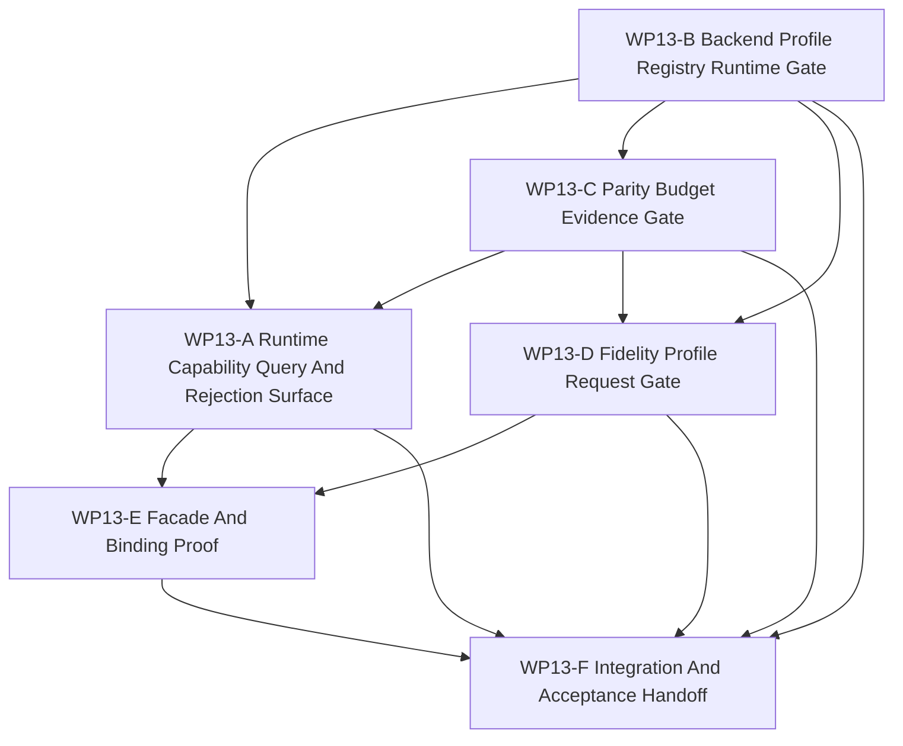

# WP13 Backend Fidelity Expansion

Status: `2026-05-20` planned / dispatch-ready implementation phase.

Language:

- English canonical: `backend_fidelity_expansion_wp13_20260520.md`
- Chinese companion:
  [backend_fidelity_expansion_wp13_20260520.zh.md](backend_fidelity_expansion_wp13_20260520.zh.md)

Inputs:

- [Post-WP9 architecture route plan](../post_wp9_architecture_route_plan_20260520.md)
- [WP12 information and agency enforcement acceptance](../../review/wp12_information_agency_enforcement_acceptance_review_20260520.md)
- [WP6 backend profile policy](../wp6_backend_profile_policy/backend_profile_policy_wp6_20260519.md)
- [WP6 backend profile registry](../wp6_backend_profile_policy/wp6_backend_profile_registry_20260519.md)
- [WP6 parity budget registry](../wp6_backend_profile_policy/wp6_parity_budget_registry_20260519.md)
- [WP6 resident-state boundary rules](../wp6_backend_profile_policy/wp6_resident_state_boundary_rules_20260519.md)
- [WP7 backend capability materialization](../wp7_backend_capability_materialization/backend_capability_materialization_wp7_20260519.md)
- [WP7 runtime capability projection](../wp7_backend_capability_materialization/wp7_runtime_capability_projection_cluster_20260519.md)
- [WP7 multi-fidelity entry conditions](../wp7_backend_capability_materialization/wp7_multifidelity_entry_conditions_cluster_20260519.md)
- [WP10 causal runtime foundation](../wp10_causal_runtime_foundation/causal_runtime_foundation_wp10_20260520.md)
- [WP11 facade vertical slice and provenance](../wp11_facade_vertical_slice_provenance/facade_vertical_slice_provenance_wp11_20260520.md)
- [WP12 information and agency enforcement](../wp12_information_agency_enforcement/information_agency_enforcement_wp12_20260520.md)
- [Simulation system architecture design](../../../plan/architecture/simulation_system_architecture_design.md)
- [Subagent Usage Policy](../../../standards/governance/subagent_usage_policy.md)
- [WP Closure Lane Policy](../../../standards/governance/wp_closure_lane_policy.md)

Naming and commit-message note:

- `WP13` is only the task-index and audit label for Phase 4 of the post-WP9
  route: backend/fidelity expansion.
- Commit messages should not include internal work-package labels such as
  `WP13`. Use capability/result language, for example
  `Add backend fidelity capability gates` or
  `Expose backend profile rejection evidence`.

## 1. Purpose

`WP13` turns the accepted backend-profile policy and the WP10-WP12 evidence
boundary into a maintained runtime-facing query and rejection surface.

The goal is not to enable new accelerated execution. The goal is to make
backend and fidelity claims explicit enough that callers can ask what is
maintained, see why a request is rejected, and inspect which profile, budget,
validation gate, and causal evidence supports the answer.

Target chain:

```text
WP6 backend profile / parity budget metadata
  -> code-owned queryable profile and budget records
  -> conservative RuntimeCapabilities projection
  -> backend/fidelity request admission and rejection reasons
  -> facade/binding-visible evidence behind the WP10-WP12 causal boundary
```

`WP13` is an implementation phase. Planning documents alone do not pass a gate.

## 2. Scope Boundary

`WP13` can:

1. Add code-owned backend profile and parity budget records derived from the
   accepted WP6/WP7 documentation registries.
2. Extend `RuntimeCapabilities` or adjacent DTOs with queryable profile ids,
   budget refs, maintained-status labels, and rejection/evidence strings.
3. Add runtime/facade/binding helpers that reject unsupported backend,
   resident-state, shadow, or fidelity requests fail-closed.
4. Add fidelity request vocabulary as request/admission data, not support
   claims.
5. Prove GPU helper/probe availability remains separate from maintained exact
   GPU, resident-state, device observation, shadow, or multi-fidelity support.
6. Add architecture/runtime/Python tests for query, rejection, and evidence
   behavior.

`WP13` cannot:

1. Promote exact GPU execution to maintained support.
2. Promote resident-state ownership or device observation views to maintained
   support.
3. Promote shadow compare or shadow fallback to maintained support.
4. Implement adaptive fidelity scheduling or learned `ModelProvider` runtime.
5. Add a second semantic lifecycle outside the P0-P10 causal/facade boundary.
6. Treat helper/probe availability, candidate registry rows, or diagnostics
   reports as validation evidence.
7. Bypass WP10 barrier/snapshot/event evidence, WP11 provenance labels, or WP12
   maintained decision authority gates.

Preferred first implementation slice:

```text
RuntimeFacade.capabilities()
  -> profile/budget/evidence query DTOs
  -> Python binding visibility
  -> request rejection helpers for exact_gpu / resident_state / shadow /
     fidelity-profile claims
  -> tests proving all unsupported claims fail closed with evidence
```

## 3. Work Packages

| Work package | Status | Route item | Goal | Output |
|--------------|--------|------------|------|--------|
| `WP13-A Runtime Capability Query And Rejection Surface` | planned | Phase 4 capability query | Make `RuntimeCapabilities` expose conservative profile/evidence metadata and explicit unsupported-request reasons without GPU/helper inference. | [capability query task slice](wp13_runtime_capability_query_cluster_20260520.md) |
| `WP13-B Backend Profile Registry Runtime Gate` | planned | WP6/WP7 registry materialization | Add code-owned backend profile records and validation helpers that enforce maintained/candidate/diagnostics boundaries. | [backend profile registry gate task slice](wp13_backend_profile_registry_gate_cluster_20260520.md) |
| `WP13-C Parity Budget Evidence Gate` | planned | profile-owned budget evidence | Add queryable parity budget records and validators that reject missing or non-maintained budgets before capability promotion. | [parity budget evidence task slice](wp13_parity_budget_evidence_gate_cluster_20260520.md) |
| `WP13-D Fidelity Profile Request Gate` | planned | fidelity request admission | Define and implement fidelity request admission as fail-closed request grammar, not multi-fidelity support. | [fidelity request gate task slice](wp13_fidelity_profile_request_gate_cluster_20260520.md) |
| `WP13-E Facade And Binding Proof` | planned | facade-visible evidence | Prove query/rejection/evidence behavior through maintained facade and Python binding surfaces without raw backend paths. | [facade proof task slice](wp13_facade_binding_proof_cluster_20260520.md) |
| `WP13-F Integration And Acceptance Handoff` | planned | closure lane | Reconcile shared validators, validation commands, residuals, acceptance review, route/README sync, and bilingual closure after A-E are mergeable. | [integration handoff task slice](wp13_integration_acceptance_cluster_20260520.md) |

## 4. Dependency Map



Parallel rule:

- `WP13-A`, `WP13-B`, and `WP13-C` may start in the first wave if they keep
  write scopes disjoint and agree on small shared DTO names before editing.
- `WP13-D` should wait until B/C vocabulary is stable enough to cite profile
  and budget ids.
- `WP13-E` should wait until A/D expose a facade or binding surface to prove.
- `WP13-F` is serial integration and must not block code streams on README,
  review, archive, or bilingual chores.

## 5. Dispatch Plan

| Stream | Main concern | Write-scope rule | Suggested model / reasoning |
|--------|--------------|------------------|-----------------------------|
| `WP13-A` | Queryable `RuntimeCapabilities` metadata, rejection reason vocabulary, and conservative support defaults. | Own facade DTO/projection helper and focused capability tests. Coordinate shared struct names with B/C; do not touch registry rows owned by B/C unless integrating. | Complex cross-layer surface: `gpt-5.4`, xhigh. |
| `WP13-B` | Code-owned backend profile records, maintained/candidate/diagnostics validation, and helper/probe non-promotion. | Own backend profile contract/header or registry helper plus architecture tests. Do not add parity budget implementation details beyond references. | Complex registry gate: `gpt-5.4`, xhigh. |
| `WP13-C` | Code-owned parity budget records, budget validators, comparison-domain evidence, and missing-budget rejection. | Own parity budget contract/helper and tests. Do not implement fidelity request grammar beyond consumer-facing refs. | Medium-complex evidence gate: `gpt-5.4`, high. |
| `WP13-D` | Fidelity profile request grammar and fail-closed admission, using B/C ids and budgets. | Own fidelity request DTO/helper/tests. Do not implement adaptive scheduling, backend selection, or learned provider runtime. | Complex request semantics: `gpt-5.4`, xhigh. |
| `WP13-E` | Facade/binding proof for query, rejection, evidence, and no raw backend bypass. | Own Python binding exposure/tests and facade proof tests after A/D land. | Medium-complex integration: `gpt-5.4`, high. |
| `WP13-F` | Validation, residual register, acceptance review, README/index sync, bilingual closure. | Serial owner after A-E are mergeable. | Light closure: mini model with xhigh, or `gpt-5.4` medium if code conflicts remain. |

Worker rule:

- Use the project [Subagent Usage Policy](../../../standards/governance/subagent_usage_policy.md).
- Workers are not alone in the codebase; they must not revert unrelated edits or
  edits from other workers.
- Each worker must return touched files, commands run, blockers, residuals, and
  integration notes.
- A stream may be reported `Mergeable` with code/test evidence before README,
  archive, acceptance, or bilingual closure is complete.

## 6. Required Acceptance Artifacts

No `WP13` gate may be reported as accepted unless the acceptance packet includes
all required artifacts below.

| Artifact | Required status | Purpose |
|----------|-----------------|---------|
| `docs/task/simulation_architecture/wp13_backend_fidelity_expansion/backend_fidelity_expansion_wp13_20260520.md` | required | Normative English definition of WP13 scope, streams, and gate rules. |
| `docs/task/simulation_architecture/wp13_backend_fidelity_expansion/backend_fidelity_expansion_wp13_20260520.zh.md` | required | Chinese companion for the same normative rules. |
| `docs/task/simulation_architecture/wp13_backend_fidelity_expansion/wp13_runtime_capability_query_cluster_20260520.md` | required | English WP13-A capability query task slice. |
| `docs/task/simulation_architecture/wp13_backend_fidelity_expansion/wp13_runtime_capability_query_cluster_20260520.zh.md` | required | Chinese WP13-A companion. |
| `docs/task/simulation_architecture/wp13_backend_fidelity_expansion/wp13_backend_profile_registry_gate_cluster_20260520.md` | required | English WP13-B backend profile registry task slice. |
| `docs/task/simulation_architecture/wp13_backend_fidelity_expansion/wp13_backend_profile_registry_gate_cluster_20260520.zh.md` | required | Chinese WP13-B companion. |
| `docs/task/simulation_architecture/wp13_backend_fidelity_expansion/wp13_parity_budget_evidence_gate_cluster_20260520.md` | required | English WP13-C parity budget task slice. |
| `docs/task/simulation_architecture/wp13_backend_fidelity_expansion/wp13_parity_budget_evidence_gate_cluster_20260520.zh.md` | required | Chinese WP13-C companion. |
| `docs/task/simulation_architecture/wp13_backend_fidelity_expansion/wp13_fidelity_profile_request_gate_cluster_20260520.md` | required | English WP13-D fidelity request task slice. |
| `docs/task/simulation_architecture/wp13_backend_fidelity_expansion/wp13_fidelity_profile_request_gate_cluster_20260520.zh.md` | required | Chinese WP13-D companion. |
| `docs/task/simulation_architecture/wp13_backend_fidelity_expansion/wp13_facade_binding_proof_cluster_20260520.md` | required | English WP13-E facade/binding proof task slice. |
| `docs/task/simulation_architecture/wp13_backend_fidelity_expansion/wp13_facade_binding_proof_cluster_20260520.zh.md` | required | Chinese WP13-E companion. |
| `docs/task/simulation_architecture/wp13_backend_fidelity_expansion/wp13_integration_acceptance_cluster_20260520.md` | required | English WP13-F integration handoff task slice. |
| `docs/task/simulation_architecture/wp13_backend_fidelity_expansion/wp13_integration_acceptance_cluster_20260520.zh.md` | required | Chinese WP13-F companion. |
| `docs/task/review/wp13_backend_fidelity_expansion_acceptance_review_20260520.md` | required before acceptance | English final acceptance decision record. |
| `docs/task/review/wp13_backend_fidelity_expansion_acceptance_review_20260520.zh.md` | required before acceptance | Chinese acceptance companion. |

Artifact rule:

- Missing task artifacts keep WP13 planning incomplete.
- Missing acceptance review is expected while WP13 is open.
- Documentation-only updates do not pass an implementation gate.

## 7. Strict Gate Rules

| Gate | Required evidence | Pass rule | Fail rule |
|------|-------------------|-----------|-----------|
| `WP13-A Runtime Capability Query And Rejection Surface` | DTO/projection helper and tests proving profile/evidence fields plus fail-closed unsupported reasons. | Pass only if exact GPU, resident-state, device observation, shadow, and multi-fidelity support remain false without maintained profile/budget evidence. | Fail if helper/probe availability, candidate rows, or diagnostics output can flip support true. |
| `WP13-B Backend Profile Registry Runtime Gate` | Code-owned profile rows or schema, validators, and tests covering maintained, candidate, and diagnostics-only records. | Pass only if every maintained profile requires class, comparison reference, ownership, sync, parity ref, observability, compatibility, deprecation, and validation gate fields. | Fail if unmaintained candidates are accepted as maintained or if profile metadata stays prose-only. |
| `WP13-C Parity Budget Evidence Gate` | Code-owned budget rows or schema, validators, and tests for comparison domains, sync barriers, mismatch policy, and acceptance gates. | Pass only if missing or non-maintained budgets reject promotion and produce inspectable evidence. | Fail if a parity budget is treated as a scalar tolerance or detached from backend profile ownership. |
| `WP13-D Fidelity Profile Request Gate` | Request DTO/helper and tests for accepted baseline requests and rejected unsupported fidelity claims. | Pass only if fidelity labels are requests bound to profile ids, budget refs, model-family scope, validation gate, and facade evidence. | Fail if `fast_training`, `sensor_heavy`, or similar labels imply maintained multi-fidelity support. |
| `WP13-E Facade And Binding Proof` | Runtime facade and Python binding tests proving query/rejection/evidence visibility without raw backend access. | Pass only if callers can inspect capability/profile/budget/fidelity rejection through maintained surfaces. | Fail if proof depends on raw runtime or GPU helper paths outside facade/binding contracts. |
| `WP13-F Integration And Acceptance Handoff` | A-E status, exact validation commands, residual register, acceptance-review draft, route/README sync, and bilingual closure. | Pass only after implementation gates are mergeable and residuals are recorded honestly. | Fail if closure text claims exact GPU, resident-state, shadow, adaptive fidelity, or learned provider runtime support. |

## 8. Validation Commands

Expected focused validation set:

```bash
git diff --check
cmake --build build-workshop -j4
CMO_BUILD_DIR=build-workshop pytest -q tests/runtime/facade/test_runtime_facade.py tests/test_gpu_runtime_bindings.py
CMO_BUILD_DIR=build-workshop pytest -q tests/runtime/bindings/test_bindings_runtime_dto_surface.py tests/runtime/bindings/test_bindings_policy_surface.py
CMO_BUILD_DIR=build-workshop pytest -q tests/architecture/test_runtime_facade_layering.py
python3 tools/maintenance/wp_doc_closure_audit.py --wp WP13
```

Worker-specific tests should be narrower and named in each cluster handoff.
The final acceptance review should report exact commands as `passed`, `failed`,
or `blocked`.

## 9. Non-Goals

- Exact GPU world-step support.
- Resident-state ownership or device observation view promotion.
- Shadow compare or shadow fallback promotion.
- Adaptive fidelity scheduling.
- Learned `ModelProvider` runtime interfaces.
- Backend selection or performance-based automatic promotion.
- A second semantic lifecycle outside the causal/facade boundary.
