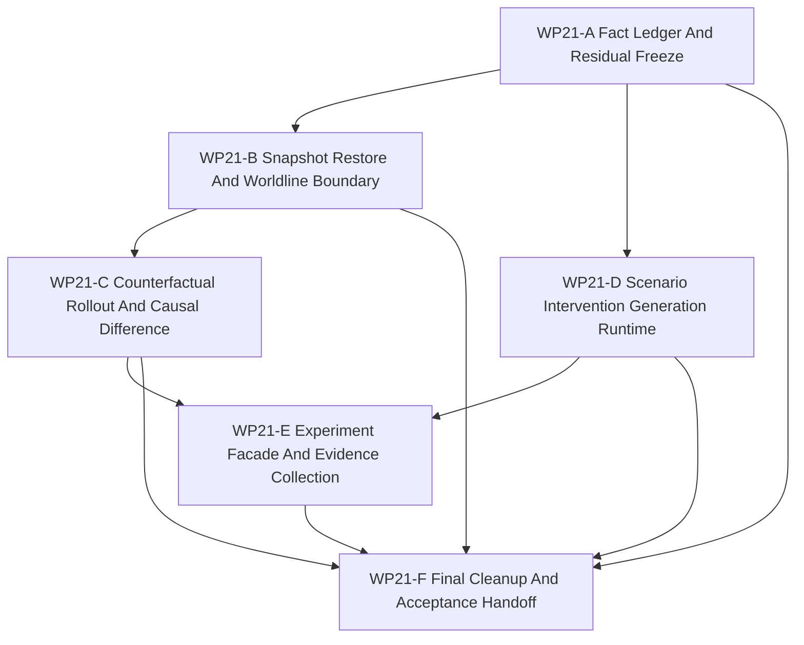

# WP21 Full Counterfactual Experiment Runtime

Status: `2026-05-22` complete / accepted.

Language:

- English canonical: `full_counterfactual_experiment_runtime_wp21_20260521.md`
- Chinese companion:
  [full_counterfactual_experiment_runtime_wp21_20260521.zh.md](full_counterfactual_experiment_runtime_wp21_20260521.zh.md)

Inputs:

- [Stage 3 platform expansion mainline plan](../../review/stage3_platform_expansion_mainline_plan_20260521.md)
- [WP15 counterfactual experiment generation](../wp15_counterfactual_experiment_generation/counterfactual_experiment_generation_wp15_20260521.md)
- [WP17 counterfactual runtime slice](../wp17_stage3_runtime_materialization_cleanup/wp17_counterfactual_runtime_closure_cluster_20260521.md)
- [WP18 runtime ownership and C++ hot-path consolidation](../wp18_runtime_ownership_cxx_hot_path_consolidation/runtime_ownership_cxx_hot_path_consolidation_wp18_20260521.md)
- [WP19 CUDA and resident-state mainline alignment](../wp19_cuda_resident_state_alignment/cuda_resident_state_alignment_wp19_20260521.md)
- [WP20 public capability-platform composition](../wp20_public_capability_platform_composition/public_capability_platform_composition_wp20_20260521.md)
- [WP21 acceptance review](../../review/wp21_full_counterfactual_experiment_runtime_acceptance_review_20260522.md)
- [Simulation system architecture design](../../../plan/architecture/simulation_system_architecture_design.md)
- [Subagent Usage Policy](../../../standards/governance/subagent_usage_policy.md)
- [WP Closure Lane Policy](../../../standards/governance/wp_closure_lane_policy.md)

Naming and commit-message note:

- `WP21` is the final task-index label for the frozen post-WP17 route.
- Implementation commits should use result language such as
  `Run counterfactual branches through facade evidence` or
  `Collect experiment worldline evidence`, not internal work-package labels.

## 1. Purpose

WP21 is the final planned stage of the architecture/refactor route. It consumes
the accepted contract and runtime slices from WP15, WP17, WP18, WP19, and WP20
and closes the remaining counterfactual / experiment runtime gap.

The target is not an unbounded research platform. The target is a maintained,
facade-owned runtime path that can:

```text
explicit typed setup or scenario-generation artifact
  -> replay envelope and branch point
  -> bounded snapshot / restore boundary
  -> parent and branch worldline execution
  -> causal difference and experiment evidence
  -> final cleanup of legacy-only counterfactual paths
```

WP21 is an implementation stage. Planning documents alone do not pass a gate.

## 2. Current Code Facts To Preserve

| Area | Current fact | WP21 implication |
|------|--------------|------------------|
| Counterfactual contracts | `src/runtime/contracts/counterfactual_replay_contracts.h` owns replay envelope, branch point, worldline metadata, admission, generation, and experiment evidence vocabulary. | WP21 must extend or consume this vocabulary instead of creating a parallel schema. |
| Selected runtime slice | `RuntimeFacade::snapshot_counterfactual_entity()` and `RuntimeFacade::run_counterfactual_branch()` expose selected-entity branch/compare behavior. | WP21 starts from the accepted selected slice and broadens only behind snapshot/restore evidence. |
| Public bindings | Python bindings expose the runtime counterfactual DTOs and facade methods. | Public runtime changes need binding and facade tests when the surface changes. |
| Scenario generation | `python/scenario/compiler/generation_request.py` validates generation requests and artifacts, but does not run a maintained generator. | WP21 must turn the request surface into a deterministic, non-mutating generation path before experiment orchestration depends on it. |
| Runtime ownership residual | WP18 recorded that `ScenarioLoader` still mixes scenario adaptation with runtime-state mirror behavior. | WP21 must either split, gate, or route this mirror before broad experiment runtime is accepted. |
| Platform setup | WP20 exposes typed platform setup results while preserving type-name compatibility. | Counterfactual baselines should prefer explicit setup / typed setup evidence and must not force scenario schema migration. |
| Backend / resident state | WP19 keeps GPU and resident-state helpers diagnostics/export-only unless evidence exists. | WP21 must keep host-visible snapshot/restore as the maintained default and must not promote exact GPU or resident-state support. |

## 3. Scope Boundary

WP21 can:

1. Freeze final source facts and residuals for full counterfactual / experiment
   runtime.
2. Implement a bounded snapshot/restore boundary for the maintained host-owned
   runtime state needed by counterfactual execution.
3. Execute parent and branch worldlines from explicit setup / generated artifacts
   under facade authority.
4. Compare worldlines and emit causal-difference evidence at declared barriers.
5. Add deterministic scenario/intervention generation for parameter variation
   without direct authoritative state mutation.
6. Collect experiment-run evidence through facade and Python surfaces.
7. Close or guard remaining legacy-only counterfactual, generation, and loader
   mirror paths so the refactor route ends with a clear maintained boundary.

WP21 cannot:

1. Promote exact GPU or resident-state support beyond accepted WP19 evidence.
2. Treat experiment scores, generated outcomes, or capability profiles as truth
   or support claims.
3. Mutate authoritative runtime state outside facade/request contracts.
4. Force all scenario JSON or existing callers to migrate to generated scenarios.
5. Claim arbitrary-depth worldline trees unless bounded execution, evidence, and
   cleanup gates exist.
6. Reopen earlier WP scope unless a named blocker proves the accepted boundary
   was wrong.

## 4. Work Packages

| Work package | Status | Main concern | Goal | Output |
|--------------|--------|--------------|------|--------|
| `WP21-A Fact Ledger And Residual Freeze` | complete / accepted | final facts and entry gate | Freeze source/test facts, remaining residuals, and final-stage non-goals before implementation. | [fact ledger](wp21_fact_ledger_residual_freeze_cluster_20260521.md) |
| `WP21-B Snapshot Restore And Worldline Boundary` | complete / accepted | snapshot/restore runtime | Broaden the selected slice into a bounded, facade-owned snapshot/restore and worldline boundary. | [snapshot / restore boundary](wp21_snapshot_restore_worldline_boundary_cluster_20260521.md) |
| `WP21-C Counterfactual Rollout And Causal Difference` | complete / accepted | branch execution | Execute parent/branch worldlines and produce causal-difference evidence without raw mutation. | [rollout and causal difference](wp21_counterfactual_rollout_causal_difference_cluster_20260521.md) |
| `WP21-D Scenario Intervention Generation Runtime` | complete / accepted | deterministic generated inputs | Turn the WP15 generation request surface into a deterministic parameter-variation generator. | [scenario generation runtime](wp21_scenario_intervention_generation_cluster_20260521.md) |
| `WP21-E Experiment Facade And Evidence Collection` | complete / accepted | experiment orchestration | Expose a maintained experiment run surface that collects observations, terminations, traces, and evidence ancestry. | [experiment facade and evidence](wp21_experiment_facade_evidence_cluster_20260521.md) |
| `WP21-F Final Cleanup And Acceptance Handoff` | complete / accepted | route closure | Integrate A-E, close or guard legacy residuals, run validation, sync indexes, and prepare final acceptance. | [final cleanup and handoff](wp21_final_cleanup_acceptance_cluster_20260521.md) |

## 5. Dependency Map



Parallel rule:

- `WP21-A` starts first or in the first wave because it freezes final residuals.
- `WP21-B` and `WP21-D` may proceed in parallel after A if their write scopes
  stay disjoint.
- `WP21-C` waits for B because branch rollout must consume the snapshot/restore
  boundary.
- `WP21-E` waits for C and D because experiment orchestration needs both
  branch execution and generated-input evidence.
- `WP21-F` is serial closure and must not block implementation workers on
  README, review, archive, or bilingual chores.

## 6. Dispatch Plan

| Stream | Write-scope rule | Suggested model / reasoning |
|--------|------------------|-----------------------------|
| `WP21-A` | Own source-backed fact ledger and final residual map. Read-only source/test inventory. | Light but precision-sensitive: `gpt-5.4-mini`, xhigh. |
| `WP21-B` | Own snapshot/restore DTOs, runtime boundary, facade/binding surface if changed, and focused tests. Do not implement experiment orchestration. | Complex runtime seam: `gpt-5.4`, xhigh. |
| `WP21-C` | Own parent/branch execution and causal-difference runtime after B. Do not edit scenario generation. | Complex runtime semantics: `gpt-5.4`, xhigh. |
| `WP21-D` | Own deterministic scenario/intervention generator and non-mutation tests. Do not edit C++ rollout. | Medium-complex Python/runtime boundary: `gpt-5.4`, high. |
| `WP21-E` | Own experiment facade, evidence collection, bindings, and non-truth-claim tests after C/D. | Complex public orchestration surface: `gpt-5.4`, xhigh. |
| `WP21-F` | Own final validation rollup, residual closure, indexes, acceptance review, bilingual closure. | Light closure: `gpt-5.4-mini`, xhigh. |

Worker rule:

- Use the project [Subagent Usage Policy](../../../standards/governance/subagent_usage_policy.md).
- Workers are not alone in the codebase; they must not revert unrelated edits or
  edits from other workers.
- Each worker must return touched files, commands run, blockers, residuals, and
  integration notes.
- A stream may stop at `blocked` if the final-stage scope cannot be completed
  without reopening an accepted earlier boundary.

## 7. Gate Rules

| Gate | Required evidence | Fail condition |
|------|-------------------|----------------|
| `WP21-A` | Source/test ledger for contracts, selected-slice runtime, generation requests, loader mirror residuals, typed setup, and backend boundaries. | Work proceeds from stale assumptions or hides a final residual. |
| `WP21-B` | Snapshot/restore boundary captures and restores declared host-owned state with barrier, seed, provider, and evidence refs. | Restore mutates state outside facade authority or claims unsupported GPU/resident state. |
| `WP21-C` | Parent and branch worldlines execute independently from admitted inputs and produce deterministic causal deltas. | Branch execution bypasses replay/branch/admission contracts or permits raw authoritative mutation. |
| `WP21-D` | Generated scenarios/interventions are deterministic artifacts with lineage, version, seed, and non-mutation guards. | Generator output directly mutates runtime state or silently changes scenario schema requirements. |
| `WP21-E` | Experiment run collection exposes observations, rewards, terminations, traces, comparisons, and evidence ancestry without truth promotion. | Experiment results promote capability/backend support or omit ancestry. |
| `WP21-F` | Validation rollup, residual closure, README/index sync, bilingual docs, and acceptance review after implementation evidence exists. | Final acceptance leaves unowned refactor-route residuals or is created from planned docs alone. |

## 8. Suggested Validation

```bash
git diff --check
bash tools/maintenance/cmo_env.sh python -m pytest -q tests/architecture/test_wp15_*.py
bash tools/maintenance/cmo_env.sh python -m pytest -q tests/runtime/facade/test_runtime_facade.py -k "counterfactual or worldline or experiment or setup"
bash tools/maintenance/cmo_env.sh python -m pytest -q tests/scenario/test_wp15_generation_request_surface.py
bash tools/maintenance/cmo_env.sh python -m pytest -q tests/runtime/bindings/test_bindings_runtime_dto_surface.py -k "counterfactual or experiment"
python3 tools/maintenance/wp_doc_closure_audit.py --wp WP21 --summary
```

Implementation waves should add focused `test_wp21_*` coverage for the touched
runtime, facade/binding, scenario, or architecture guard files.

## 9. Final-Stage Done Definition

WP21 is complete only when:

- maintained counterfactual / experiment execution no longer relies on
  metadata-only contracts;
- accepted branch/compare behavior is reachable through facade-owned runtime
  surfaces and bindings where applicable;
- scenario generation is deterministic, versioned, and non-mutating;
- experiment evidence is collected without support/truth promotion;
- legacy-only runtime mirror or bypass paths are either removed, guarded, or
  explicitly retained as compatibility-only with tests;
- the final acceptance review names no remaining unowned refactor-route work.
