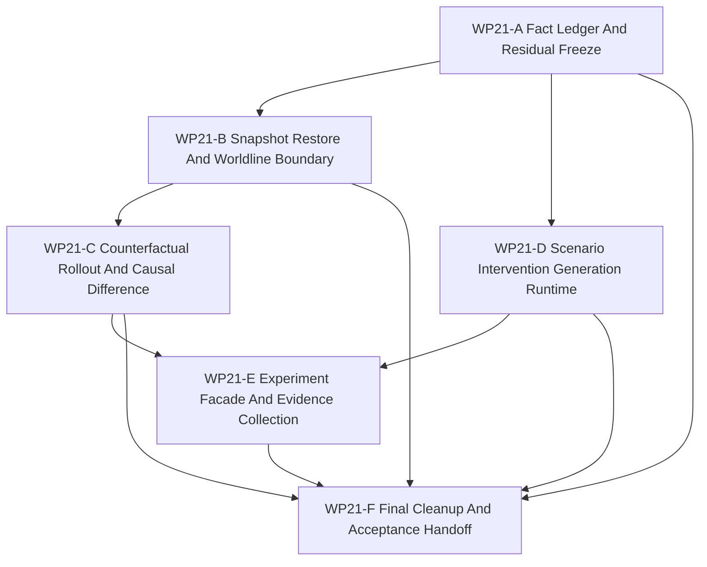

# WP21 Full Counterfactual Experiment Runtime

状态：`2026-05-22` complete / accepted。

Language:

- English canonical:
  [full_counterfactual_experiment_runtime_wp21_20260521.md](full_counterfactual_experiment_runtime_wp21_20260521.md)
- Chinese companion: `full_counterfactual_experiment_runtime_wp21_20260521.zh.md`

输入：

- [Stage 3 platform expansion mainline plan](../../review/stage3_platform_expansion_mainline_plan_20260521.md)
- [WP15 counterfactual experiment generation](../wp15_counterfactual_experiment_generation/counterfactual_experiment_generation_wp15_20260521.zh.md)
- [WP17 counterfactual runtime slice](../wp17_stage3_runtime_materialization_cleanup/wp17_counterfactual_runtime_closure_cluster_20260521.zh.md)
- [WP18 runtime ownership and C++ hot-path consolidation](../wp18_runtime_ownership_cxx_hot_path_consolidation/runtime_ownership_cxx_hot_path_consolidation_wp18_20260521.zh.md)
- [WP19 CUDA and resident-state mainline alignment](../wp19_cuda_resident_state_alignment/cuda_resident_state_alignment_wp19_20260521.zh.md)
- [WP20 public capability-platform composition](../wp20_public_capability_platform_composition/public_capability_platform_composition_wp20_20260521.zh.md)
- [WP21 验收审查](../../review/wp21_full_counterfactual_experiment_runtime_acceptance_review_20260522.zh.md)
- [Simulation system architecture design](../../../plan/architecture/simulation_system_architecture_design.md)
- [Subagent 使用规范](../../../standards/governance/subagent_usage_policy.zh.md)
- [WP Closure Lane Policy](../../../standards/governance/wp_closure_lane_policy.zh.md)

命名与提交信息说明：

- `WP21` 是冻结 post-WP17 路线的最终任务索引标签。
- 实现提交应使用结果语言，例如 `Run counterfactual branches through facade evidence`
  或 `Collect experiment worldline evidence`，不要使用内部 work-package 标签。

## 1. 目的

WP21 是架构/重构路线的最后一个计划阶段。它消费 WP15、WP17、WP18、WP19 与
WP20 已验收的 contract 与 runtime slices，并关闭剩余的 counterfactual /
experiment runtime gap。

目标不是无边界研究平台，而是一条维护中的、facade-owned runtime path：

```text
explicit typed setup 或 scenario-generation artifact
  -> replay envelope and branch point
  -> bounded snapshot / restore boundary
  -> parent and branch worldline execution
  -> causal difference and experiment evidence
  -> final cleanup of legacy-only counterfactual paths
```

WP21 是实现阶段。只有规划文档不能通过 gate。

## 2. 需要保留的当前代码事实

| 范围 | 当前事实 | WP21 含义 |
|------|----------|-----------|
| Counterfactual contracts | `src/runtime/contracts/counterfactual_replay_contracts.h` 拥有 replay envelope、branch point、worldline metadata、admission、generation 与 experiment evidence vocabulary。 | WP21 必须扩展或消费该 vocabulary，而不是创建平行 schema。 |
| Selected runtime slice | `RuntimeFacade::snapshot_counterfactual_entity()` 与 `RuntimeFacade::run_counterfactual_branch()` 已暴露 selected-entity branch/compare。 | WP21 从已验收 selected slice 出发，并且只在 snapshot/restore evidence 后扩展。 |
| Public bindings | Python bindings 已暴露 runtime counterfactual DTOs 与 facade methods。 | public runtime surface 变化需要 binding 与 facade tests。 |
| Scenario generation | `python/scenario/compiler/generation_request.py` 校验 generation requests/artifacts，但还不是 maintained generator。 | WP21 必须先把 request surface 转成 deterministic、non-mutating generation path。 |
| Runtime ownership residual | WP18 记录 `ScenarioLoader` 仍混合 scenario adaptation 与 runtime-state mirror。 | WP21 需要在 broad experiment runtime 验收前拆分、加闸或路由该 mirror。 |
| Platform setup | WP20 暴露 typed platform setup results，同时保留 type-name compatibility。 | Counterfactual baselines 应优先使用 explicit setup / typed setup evidence，并且不得强制 scenario schema migration。 |
| Backend / resident state | WP19 保持 GPU 与 resident-state helpers 为 diagnostics/export-only，除非存在证据。 | WP21 必须以 host-visible snapshot/restore 作为维护默认，不得晋级 exact GPU 或 resident-state support。 |

## 3. 范围边界

WP21 可以：

1. 冻结 full counterfactual / experiment runtime 的最终 source facts 与 residuals。
2. 为 counterfactual execution 所需的 maintained host-owned runtime state 实现 bounded snapshot/restore boundary。
3. 在 facade authority 下从 explicit setup / generated artifacts 执行 parent 与 branch worldlines。
4. 比较 worldlines，并在声明 barrier 上输出 causal-difference evidence。
5. 为 parameter variation 添加 deterministic scenario/intervention generation，且不直接改 authoritative state。
6. 通过 facade 与 Python surfaces 收集 experiment-run evidence。
7. 关闭或加闸剩余 legacy-only counterfactual、generation 与 loader mirror paths。

WP21 不可以：

1. 超过 WP19 已验收证据晋级 exact GPU 或 resident-state support。
2. 把 experiment scores、generated outcomes 或 capability profiles 当作 truth/support claims。
3. 在 facade/request contracts 之外修改 authoritative runtime state。
4. 强制所有 scenario JSON 或既有调用方迁移到 generated scenarios。
5. 在没有 bounded execution、evidence 与 cleanup gates 时声明 arbitrary-depth worldline trees。
6. 重开早期 WP 范围，除非命名 blocker 证明已验收边界有误。

## 4. 工作包

| 工作包 | 状态 | 关注点 | 目标 | 产出 |
|--------|------|--------|------|------|
| `WP21-A Fact Ledger And Residual Freeze` | complete / accepted | final facts and entry gate | 冻结 source/test facts、剩余 residuals 与 final-stage non-goals。 | [fact ledger](wp21_fact_ledger_residual_freeze_cluster_20260521.zh.md) |
| `WP21-B Snapshot Restore And Worldline Boundary` | complete / accepted | snapshot/restore runtime | 将 selected slice 扩展为 bounded、facade-owned snapshot/restore 与 worldline boundary。 | [snapshot / restore boundary](wp21_snapshot_restore_worldline_boundary_cluster_20260521.zh.md) |
| `WP21-C Counterfactual Rollout And Causal Difference` | complete / accepted | branch execution | 执行 parent/branch worldlines，并在无 raw mutation 的前提下产生 causal-difference evidence。 | [rollout and causal difference](wp21_counterfactual_rollout_causal_difference_cluster_20260521.zh.md) |
| `WP21-D Scenario Intervention Generation Runtime` | complete / accepted | deterministic generated inputs | 将 WP15 generation request surface 转为 deterministic parameter-variation generator。 | [scenario generation runtime](wp21_scenario_intervention_generation_cluster_20260521.zh.md) |
| `WP21-E Experiment Facade And Evidence Collection` | complete / accepted | experiment orchestration | 暴露 maintained experiment run surface，收集 observations、terminations、traces 与 evidence ancestry。 | [experiment facade and evidence](wp21_experiment_facade_evidence_cluster_20260521.zh.md) |
| `WP21-F Final Cleanup And Acceptance Handoff` | complete / accepted | route closure | 集成 A-E，关闭或加闸 legacy residuals，运行验证，同步索引并准备最终验收。 | [final cleanup and handoff](wp21_final_cleanup_acceptance_cluster_20260521.zh.md) |

## 5. 依赖图



并行规则：

- `WP21-A` 先启动或作为第一波，因为它冻结最终 residuals。
- `WP21-B` 与 `WP21-D` 可在 A 后并行，前提是写入范围互不重叠。
- `WP21-C` 等待 B，因为 branch rollout 必须消费 snapshot/restore boundary。
- `WP21-E` 等待 C 与 D，因为 experiment orchestration 需要 branch execution 与 generated-input evidence。
- `WP21-F` 是串行 closure，不应让 README、review、archive 或 bilingual chores 阻塞实现 worker。

## 6. 派发计划

| Stream | 写入范围规则 | 建议模型 / reasoning |
|--------|--------------|----------------------|
| `WP21-A` | 拥有 source-backed fact ledger 与 final residual map；source/test 只读盘点。 | 轻量但精度敏感：`gpt-5.4-mini`, xhigh。 |
| `WP21-B` | 拥有 snapshot/restore DTOs、runtime boundary、必要 facade/binding surface 与聚焦测试；不实现 experiment orchestration。 | 复杂 runtime seam：`gpt-5.4`, xhigh。 |
| `WP21-C` | 在 B 后拥有 parent/branch execution 与 causal-difference runtime；不编辑 scenario generation。 | 复杂 runtime semantics：`gpt-5.4`, xhigh。 |
| `WP21-D` | 拥有 deterministic scenario/intervention generator 与 non-mutation tests；不编辑 C++ rollout。 | 中等复杂 Python/runtime 边界：`gpt-5.4`, high。 |
| `WP21-E` | 在 C/D 后拥有 experiment facade、evidence collection、bindings 与 non-truth-claim tests。 | 复杂 public orchestration surface：`gpt-5.4`, xhigh。 |
| `WP21-F` | 拥有最终 validation rollup、residual closure、indexes、acceptance review 与 bilingual closure。 | 轻量 closure：`gpt-5.4-mini`, xhigh。 |

## 7. Gate 规则

| Gate | 必需证据 | 失败条件 |
|------|----------|----------|
| `WP21-A` | contracts、selected-slice runtime、generation requests、loader mirror residuals、typed setup 与 backend boundaries 的 source/test ledger。 | 从过时假设出发或隐藏 final residual。 |
| `WP21-B` | Snapshot/restore boundary 捕获并恢复声明的 host-owned state，带 barrier、seed、provider 与 evidence refs。 | Restore 绕过 facade authority 修改状态，或声明 unsupported GPU/resident state。 |
| `WP21-C` | Parent/branch worldlines 从 admitted inputs 独立执行并产生 deterministic causal deltas。 | Branch execution 绕过 replay/branch/admission contracts 或允许 raw authoritative mutation。 |
| `WP21-D` | Generated scenarios/interventions 是带 lineage、version、seed 与 non-mutation guards 的 deterministic artifacts。 | Generator output 直接修改 runtime state 或静默改变 scenario schema requirements。 |
| `WP21-E` | Experiment run collection 暴露 observations、rewards、terminations、traces、comparisons 与 evidence ancestry，且无 truth promotion。 | Experiment results 晋级 capability/backend support 或遗漏 ancestry。 |
| `WP21-F` | 实现证据存在后完成 validation rollup、residual closure、README/index sync、bilingual docs 与 acceptance review。 | 最终验收留下 unowned refactor-route residuals，或仅凭规划文档创建 acceptance。 |

## 8. 建议验证

```bash
git diff --check
bash tools/maintenance/cmo_env.sh python -m pytest -q tests/architecture/test_wp15_*.py
bash tools/maintenance/cmo_env.sh python -m pytest -q tests/runtime/facade/test_runtime_facade.py -k "counterfactual or worldline or experiment or setup"
bash tools/maintenance/cmo_env.sh python -m pytest -q tests/scenario/test_wp15_generation_request_surface.py
bash tools/maintenance/cmo_env.sh python -m pytest -q tests/runtime/bindings/test_bindings_runtime_dto_surface.py -k "counterfactual or experiment"
python3 tools/maintenance/wp_doc_closure_audit.py --wp WP21 --summary
```

## 9. 最终阶段完成定义

WP21 只有在以下条件满足时才算 complete：

- maintained counterfactual / experiment execution 不再只依赖 metadata-only contracts；
- 已验收 branch/compare behavior 可通过 facade-owned runtime surfaces 访问，必要时也有 bindings；
- scenario generation deterministic、versioned 且 non-mutating；
- experiment evidence 被收集，且不晋级 support/truth claims；
- legacy-only runtime mirror 或 bypass paths 被删除、加闸，或以 compatibility-only 形式保留并有测试；
- 最终验收审查不再留下 unowned refactor-route work。
