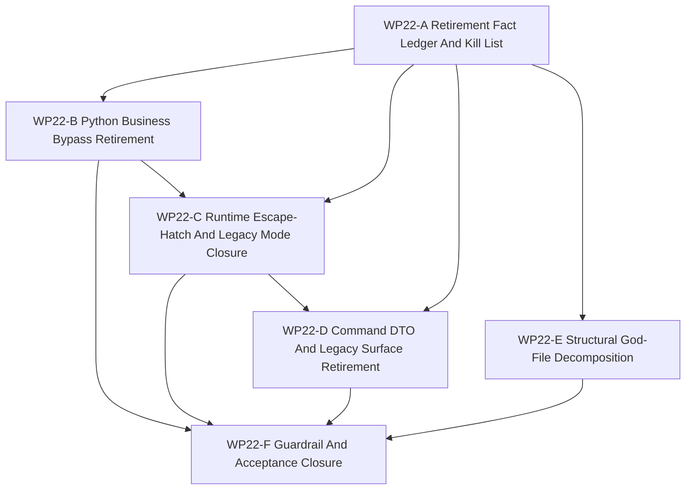

# WP22 旧兼容层强制退场与架构硬化

状态：`2026-05-23` frozen / owner-rejected；已由
[`WP23 Legacy Retirement Recovery And Reset`](../wp23_legacy_retirement_recovery/legacy_retirement_recovery_wp23_20260523.zh.md)
取代。本文档只保留历史 provenance。其 queues、"next dispatch" sections、
partial packets 与 quarantine evidence 不得用于启动新工作，除非先重写为 WP23
cluster，并通过 WP23 delete-or-block gate。

冻结前历史状态：`2026-05-22` WP21 owner-rejected；WP22 remediation active。最新几轮
implementation wave 已对其限定 packet 完成本地验收：production `loader.sim`
使用已清零，`RTE-007` setup/type/schema ownership 通过 terrain/setup 聚焦验证，
`A-001` maintained typed setup promotion 已落地，runtime legacy-mode 与
batch-runtime compatibility 已变为显式 opt-in quarantine surface，weapon-release
ordering 使用命名 helper systems。`WP22 overall complete? no`：compatibility escape
hatches、default-factory typed control-state replacement、aggregate DTO shells、
broad bindings、fat world-batch services 与剩余结构债仍阻塞 `WP22-F`。最新
implementation round 还把 direct GPU visual-binding raw-world access 隔离到命名
`WorldBatchRuntime` helper，并把 default-factory legacy seed ownership 抽到
`default_factory_legacy_spawn_compat.h`。最新 guard-and-quarantine round 又把
aggregate DTO 标记为 compatibility transport shell，将 `bindings_core.cpp`
registration 拆成 maintained / diagnostics / legacy helper surfaces，并收紧
repo 级 `batch_runtime` consumer guard。`WP22 overall complete? no` 仍不变：
这些都是更强 guard 或局部隔离，不是最终退场。最新 implementation round 又收窄了两个
结构面，并暴露一条 command blocker：maintained `bindings_core.cpp` entity reads
现在经由 kernel-owned query methods，visual-binding scene assembly 已从
	`WorldBatchRuntime` 抽到 helper，而 default-factory spawn seed 现在从
	`MissionCommandCore` 投影剩余 compatibility seed，并 seed
	`MissionCommandControlState`，但仍依赖 `MovementCommand` / `LaggedCommand`
	compatibility mirrors。Meitner 返回的是 partial typed-control implementation；
	主线程修复了其中的 `CommandLag` target overwrite 风险并完成 focused
	guards/build 复验。Descartes 随后确认 command ingress 与 command-link delivery
	仍绕过 typed-state ownership；Averroes 与 Parfit 在第十轮关闭了该 ingress/link
	sync 缺口并收紧 guard。Copernicus、Gauss 与
	Dalton 随后厘清了下一步 command-control 状态：Gauss 将 default-factory seed
	ownership 收窄到 `MissionCommandControlState`，Dalton 只给出 partial consumer
	migration，Copernicus 确认 `WP22-F` 仍不 eligible。这仍不是 closure，因为 legacy
	transport shells、debug surfaces、下游 mirror consumers、default-factory
	compatibility projection、DTO shells、runtime escape hatches 与 structural debt
	仍开放。

语言：

- 英文主文：[legacy_compatibility_retirement_wp22_20260522.md](legacy_compatibility_retirement_wp22_20260522.md)
- 中文辅文：`legacy_compatibility_retirement_wp22_20260522.zh.md`

输入：

- [Architecture refactoring audit](../../review/architecture_refactoring_audit_20260522.md)
- [WP21 full counterfactual experiment runtime](../archive/wp21_full_counterfactual_experiment_runtime/full_counterfactual_experiment_runtime_wp21_20260521.zh.md)
- [已争议的 WP21 验收记录](../../review/archive/wp-acceptance/wp21_full_counterfactual_experiment_runtime_acceptance_review_20260522.zh.md)
- [WP16 runtime spine consolidation](../archive/wp16_runtime_spine_consolidation/runtime_spine_consolidation_wp16_20260521.zh.md)
- [WP18 runtime ownership and C++ hot-path consolidation](../archive/wp18_runtime_ownership_cxx_hot_path_consolidation/runtime_ownership_cxx_hot_path_consolidation_wp18_20260521.zh.md)
- [WP20 public capability-platform composition](../archive/wp20_public_capability_platform_composition/public_capability_platform_composition_wp20_20260521.zh.md)
- [Simulation system architecture design](../../../plan/architecture/simulation_system_architecture_design.md)
- [Subagent Usage Policy](../../../standards/governance/subagent_usage_policy.md)
- [WP Closure Lane Policy](../../../standards/governance/wp_closure_lane_policy.md)

命名与提交信息说明：

- `WP22` 只是旧兼容层强制退场阶段的任务索引标签。
- 实现提交应使用结果语言，例如 `Route tasking writes through facade bridge`
  或 `Gate legacy runtime mode behind explicit opt-in`，不要使用工程内部 WP
  标签作为提交主题。

## 1. 目的

WP21 曾 claimed bounded counterfactual / experiment runtime path，但 owner 已在
`2026-05-22` 否决 WP21 closure。该否决与 post-WP21 审计共同说明：仍有过多兼容层
和旧实现面作为 first-class 路径存在。因此 WP22 是补救阶段，不是普通后续阶段：
compatibility residual 不再足以证明架构完成。

WP22 的目标是强制退场仍作为默认生产路径、维护中业务路径或未加守卫 raw runtime
access 的旧兼容面。剩余 legacy path 必须迁移、删除，或隔离到显式 opt-in
兼容区，并由 guard 阻止新的 maintained caller 进入。

目标姿态：

```text
verified legacy/compatibility kill list
  -> replacement facade / typed DTO / explicit bridge
  -> caller migration
  -> opt-in quarantine or deletion
  -> architecture guard
  -> closure only if no unowned default legacy path remains
```

这是实现阶段。只有规划文档不能通过 gate。

## 2. 审计基线修正

审计方向基本正确，但实现 worker 使用前必须先修正事实。

| 区域 | 已核验状态 | WP22 含义 |
|------|------------|-----------|
| God files | `counterfactual_replay_contracts.h`、`runtime_facade.cpp`、`runtime_window_coordinator.h`、`default_unit_factory.h` 行数与审计吻合。 | 这些是需要阶段化拆分的结构债，不再可作为可接受残留。 |
| Contract headers | 当前是 11 个 contract headers，其中 9 个超过 300 行，不是 “7 of 9”。多处混合 constants、DTO 与 inline validation。 | 拆分前必须修正 ledger。 |
| Python tasking bypasses | `leader_tasking.py` 仍读取 raw truth、写入 `loader.sim.*`，并硬编码 air profile。 | 第一轮实现应移除这些维护中业务绕过。 |
| Mission command shape | `loader.mission_cmd` 在 loader/runtime-state 路径中仍是 raw dict。 | 引入 typed DTO/adapter，并在 WP22 gate 内迁移消费者。 |
| Runtime escape hatches | `RuntimeFacade.runtime()` 和 `batch_runtime` 视图仍存在；部分主批量调用已优先 facade，因此 “default path” 说法偏重。 | 不再接受 escape hatch 作为默认 maintained surface；必须隔离并加 guard。 |
| Legacy runtime mode | `legacy` 仍是有效 first-class runtime mode；terrain source/binding 默认值现在已验证为 `flat`，但 setup/type/schema closure 仍需要完成。 | 将 legacy mode 隔离为显式 opt-in，并拒绝 silent default legacy 或 setup fallback。 |
| Command surface | `legacy_command.h` 仍有活跃 C++ consumers；部分 per-system fallback 已由 `control_input_resolution.h` 集中。 | 完成中心化 bridge，并退场 maintained legacy fallback。 |
| ECS / DTO shape | flat aggregate shells 与 implicit ECS ordering 仍是事实。 | 通过 typed/domain gate 与显式 ordering guard 退场默认 flat-shell 假设。 |
| Python profile layer | profile duplication、adapter triplication、air-specific common logic 与运行时 `ef_py` injection 部分属实。 | 通过 bridge-owned helpers 收敛 profile dispatch，移除 air/default 耦合。 |

## 2.1 Subagent 收口纠偏

WP22 继承 WP21 被否决后更严格的 closure rule：

- subagent 线程被关闭，不等于任务已关闭。
- timeout 在没有完整 return packet 时必须记为 blocker。
- partial source pass 只能记录为 partial，不能解锁 acceptance。
- integration 必须在推进下游 gate 前命名所有缺失 return packet。

当前 WP22-A 证据是 partial：Lagrange、Laplace 与 Raman 返回了可用的 runtime /
C++ / structural findings；Python source-pass worker 超时并被关闭，没有完整 return
packet。该缺口已经不再阻挡 `WP22-B` 的维护中业务退场，它现在是 `pass`；剩余
的 import-time `ef_py.TaskOrder` 后续位于 `command_chain_cache`，只是 C/F
compatibility guard lane 的 validation unlock，不是 blocker。

最新事实核验与文档补强任务已经返回 packet：`TaskOrder` / `ObjectiveShapingConfig`
import unlock 已通过，terrain build 与 binding blocker 已通过，有边界的 `RTE-003`
runtime seam 切片为 partial，文档需要本次事实纠偏。这是进展证据，不是 closure
evidence。

## 3. 范围边界

WP22 可以：

1. 为所有仍作为默认或 maintained business path 的 legacy/compatibility
   surface 建立 source-backed kill list。
2. 用 facade 或 bridge-owned surface 替换生产 `loader.sim.*`、raw-truth 与
   hardcoded-profile access。
3. 引入 typed mission-command adapters，并迁移影响 maintained runtime/tasking
   行为的 raw-dict consumers。
4. 将 `RuntimeFacade.runtime()`、`batch_runtime`、`loader.sim` 与 `legacy`
   runtime mode 隔离到显式 opt-in path，并加 architecture guards。
5. 完成 command-input 中心化，使 maintained systems 不再独立实现 legacy fallback。
6. 对最大的旧实现文件做可验证、保持行为不变的拆分或预拆分。
7. 添加测试，禁止新的默认 legacy access、direct raw runtime writes、silent
   legacy runtime mode 与 unowned compatibility residual。

WP22 不能：

1. 仅因为兼容而把 legacy path 标记为 accepted。
2. 在没有 owner、replacement、explicit opt-in 与 removal gate 的情况下让默认
   maintained caller 留在 legacy path。
3. 把 blocker 改名为 residual 来掩盖。
4. 静默破坏 public scenarios 或测试；调用方必须迁移，或带证据隔离。
5. 重开 exact GPU、resident-state、experiment truth-claim 或 unsupported backend
   promotion 范围。
6. 仅凭文档工作声明 closure。

## 4. 工作包

| 工作包 | 状态 | 关注点 | 目标 | 产出 |
|--------|------|--------|------|------|
| `WP22-A Retirement Fact Ledger And Kill List` | source-backed | source facts 与强制范围 | 验证审计 claims，把每个 old path 分类为 `delete`、`migrate`、`quarantine` 或 `blocker`，并分配 owner/gate。 | [fact ledger and kill list](wp22_retirement_fact_ledger_cluster_20260522.zh.md) |
| `WP22-B Python Business Bypass Retirement` | pass / validation unlock pass | tasking/profile callers | 移除维护中 Python tasking/profile bypass：hardcoded air dispatch、`loader.sim.*` writes、raw truth reads、profile triplication 与 raw mission-cmd consumers；剩余的 import-time `TaskOrder` unlock 只是 C/F validation follow-up。 | [Python business bypass retirement](wp22_python_business_bypass_retirement_cluster_20260522.zh.md) |
| `WP22-C Runtime Escape-Hatch And Legacy Mode Closure` | partial / public escape-hatch quarantine remains | runtime facade 边界 | 让 raw runtime/batch access 与 `legacy` runtime mode 只作为显式 opt-in compatibility 存在，并把 maintained callers 路由到 facade-owned methods。Direct GPU binding raw-world drilling 现在是 scoped-pass quarantine。 | [runtime escape-hatch closure](wp22_runtime_escape_hatch_closure_cluster_20260522.zh.md) |
| `WP22-D Command DTO And Legacy Surface Retirement` | scoped passes / typed control-state open | C++ command/DTO/spawn legacy | 完成 maintained legacy command fallbacks、raw DTO shells 与 type-name compatibility first-class surface 的退场。Default-factory seed 已由 helper 持有，但仍等待 typed control-state replacement。 | [command DTO legacy retirement](wp22_command_dto_legacy_surface_retirement_cluster_20260522.zh.md) |
| `WP22-E Structural God-File Decomposition` | partial / latest scoped passes accepted | 旧实现体量 | 在 behavior-preserving seam 后拆分最大 legacy implementation files，并把 validation 从单体 header 中移出。GPU binding raw-world 与 default-factory helper extraction 是 scoped pass；broad binding/service/factory structure 仍开放。 | [structural decomposition](wp22_structural_god_file_decomposition_cluster_20260522.zh.md) |
| `WP22-F Guardrail And Acceptance Closure` | not eligible | closure gate | 集成 B-E，安装 hard guards，运行 validation drift cleanup，同步索引与文档；只有没有 unowned default legacy path 时才准备验收。 | [guardrail and closure](wp22_guard_acceptance_closure_cluster_20260522.zh.md) |

## 5. 依赖图



并行规则：

- `WP22-A` 先启动，是 kill-list vocabulary 的唯一来源。
- `WP22-B` 已完成维护中业务退场；剩余的 import-time `TaskOrder` validation
  是 C/F compatibility-guard 后续，而 C 拥有 runtime facade/batch/environment
  files。
- `WP22-D` 等待 A，并吸收 C 的 facade boundary 决策。
- `WP22-E` 可在 A 后作为保持行为不变的 extraction 启动，但不得与 C 并行编辑
  同一组 runtime facade 行。
- `WP22-F` 是串行 closure；如仍有 unowned default legacy path，它有权使 WP 失败。

## 6. 派发计划

| Stream | 写入范围规则 | 建议模型 / 推理预算 |
|--------|--------------|---------------------|
| `WP22-A` | 拥有 source-backed kill-list docs 与 guard inventory。除非 broken planning link 阻塞，否则只读代码。 | 轻量但精度敏感：`gpt-5.4-mini`, xhigh。 |
| `WP22-B` | 拥有 Python tasking/profile/mission-command migration files 与聚焦测试。不编辑 runtime facade C++ internals。 | 中等跨文件业务迁移：`gpt-5.4`, high。 |
| `WP22-C` | 拥有 runtime facade/batch escape-hatch gating、legacy-mode opt-in 与 facade tests。除 call-site adaptation 外不编辑 tasking profile logic。 | 复杂 runtime boundary：`gpt-5.4`, xhigh。 |
| `WP22-D` | 拥有 C++ command resolution、DTO compatibility gates、typed spawn first-class transition tests。改变 public runtime setup 前需与 C 协调。 | 复杂 architecture seam：`gpt-5.4`, xhigh。 |
| `WP22-E` | 拥有 contracts/facade/window/factory 结构抽取，要求行为不变测试，不改变业务语义。 | 复杂重构：`gpt-5.4`, xhigh。 |
| `WP22-F` | 拥有 architecture guards、validation rollup、residual rejection、README/review sync、bilingual closure 与 acceptance draft。 | 轻量 closure 但严格 gatekeeping：`gpt-5.4-mini`, xhigh。 |

Worker 规则：

- 使用项目 [Subagent Usage Policy](../../../standards/governance/subagent_usage_policy.md)。
- worker 不是独自在代码库中工作；不得 revert 无关编辑或其他 worker 的编辑。
- 每个 worker 必须返回 touched files、commands run、remaining legacy paths、blockers
  与 integration notes。
- worker 可以停在 `blocked`，但 blocker 必须命名 replacement、owner 与 failing guard。
  “Compatibility residual” 不是 pass state。

## 6.1 第一轮实现快照

| Stream | 本地结果 | 证据与说明 |
|--------|----------|------------|
| `WP22-B` | `pass` | `leader_tasking` 的 maintained path 已清空维护中业务退场 lane；`command_chain_cache` 的 import-time `ef_py.TaskOrder` 只剩 validation-only unlock，raw sim seam 现在属于 C/F compatibility guard ownership。聚焦测试：`34` 个通过；`24` 个 deselected。 |
| `WP22-C` | `partial` | runtime opt-in / quarantine 测试通过；import-time binding blocker 已解除；maintained reward/info 经由命名 loader-backed seam；terrain source 已验证 `flat`；direct GPU binding raw-world access 现在经由命名 `WorldBatchRuntime` compatibility helper，repo 级 `batch_runtime` consumer drift 也已有 guard。公开 `RuntimeFacade::runtime()` / `WorldBatchRuntime::world()` escape hatches 仍是 quarantine。 |
| `WP22-D` | `scoped passes / transport shells guarded` | air-control bridge 与 A-001 maintained typed setup 已落地。Default factory 不再 direct include `legacy_command.h`；seed ownership 已隔离到 `default_factory_legacy_spawn_compat.h`。Aggregate DTO 已被标成 compatibility transport shell，但 typed control-state replacement 与真实 aggregate DTO retirement 仍开放。 |
| `WP22-E` | `partial / binding quarantine accepted` | constants/helper split、entry-header splits、validation-family split、helper-system ordering、GPU binding raw-world quarantine、default-factory helper extraction 与 `bindings_core.cpp` maintained/diagnostics/legacy registration split 已落地，但 runtime-facade/factory 结构债、broad public bindings 与 fat world-batch services 仍开放。结构 guard 证据仍是 scoped，不是 closure。 |
| `WP22-F` | `not eligible` | 尚未具备 closure 资格；只能消费已锁定的 B-E 证据集。 |

## 6.2 第二轮实现快照

| Stream | 本地结果 | 证据与说明 |
|--------|----------|------------|
| `WP22-B` | `pass` | policy-read seam 已落地，`common_core_profile` 与 `loading.py` 现在都是 compatibility-only guard surfaces；raw sim seam 已转入 C/F compatibility guard ownership，而 `command_chain_cache` 的 import-time `ef_py.TaskOrder` 仍是 validation-only unlock。WP22-specific tests 已通过。 |
| `WP22-D` | `pass` | legacy command consumers 已被迁移或隔离到 bridge；direct-include allowlist 现在只剩 specific bridge/default-factory seams。 |
| `Validation sweep` | `pass` | WP22-specific tests 已通过，且 aggregate sweep 在 WP16/WP20 drift cleanup 后已通过。当前聚焦验证还覆盖了 TaskOrder/objective-shaping import unlock、terrain binding rebuild 与有边界 runtime seam 切片。 |

文档同步现在进入第四轮，因为 drift cleanup 已让验证结果稳定，而剩余后续已转为 validation lane。

## 6.3 本地验证摘要

| 命令 | 结果 |
|------|------|
| `tests/architecture/test_wp22_tasking_bridge_retirement.py ...` | focused combined `34` passed, `24` deselected |
| `tests/architecture -k "tasking or facade or legacy"` | `59` passed, `147` deselected |
| `tests/architecture/test_wp22_structural_guardrails.py tests/architecture/test_wp9_guard_enforcement.py` | `16` passed |
| `git diff --check` | 通过 |
| `python3 tools/maintenance/wp_doc_closure_audit.py --wp WP22` | 已完成；task docs `16`，acceptance reviews `0`；`missing-acceptance-review` 警告仍然开放。 |

## 6.4 第三轮派发

| Stream | 写入范围规则 | 建议模型 / 推理预算 |
|--------|--------------|---------------------|
| `TaskOrder import unlock` | 已完成；保留 lazy binding/import-order guard 作为 C/F guard ownership 下的验证证据。 | `gpt-5.4-mini`, high。 |
| `RTE-003/RTE-007 next slice` | production raw-loader cleanup 与 setup/type/schema ownership 已完成。后续只作为 guard follow-up；公开 `L-002` raw facade/world access 仍是 quarantine，direct GPU binding raw-world access 已 scoped-pass closed。 | `gpt-5.4`, xhigh。 |
| `WP22-E/D residual gates` | 收紧 structural decomposition 与 command DTO retirement 的剩余 residual gate，避免把开放工作写成完成证据。 | `gpt-5.4-mini`, xhigh。 |
| `Documentation fourth sync` | 在下一切片完成后，重新对齐账本、队列与双语文档到当前 pass/block 状态。 | `gpt-5.4-mini`, xhigh。 |

## 6.5 当前 round packet

| Stream | 状态 | Packet | 证据 |
|--------|------|--------|------|
| `Schrodinger` | `pass` | complete packet | `command_chain_cache.py` 现在懒解析 `MissionCommand` / `TaskOrder` / `LeaderIntent` / `PilotReport` 字段；`reward_metadata.py`、`service.py` 与 loader reward path 现在使用 conditional/lazy `ObjectiveShapingConfig`；聚焦组合测试回报 `13 passed, 57/58 deselected`，diagnostics 回报 `4 passed`。 |
| `Zeno` | `pass` | complete packet | 恢复 datalink command cleanup 变量，成功重建 `ef_py`，并验证 terrain/setup 聚焦测试。此前的 `data_link_system.h:284` build blocker 已关闭。 |
| `Tesla` | `partial` | complete packet | maintained runtime reward/info 切片现在经由命名 loader-backed seam，聚焦 runtime 测试通过；repo 级 raw loader seam 仍在有边界切片外存活。 |
| `Arendt` | `pass` | complete packet | 文档同步 packet 完整，但它早于 Zeno 修复 build blocker；只有在本事实纠偏后才接受。 |

closed thread 只是 transport，不是 completion evidence。`WP22 overall complete? no`。

## 6.6 当前实现轮次验收

| Worker | 分片结果 | 本地验证 | 剩余 blocker |
|--------|----------|----------|--------------|
| `Locke` | 早期 `RTE-003` raw-loader seam 切片 `pass`。Maintained tasking、command-chain、time-step、naval-screen 与 scripted-opponent 路径现在经由命名 compatibility seam。 | 历史 packet：`git diff --check`；当时 raw-loader scan 还报告 `gym_envs/scenario_loader/runtime_state.py:329` 与 `gym_envs/scenario_loader/loading.py:348`；runtime facade guard `8 passed`；tasking/naval/execution 聚焦套件 `34 passed`。Russell 后续关闭了这些最终 production anchors。 | raw-loader cleanup 已被 Russell 覆盖；更广义 runtime escape hatches 另行追踪。 |
| `Hubble` | `RTE-007` setup/type/schema ownership `pass`。缺失 terrain 默认解析为带 `default_mainline` 来源的 `flat`；显式 legacy terrain 被命名为 compatibility。 | `cmake --build build-workshop --target ef_py -j4`；facade terrain/setup `5 passed`；world-batch terrain/setup `5 passed`；scenario compiler terrain/layout `7 passed`；world setup compat `5 passed`。 | 历史显式 `legacy` fixture consumer 仍是 compatibility consumer；A-001 后续已由主线程关闭。 |
| `Carver` | counterfactual contract 入口头拆分 `pass`。`counterfactual_replay_contracts.h` 现在是低于 `1500` 阈值的 umbrella header。 | structural/WP9 guards `16 passed`；build passed。 | 后续 validation-family work 已拆 former follow-up chunk；本行保留为 provenance。 |
| `Noether` | runtime-window 入口头拆分 `pass`。`runtime_window_coordinator.h` 现在低于 `1000` 阈值，并委托给命名 helper headers。 | structural/WP9 guards `16 passed`；build passed。 | 更广义结构 blocker 仍存在：`runtime_facade.cpp`、`default_unit_factory.h`、broad bindings 与 fat world-batch services。 |

这些 packet 只在自身限定分片内被验收，不授权 `WP22-F` 或 acceptance review。

## 6.7 后续实现轮次验收

| Worker | 分片结果 | 本地验证 | 剩余 blocker |
|--------|----------|----------|--------------|
| `Russell` | final production raw-loader cleanup `pass`。Production `loader.sim.*` / `loader.sim,` scan 现在为空。 | `git diff --check`；raw-loader scan 无匹配；runtime facade guard `8 passed`；WP22 tasking bridge guard `7 passed`；聚焦 mission/execution 测试 `4 + 2 + 1` passed。 | 只剩显式测试/guard 字符串；更广义 runtime escape hatch 另行追踪。 |
| `Bernoulli` | requested Python runtime quarantine slice `pass`。silent env/default legacy selection 已移除；`legacy` mode、`batch_runtime`、raw runtime fallback 与 fallback cadence 都是显式 compatibility opt-in。 | `git diff --check`；env config `6 passed`；vec-env runtime/batch tests `3 passed`；single-runtime fallback tests `8 passed`；runtime facade architecture tests `4 passed`。 | 后续 Hooke 已移除 maintained facade raw drilling；public raw access 仅作为 compatibility/diagnostics 保留。 |
| `Parfit` | `PilotWeaponRelease` ordering residual slice `pass`。该 system 现在经由 `register_pilot_weapon_release_system(ecs, *this)` 注册。 | `git diff --check`；structural/WP9 guards `16 passed`；`ef_py` build passed；聚焦 engagement/facade tests passed。 | Naval post-step fire loop、`default_unit_factory.h` legacy command seeding 与 typed setup compatibility path 仍开放。 |
| `Raman` | 仅 queue sync `done`。队列记录 scoped passes，并保持 `WP22-F` pending next implementation evidence。 | `git diff --check`；WP22 doc closure audit advisory summary 报告 `0` canonical acceptance reviews 与 `8/8` zh peers。 | acceptance review 仍不存在；review/index sync 继续后置。 |

这些 packet 仍不授权 `WP22-F`。它们只是把 WP22 收窄到剩余 C++/structural
retirement lanes。

## 6.8 第六轮实现验收

| Worker | 分片结果 | 本地验证 | 剩余 blocker |
|--------|----------|----------|--------------|
| `Pascal` | direct GPU visual binding raw-world quarantine `pass`。`bindings_gpu.cpp` 不再直接调用 `runtime.world(...)`；visual scene collection 现在通过 `WorldBatchRuntime::collect_visual_binding_compatibility_scenes_batch(...)`。 | `ef_py` build passed；GPU visual-binding architecture guard `2 passed`；focused GPU runtime binding test `1 passed`。 | 公开 `WorldBatchRuntime::world()` 仍是 compatibility/diagnostics escape hatch；更广义 world-batch service decomposition 仍开放。 |
| `Bohr` | default-factory legacy seed helper extraction 在主线程行为保持修复后 `pass`。`default_unit_factory.h` 不再 direct include `legacy_command.h`；default action 与 flight legacy seed 经由 `default_factory_legacy_spawn_compat.h`。 | `ef_py` build passed；default-factory/WP9 focused guard `9 passed, 2 deselected`。 | `default_factory_legacy_spawn_compat.h` 在 typed control-state/default initialization replacement 前仍是 compatibility seed ownership。 |
| `Poincare` | `WP22-F closure preflight` `timeout/shutdown`；没有返回完整 packet。 | 无 accepted packet | 不解锁 `WP22-F`；closure preflight 要等剩余 implementation blocker 关闭后重跑。 |

这些 packet 仍不授权 `WP22-F`；只退场两个 scoped implementation residual，并记录一次 closure-preflight timeout。

## 6.9 第七轮 Guard 与 Quarantine 验收

| Worker | 分片结果 | 本地验证 | 剩余 blocker |
|--------|----------|----------|--------------|
| `Pauli` | WP22-D DTO/domain-shell guard 切片 `pass`。`MissionCommand`、`TaskOrder`、`LeaderIntent` 与 `PilotReport` 仍存在，但现在明确标记为 compatibility transport shell，并带 owner-slice projection helper；world-batch assignment wrapper 也声明同样的 transport-only ownership。 | `python -m pytest -q tests/architecture -k "wp22 and (dto or shell or command or tasking)"` -> `17 passed, 212 deselected`；`ef_py` build passed；后续 WP22 组合 guard sweep 通过。 | 真正的 aggregate DTO retirement 仍开放。Air/naval duplicated truth 仍需要下游 maintained consumer 优先使用 owner slice，而不是 flat shell。 |
| `Ramanujan` | WP22-E binding-surface quarantine 切片 `pass`。`bindings_core.cpp` 现在通过 explicit maintained、diagnostics-introspection、legacy-compatibility 与 diagnostics-override helper 注册 SimulationKernel API；maintained 与 override helper block 中已没有直接 `self.get_world().entity(...)` drilling。 | `python -m pytest -q tests/architecture/test_wp22_structural_guardrails.py -k "bindings"` -> `3 passed, 7 deselected`；`ef_py` build passed；后续 WP22 组合 guard sweep 通过。 | Python binding 仍暴露 `75` 个 SimulationKernel 方法，maintained binding 仍使用本地 raw-entity seam。这是 quarantine，不是 public API reduction。 |
| `Beauvoir` | WP22-C/F public escape-hatch guard hardening 的 `preflight-only`。Repo 级 non-test Python `batch_runtime` consumer 现在会在 explicit compatibility/diagnostics allowlist 外被扫描，文档也继续保持 `WP22-F` not eligible。 | `python -m pytest -q tests/architecture/test_runtime_facade_layering.py -k "runtime_facade_runtime_consumers or escape_hatch or batch_runtime or world_batch_vec_env"` -> `16 passed, 19 deselected`；`wp_doc_closure_audit --summary` 报告 `0` canonical acceptance reviews。 | 公开 `RuntimeFacade::runtime()`、`WorldBatchRuntime::world()`、`vec_env.batch_runtime`、显式 `legacy` mode 与 fallback cadence 仍是 compatibility/diagnostics surfaces。 |

本地主线程集成复测：`python -m pytest -q tests/architecture/test_wp22_structural_guardrails.py tests/architecture/test_runtime_facade_layering.py tests/architecture/test_wp22_default_factory_legacy_seed_guard.py tests/architecture/test_wp22_dto_domain_shell_guard.py tests/architecture/test_wp9_guard_enforcement.py -k "wp22 or default_factory or dto or shell or bindings or gpu_visual_binding or visual_binding_raw_world_access or runtime_facade_runtime_consumers or escape_hatch or batch_runtime or world_batch_vec_env"` -> `48 passed, 13 deselected`；`cmake --build build-workshop --target ef_py -j4` -> 通过；`git diff --check` -> 通过；`python3 tools/maintenance/wp_doc_closure_audit.py --wp WP22 --summary` -> advisory summary only，`0` canonical acceptance reviews。

这些 packet 仍不授权 `WP22-F`。它们只是把开放 surface 转成更强的 guarded
implementation seam，并没有移除剩余 compatibility surface。

## 6.10 第八轮实现验收

| Worker | 分片结果 | 本地验证 | 剩余 blocker |
|--------|----------|----------|--------------|
| `Harvey` | default-factory typed seed reduction 为 `partial`。Default-factory flight-model spawn 现在 materialize typed `MissionCommand` shell，并从 `MissionCommandCore` 投影剩余 legacy command seed；重复的 flight-model `ActionCommand` seeding 已收窄。 | default-factory/WP9 guards `9 passed, 2 deselected`；mission/naval focused tests `5 passed`；`ef_py` build passed；`git diff --check` passed。 | `default_factory_legacy_spawn_compat.h` 仍 direct include `legacy_command.h`，仍持有 spawn-time `MovementCommand` / `LaggedCommand` projection。该 control path 仍缺 typed replacement。 |
| `Banach` | maintained binding raw-entity seam reduction `pass`。Maintained `SimulationKernel` bindings 不再使用本地 `lookup_entity(...)` 或直接 `self.get_world().entity(...)`；entity reads 现在绑定到 kernel-owned query methods。 | `python -m pytest -q tests/architecture/test_wp22_structural_guardrails.py -k "bindings"` -> `3 passed, 7 deselected`；`ef_py` build passed；`git diff --check` passed。 | diagnostics 与 legacy binding block 仍有意 raw ECS drilling，并保持 quarantine；broad public binding count 仍为 `75`。 |
| `Planck` | behavior-preserving `WorldBatchRuntime` service split `pass`。Visual-binding compatibility scene assembly 已移动到 private `world_batch_visual_binding_compatibility` helper；公开 compatibility method 与 error semantics 保持不变。 | runtime facade layering guard `9 passed, 26 deselected`；`ef_py` build passed；`git diff --check` passed。 | 公开 `WorldBatchRuntime::world()` 仍是 compatibility/diagnostics escape hatch；更广义 world-batch service decomposition 仍开放。 |

本地主线程集成复测：default-factory guards `9 passed, 2 deselected`；
mission/naval focused tests `5 passed`；组合 WP22 guard sweep `45 passed,
16 deselected`；`cmake --build build-workshop --target ef_py -j4` -> 通过；
`git diff --check` -> 通过；`python3 tools/maintenance/wp_doc_closure_audit.py
--wp WP22 --summary` -> advisory summary only，`0` canonical acceptance reviews。

这些 packet 仍不授权 `WP22-F`。它们让两个实现面更窄，并识别出下一条具体 command
blocker，但没有退场剩余 compatibility seed path。

## 6.11 第九轮实现验收

| Worker | 分片结果 | 本地验证 | 剩余 blocker |
|--------|----------|----------|--------------|
| `Maxwell` | `WorldBatchRuntime` setup orchestration split 为 `pass`。新增 `src/core/engine/world_batch_setup_helper.h`；`WorldBatchRuntime::apply_world_setup_batch` 现在通过 private helper 处理 setup orchestration、terrain/wind/zone/reset seed resolution，同时保持 `WorldBatchRuntime::world()` 不变。 | runtime facade layering focused guard `10 passed, 26 deselected`；world_batch setup focused tests `3 passed, 21 deselected`；`cmake --build build-workshop --target ef_py -j4` 通过；`git diff --check` clean。 | 公开 `WorldBatchRuntime::world()` 仍是 compatibility/diagnostics escape hatch；更广义 world-batch service decomposition 仍开放；`default-factory` typed control-state replacement 仍开放。 |
| `Hooke typed-control inventory` | 只读 inventory `pass`，`touched files: none`。它识别出 `MissionCommandControlState` 是下一条最小 typed seam，并把第一实现切片限定到 `default_factory_legacy_spawn_compat.h`、`operation_system.h` 与 `control_system.h`。 | default-factory/WP9/structural architecture guards `21 passed`；mission/naval/link focused tests `18 passed`；无文件编辑。 | inventory 不是 retirement；Meitner 已派发 typed-control implementation slice。 |
| `Poincare docs cleanup` | `partial`，`touched files: none`；未应用 docs cleanup patch 即停止。 | packet 未运行 audit 或 diff-check；主线程继续持有 audit 责任。 | 无 closure evidence。 |
| `Meitner typed-control implementation` | `partial / main-thread repaired`：新增 `MissionCommandControlState`，并让 operation/control/default-control 朝 typed state 接入，但在 command ingress/link/default-factory validation 前停止。主线程修复 `CommandLag` lagged 初始化覆盖 fresh target 的风险。 | 主线程复验：architecture default-factory/WP9/structural guards `21 passed`；mission/naval/link focused tests `18 passed`；`cmake --build build-workshop --target ef_py -j4` 通过；`git diff --check` clean。Descartes 只读核验确认 ingress/link 仍绕过 typed state。 | `set_unit_command`、`set_unit_stick_command`、`CommandLinkMovement` 与 default-factory compatibility projection 仍是 blockers；Averroes/Parfit 第十轮任务 active。 |
| `Averroes typed ingress/link sync` | `pass`：non-ship immediate `set_unit_command` 与 deferred `CommandLinkMovement` 现在先更新 `MissionCommandControlState`，再刷新 legacy mirrors；stick command 明确 quarantine 为 legacy-only。 | 主线程复验：`cmake --build build-workshop --target ef_py -j4`；runtime mission/naval/link focused suite `19 passed`；`git diff --check` clean。 | Legacy transport shell、debug surfaces、`ActionCommand` / `PendingActionCommand`、下游 mirror consumers 与 default-factory compatibility projection 仍开放。 |
| `Parfit typed-control guard hardening` | `pass`：command ingress 与 default-factory guards 现在防止 partial typed-state work 被误认为 retirement。 | 主线程复验：architecture default-factory/WP9/structural suite `21 passed`；`git diff --check` clean。 | Guard hardening 不是 WP22-F evidence；它只是迁移剩余 seam 期间的防回归边界。 |

这些 packet 仍不授权 `WP22-F`。它们收窄了实现面并把下一条 command blocker
具体化并关闭 ingress/link typed-state blocker，但没有退场剩余 compatibility seed path
或更广义 legacy surfaces。

## 7. Gate 规则

| Gate | 所需证据 | 失败条件 |
|------|----------|----------|
| `WP22-A` | 带 source links、修正审计事实、owner、replacement path、retirement mode 与 validation gate 的 kill list。 | 从未经核验的审计数字推进，或允许 open-ended residual。 |
| `WP22-B` | maintained tasking/profile code 不再 hardcode air、不再写 `loader.sim.*`、不再把 raw truth 当 policy input，也不再把 mission command 当 untyped raw dict 消费。 | 任意 production tasking path 仍依赖 raw loader/runtime access 且无显式隔离。 |
| `WP22-C` | maintained batch/facade paths 不再需要 `RuntimeFacade.runtime()`、`batch_runtime`、`loader.sim` 或 silent `legacy` mode；兼容访问必须 opt-in 且有 guard 测试。 | escape hatch 仍是默认，或 architecture tests 允许新的 maintained raw runtime caller。 |
| `WP22-D` | maintained command/setup paths 通过中心化 typed/bridge-owned contracts 解析；legacy command/type-name surfaces 被隔离或在安全处删除。 | independent per-system legacy fallback 或 first-class type-name setup 仍是 maintained path。 |
| `WP22-E` | 至少第一批结构拆分带 behavior-preserving validation 落地，剩余 god-file debt 有 owner/gate，而不是 residual。 | 结构债停留在文档，或拆分无测试地改变行为。 |
| `WP22-F` | guards 能阻止新的 legacy default access，验证通过，索引同步，验收不包含 unowned default compatibility layer。 | 仍有 unowned old implementation first-class 时创建验收。 |

## 8. 建议验证

```bash
git diff --check
python3 tools/maintenance/wp_doc_closure_audit.py --wp WP22 --summary
python -m pytest -q tests/architecture -k "facade or runtime or legacy or tasking"
python -m pytest -q tests/runtime/facade -k "runtime or batch or world_setup"
python -m pytest -q tests/world_batch -k "compatibility or legacy or facade"
python -m pytest -q tests/scenario -k "mission or loader or generation"
```

worker 必须为自己触碰的退场面添加聚焦测试；宽泛 smoke 不能替代具体退场证据。

## 9. 最终完成定义

WP22 只有在以下条件满足时才算 complete：

- 每个 audit-backed compatibility/legacy surface 都有已核验 owner、replacement 与 guard；
- maintained business code 不再使用 raw runtime 或 loader bypass；
- legacy runtime mode 与 escape hatches 只作为 opt-in compatibility 存在；
- typed 或 bridge-owned DTO 替代 raw mission command 与 maintained path 的 command fallback surface；
- 大型旧实现文件至少完成第一批 behavior-preserving split，剩余 split work 有 guard 而非被忽略；
- final acceptance 不包含 unowned default legacy path。
