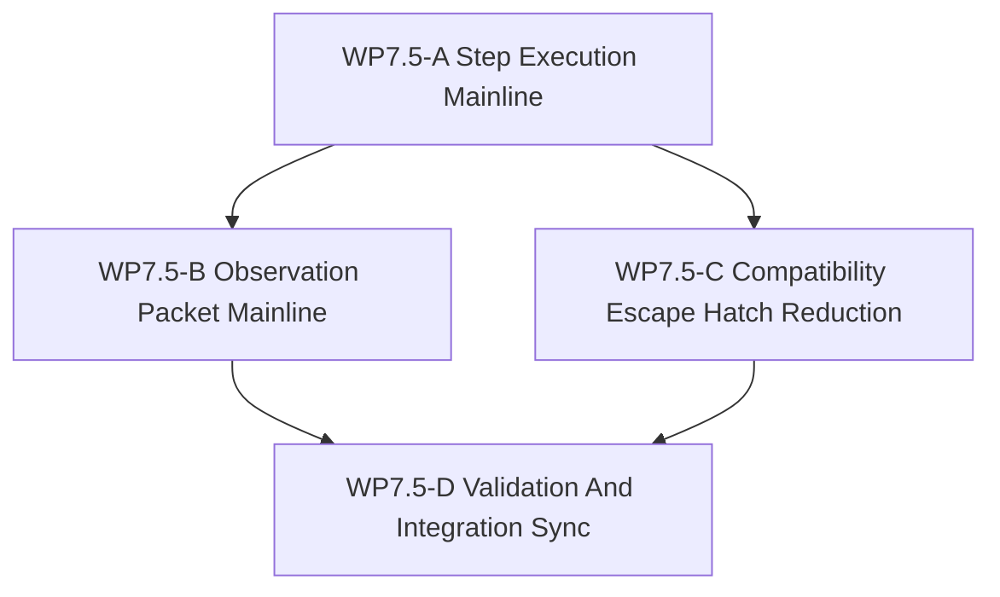

# WP7.5 Training Path Facade Bridge

Status: `2026-05-20` planned bridge line between accepted `WP7` backend
capability materialization and planned `WP8` SCAL learning-face work.

Language:

- English canonical: `training_path_facade_bridge_wp75_20260520.md`
- Chinese companion:
  [training_path_facade_bridge_wp75_20260520.zh.md](training_path_facade_bridge_wp75_20260520.zh.md)

Inputs:

- [simulation system architecture design](../../../plan/architecture/simulation_system_architecture_design.md)
- [architecture and performance research follow-up](../../../plan/architecture/architecture_and_performance_research_followup.md)
- [WP4 facade alignment](../wp4_facade_alignment/facade_alignment_wp4_20260519.md)
- [WP4 policy binding alignment notes](../wp4_facade_alignment/wp4_policy_binding_alignment_notes_20260519.md)
- [WP5 validation harness](../wp5_validation_harness/validation_harness_wp5_20260519.md)
- [WP7 backend capability materialization](../wp7_backend_capability_materialization/backend_capability_materialization_wp7_20260519.md)
- [temp-05 infrastructure closure and compatibility-layer audit](../../../plan/architecture/review/temp-05.md)
- [WP7.5 acceptance review](../../review/wp75_training_path_facade_bridge_acceptance_review_20260520.md)
- current `python/rl/runtime/world_batch/adapter.py`
- current `python/rl/runtime/world_batch_vec_env.py`
- current `python/rl/runtime/cooperative_world_batch_vec_env.py`
- current `tests/architecture/test_runtime_facade_layering.py`
- current `tests/runtime/facade/test_runtime_facade.py`
- [Subagent Usage Policy](../../../standards/governance/subagent_usage_policy.md)

Naming note:

- `WP7.5` is not a replacement for `WP8`; `WP8` remains the SCAL Learning-face
  architecture line.
- `WP7.5` does not reopen accepted `WP4`; it bridges accepted facade contracts
  into the maintained training mainline.
- `WP7.5` is not a request to delete every compatibility helper in one pass; it
  narrows raw runtime access to explicit compatibility or diagnostics seams.

When `WP7.5` is split across workers:

- keep `WP7.5-A` and `WP7.5-B` disjoint unless a single integration worker is
  reconciling them,
- do not let concurrent authors split the same normative table,
- keep one worker responsible for cross-file publication and README sync.

## 1. Purpose

The project already owns maintained facade-shaped runtime contracts from `WP3`
and `WP4`, and `WP8` will define learning-facing contract vocabulary. What is
still missing is the bridge that makes the maintained training path consume the
facade surface instead of the `RuntimeFacade.runtime()` escape hatch.

Today `WorldBatchVecEnv` and the adapters around it still route the main batch
training path through raw `WorldBatchRuntime` methods. That keeps the facade
contracts validated in tests, but not actually used by the maintained training
mainline. `WP7.5` closes that bridge by migrating maintained batch training
paths toward:

- `RuntimeFacade.step_execution_batch()`
- `RuntimeFacade.export_observation_packet()`

This makes the training path a real consumer of the same request/result
contracts that the simulation architecture now treats as maintained, and gives
`WP8` a stable facade-shaped execution and observation path to depend on.

`WP7.5` should answer:

1. Which maintained training-path operations still depend on
   `RuntimeFacade.runtime()` or raw `WorldBatchRuntime` stepping?
2. Which facade request/result surfaces become the maintained equivalents for
   batch step execution and observation export?
3. Which raw runtime paths remain allowed after migration, and only for what
   compatibility or diagnostics purpose?
4. What narrow tests prove the maintained training path no longer depends on
   raw runtime stepping or direct observation getters?

## 2. Scope Boundary

`WP7.5` can:

1. Migrate maintained batch training adapters from raw runtime episode stepping
   to `ExecutionBatchStepRequest` / `ExecutionBatchStepResult`.
2. Route maintained training observation reads through
   `ObservationBatchRequest` / `ObservationBatchPacket`.
3. Tighten naming and provenance around `AgentObservation` values that are still
   called `truth` in Python adapters.
4. Add narrow architecture/runtime tests that fail if maintained training paths
   regress to `RuntimeFacade.runtime()`.
5. Update task and review indexes so `WP8` can cite a maintained facade-shaped
   training path rather than a future migration assumption.

`WP7.5` cannot:

1. Absorb `WP8` Learning-face architecture into itself.
2. Promote GPU, resident-state, device-observation, exact-backend, or shadow
   capability claims.
3. Remove every compatibility helper needed for diagnostics, setup, or legacy
   single-world tooling in one pass.
4. Treat raw `WorldBatchRuntime` access as a maintained policy or training API.
5. Reopen accepted `WP4` or `WP5` scope as if their contract or evidence lines
   were incomplete.

## 3. Work Packages

| Work package | Status | Goal | Output |
|--------------|--------|------|--------|
| `WP7.5-A Step Execution Mainline` | planned | Make maintained batch training steps consume `RuntimeFacade.step_execution_batch()` instead of raw runtime episode stepping. | step-execution migration slice |
| `WP7.5-B Observation Packet Mainline` | planned | Make maintained training observation reads consume `ObservationBatchRequest` / `ObservationBatchPacket` and tighten packet provenance. | observation-bridge slice |
| `WP7.5-C Compatibility Escape Hatch Reduction` | planned | Reduce `RuntimeFacade.runtime()` use to explicit compatibility or diagnostics seams and document what remains allowed. | compat-reduction slice |
| `WP7.5-D Validation And Integration Sync` | planned | Add regression gates and sync README, review, and `WP8` references once A-C stabilize. | validation/index slice |

## 4. Dependency Map



Parallel rule:

- `WP7.5-A` starts first because it defines the maintained batch-step mainline.
- `WP7.5-B` may proceed once the step path settles the maintained request/result
  shape that training code will consume.
- `WP7.5-C` can trim escape-hatch usage in parallel with `WP7.5-B`, but it
  should not remove seams before maintained replacements exist.
- `WP7.5-D` is serial and should only run after A-C stabilize.

Bridge rule:

- `WP8` may define learning-facing contract vocabulary before `WP7.5` lands in
  code.
- Maintained training-path claims that rely on facade-shaped execution or
  observation consumption belong to `WP7.5`, not to `WP8`.

## 5. Dispatch Plan

| Stream | Main concern | Notes |
|--------|--------------|-------|
| `WP7.5-A Step Execution Mainline` | Batch step requests/results, reward/termination export, controller state handoff. | Highest-risk migration cut because it changes the maintained training step surface. |
| `WP7.5-B Observation Packet Mainline` | Observation packet reads, cached packet consumption, naming/provenance of ownship observation data. | Should align with `WP4` information-state discipline. |
| `WP7.5-C Compatibility Escape Hatch Reduction` | Remaining raw runtime access, diagnostics-only seams, explicit allowed fallback list. | Keep setup/debug seams explicit instead of deleting them blindly. |
| `WP7.5-D Validation And Integration Sync` | Layering guards, vec-env regression targets, README/WP8/review sync. | Serial publication pass. |

## 6. Required Acceptance Artifacts

No `WP7.5` gate may be reported as passed unless the acceptance packet includes
all required artifacts below.

| Artifact | Required status | Purpose |
|----------|-----------------|---------|
| `docs/task/simulation_architecture/wp75_training_path_facade_bridge/training_path_facade_bridge_wp75_20260520.md` | required | Normative scope, gate definitions, and bridge rules. |
| `docs/task/simulation_architecture/wp75_training_path_facade_bridge/training_path_facade_bridge_wp75_20260520.zh.md` | required | Chinese companion for the same normative rules. |
| `docs/task/review/wp75_training_path_facade_bridge_acceptance_review_20260520.md` | required | English acceptance decision record with gate-by-gate evidence and final verdict. |
| `docs/task/review/wp75_training_path_facade_bridge_acceptance_review_20260520.zh.md` | required | Chinese companion for the acceptance decision record. |

Artifact rule:

- If any required artifact is missing, the acceptance result is `fail`.
- If an artifact exists but does not contain the gate verdict and required
  evidence for the gate it claims to cover, the acceptance result is `fail`.
- A chat message, commit description, or PR summary does not replace the
  required acceptance review artifact.

## 7. Strict Gate Rules

Each gate below must be evaluated independently in the acceptance review. A
gate may end only as `pass`, `fail`, or `blocked`.

| Gate | Required evidence | Pass rule | Fail rule | Blocked-environment downgrade |
|------|-------------------|-----------|-----------|-------------------------------|
| `WP7.5-A Step Execution Mainline` | The acceptance review must name the maintained training-path files checked for step execution, cite the maintained facade surface used for batch stepping, and include the exact validation commands or tests used to prove the mainline no longer depends on raw runtime episode stepping. | Pass only if maintained `WorldBatchVecEnv` batch stepping is evidenced to consume `RuntimeFacade.step_execution_batch()` or its maintained request/result flow, and the review shows no maintained-path dependency on `RuntimeFacade.runtime()` or raw `WorldBatchRuntime` episode stepping. | Fail if the review lacks maintained-path file coverage, lacks step-execution evidence, still shows raw runtime episode stepping on the maintained path, or relies on descriptive intent without concrete evidence. | If required step-execution validation cannot run because the local environment is missing a runtime dependency or build product, record `blocked` and include the exact command, the exact error, the missing prerequisite, and the next machine or build context needed. `Blocked` is not `pass`. |
| `WP7.5-B Observation Packet Mainline` | The acceptance review must name the maintained observation bridge files checked, identify the observation request/result surface consumed by the maintained path, and include the exact validation commands or tests used to prove reads flow through `ObservationBatchRequest` / `ObservationBatchPacket` or the packet returned by `ExecutionBatchStepResult`. | Pass only if maintained training observation reads are evidenced to consume the facade observation packet flow, and the review proves maintained-path observation reads do not regress to direct observation getters outside approved compatibility seams. | Fail if the review omits the maintained bridge files, does not show packet-flow evidence, still depends on direct maintained-path observation getters, or leaves provenance ambiguous. | If validation is blocked by a missing module, binary, or runtime fixture, record `blocked` with the exact command, exact error, missing prerequisite, and the limited claim that can still be made from static inspection. Do not relabel static inspection as a runtime pass. |
| `WP7.5-C Compatibility Escape Hatch Reduction` | The acceptance review must enumerate every remaining `RuntimeFacade.runtime()` or raw `WorldBatchRuntime` use claimed to be acceptable after migration, and for each one state whether it is compatibility-only or diagnostics-only. | Pass only if all remaining escape-hatch uses on the documented surface are explicitly listed and scoped to compatibility-only or diagnostics-only seams, with no maintained policy or training API promotion. | Fail if any remaining escape hatch is undocumented, ambiguously justified, or effectively treated as a maintained training or learning surface. | If some runtime-dependent classification cannot be verified locally, record `blocked` for that classification item and keep the gate open. Partial documentation alone does not upgrade the gate to `pass`. |
| `WP7.5-D Validation And Integration Sync` | The acceptance review must confirm that the gate artifacts exist, cite the exact regression guards or validation commands used, and show that `WP8` references this bridge line rather than redefining the maintained migration. | Pass only if the review artifacts are present, the gate evidence is internally consistent, the regression guard remains narrow, and `WP8` cross references cite `WP7.5` as the maintained training-path bridge. | Fail if required artifacts are missing, the review does not reconcile the bridge into `WP8`, or the validation story is incomplete or contradictory. | If final integration validation is blocked by environment state, record `blocked` with exact missing dependency information. Missing integration evidence must not be restated as “ready” or “accepted pending tests.” |

Decision rule:

- `pass` requires all required evidence for that gate and no contradictory
  evidence in the same review packet.
- `fail` is mandatory when required evidence is missing, contradicted, or
  replaced by intention-only wording.
- `blocked` is allowed only for environment or machine limitations and must
  preserve the gate as unresolved.

## 8. Validation Commands

```bash
git diff --check
rg -n "WP7.5|Training Path Facade Bridge|facade.runtime|step_execution_batch|export_observation_packet|ObservationBatchRequest|ObservationBatchPacket|ExecutionBatchStepRequest|WorldBatchVecEnv" docs/task/simulation_architecture docs/task/review python/rl/runtime tests/architecture tests/runtime/facade
python -m pytest tests/architecture/test_runtime_facade_layering.py tests/runtime/facade/test_runtime_facade.py tests/runtime/facade/test_facade_step_evidence_gates.py -q
```

Implementation rounds may add narrower or broader `pytest` targets, but they
must keep coverage for layering, maintained facade stepping, and maintained
observation export.

Validation wording rule:

- If a command runs and passes, the acceptance review should say `passed` and
  include the exact command.
- If a command runs and fails, the acceptance review should say `failed` and
  include the exact command plus the failing symptom.
- If a command cannot run, the acceptance review should say `blocked` and
  include the exact command, exact blocker, and next environment needed.

## 9. Non-Goals

- Full local RL-training enablement.
- A rewrite of every legacy env or every diagnostics helper.
- Promoting GPU/device/resident/shadow claims.
- Turning `RuntimeFacade.runtime()` into a maintained frontend affordance.
- Moving `WP8` Learning-face architecture into this bridge line.
