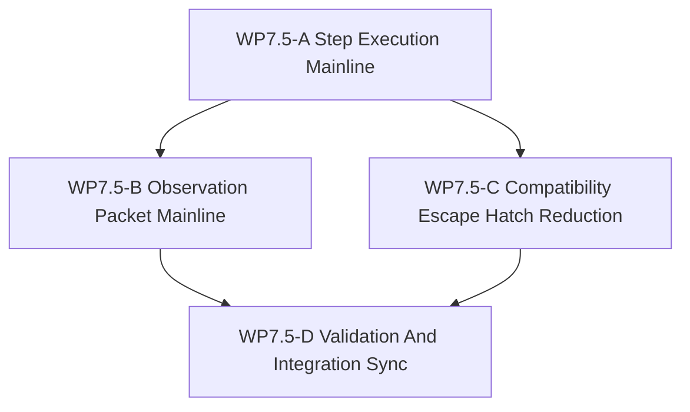

# WP7.5 训练路径 facade 桥接

状态：`2026-05-20` 计划中的桥接线，位于已验收的 `WP7` 后端能力物化与计划中的
`WP8` SCAL 学习面之间。

语言：

- 英文主文：[training_path_facade_bridge_wp75_20260520.md](training_path_facade_bridge_wp75_20260520.md)
- 中文辅文：`training_path_facade_bridge_wp75_20260520.zh.md`

输入：

- [仿真系统架构设计](../../../plan/architecture/simulation_system_architecture_design.zh.md)
- [架构与性能路线进一步调研](../../../plan/architecture/architecture_and_performance_research_followup.zh.md)
- [WP4 facade 对齐](../wp4_facade_alignment/facade_alignment_wp4_20260519.zh.md)
- [WP4 policy binding 对齐探查说明](../wp4_facade_alignment/wp4_policy_binding_alignment_notes_20260519.zh.md)
- [WP5 验证套件](../wp5_validation_harness/validation_harness_wp5_20260519.zh.md)
- [WP7 后端能力物化](../wp7_backend_capability_materialization/backend_capability_materialization_wp7_20260519.zh.md)
- [temp-05 基础设施闭合状态与兼容层审计](../../../plan/architecture/review/temp-05.md)
- [WP7.5 验收审查](../../review/wp75_training_path_facade_bridge_acceptance_review_20260520.zh.md)
- 当前 `python/rl/runtime/world_batch/adapter.py`
- 当前 `python/rl/runtime/world_batch_vec_env.py`
- 当前 `python/rl/runtime/cooperative_world_batch_vec_env.py`
- 当前 `tests/architecture/test_runtime_facade_layering.py`
- 当前 `tests/runtime/facade/test_runtime_facade.py`
- [Subagent 使用规范](../../../standards/governance/subagent_usage_policy.zh.md)

命名说明：

- `WP7.5` 不是 `WP8` 的替代；`WP8` 仍然是 SCAL Learning 面的架构线。
- `WP7.5` 不重开已验收的 `WP4`；它负责把已验收的 facade contracts 接到维护中的
  训练主线上。
- `WP7.5` 也不是一轮把所有 compatibility helper 全部删除；它的目标是把 raw
  runtime access 收窄到显式的 compatibility / diagnostics seam。

当 `WP7.5` 被拆分给多个 worker 时：

- 保持 `WP7.5-A` 与 `WP7.5-B` 互不重叠，除非由单一 integration worker
  负责收口；
- 不要让并行作者拆写同一张规范性表格；
- 保留一个 worker 负责跨文件发布与 README 同步。

## 1. 目的

项目已经在 `WP3` 和 `WP4` 中拥有维护中的 facade-shaped runtime contracts，而
`WP8` 将定义 Learning 面的 contract vocabulary。现在缺失的是中间这条桥：让维护中
的训练路径真正消费 facade surface，而不是继续通过
`RuntimeFacade.runtime()` 逃逸口访问底层 runtime。

当前 `WorldBatchVecEnv` 及其周边 adapter 仍通过 raw `WorldBatchRuntime`
方法驱动主 batch 训练路径。这使得 facade contracts 虽然已经被测试验证，但还没有
真正成为维护中的训练主线。`WP7.5` 的职责，就是把维护中的 batch 训练路径迁到：

- `RuntimeFacade.step_execution_batch()`
- `RuntimeFacade.export_observation_packet()`

这样训练路径才会成为现有维护中 request/result contracts 的真实 consumer，也让
`WP8` 未来可以建立在稳定的 facade-shaped execution / observation path 上。

`WP7.5` 需要回答：

1. 哪些维护中的训练路径操作仍依赖 `RuntimeFacade.runtime()` 或 raw
   `WorldBatchRuntime` stepping？
2. batch step execution 与 observation export 的维护中等价面应该是哪组 facade
   request/result surface？
3. 迁移后还允许哪些 raw runtime path 存在，并且它们只能承担什么
   compatibility / diagnostics 角色？
4. 哪些 narrow test 可以证明维护中的训练路径不再依赖 raw runtime stepping 或
   direct observation getter？

## 2. 范围边界

`WP7.5` 可以：

1. 把维护中的 batch 训练 adapter 从 raw runtime episode stepping 迁到
   `ExecutionBatchStepRequest` / `ExecutionBatchStepResult`。
2. 把维护中的训练 observation 读取迁到
   `ObservationBatchRequest` / `ObservationBatchPacket`。
3. 收紧 Python 中仍把 `AgentObservation` 称为 `truth` 的命名与 provenance 说明。
4. 新增 narrow architecture/runtime test，在维护路径回退到
   `RuntimeFacade.runtime()` 时失败。
5. 更新 task 与 review 索引，让 `WP8` 可以显式依赖这条 facade-shaped 训练桥接线。

`WP7.5` 不可以：

1. 把 `WP8` Learning-face 架构吸收到自己内部。
2. 晋级 GPU、resident-state、device-observation、exact-backend 或 shadow
   capability claim。
3. 在一轮里删除 diagnostics、setup 或 legacy single-world tool 仍需要的全部
   compatibility helper。
4. 把 raw `WorldBatchRuntime` access 重新包装成维护中的 policy / training API。
5. 把已验收的 `WP4` 或 `WP5` 说成未完成，从而重开它们的 scope。

## 3. 工作包

| 工作包 | 状态 | 目标 | 产出 |
|--------|------|------|------|
| `WP7.5-A Step Execution Mainline` | planned | 让维护中的 batch 训练 step 消费 `RuntimeFacade.step_execution_batch()`，而不是 raw runtime episode stepping。 | step execution 迁移子切片 |
| `WP7.5-B Observation Packet Mainline` | planned | 让维护中的训练 observation 读取消费 `ObservationBatchRequest` / `ObservationBatchPacket`，并补 observation packet provenance。 | observation bridge 子切片 |
| `WP7.5-C Compatibility Escape Hatch Reduction` | planned | 把 `RuntimeFacade.runtime()` 收窄到显式 compatibility / diagnostics seam，并记录剩余允许路径。 | compat 收窄子切片 |
| `WP7.5-D Validation And Integration Sync` | planned | 在 A-C 稳定后新增 regression gate，并同步 README、review 与 `WP8` 引用。 | 验证 / 索引同步子切片 |

## 4. 依赖图



并行规则：

- `WP7.5-A` 先启动，因为它定义维护中的 batch-step mainline。
- `WP7.5-B` 可在 step path 稳定后推进，使用已经落定的 request/result shape。
- `WP7.5-C` 可以和 `WP7.5-B` 并行收紧 escape hatch，但不应在 maintained
  replacement 落地前删除必要 seam。
- `WP7.5-D` 串行执行，只应在 A-C 稳定后启动。

桥接规则：

- `WP8` 可以先定义 learning-facing contract vocabulary。
- 但任何“训练主路径已经采用 facade-shaped execution / observation”的 maintained
  claim，都属于 `WP7.5`，不属于 `WP8`。

## 5. 分发计划

| 流 | 主要关注点 | 备注 |
|----|------------|------|
| `WP7.5-A Step Execution Mainline` | batch step request/result、reward/termination export、controller state handoff。 | 风险最高，因为它改变维护中的训练 step surface。 |
| `WP7.5-B Observation Packet Mainline` | observation packet 读取、cached packet 消费、ownship observation 的命名与 provenance。 | 需要与 `WP4` 信息状态纪律保持一致。 |
| `WP7.5-C Compatibility Escape Hatch Reduction` | 剩余 raw runtime access、diagnostics-only seam、允许 fallback 列表。 | 目标是显式收口，不是盲删。 |
| `WP7.5-D Validation And Integration Sync` | layering guard、vec-env regression target、README/WP8/review sync。 | 串行发布步骤。 |

## 6. 必需验收产物

任何 `WP7.5` gate 若要报告为通过，验收包必须包含下列全部产物。

| 产物 | 必需状态 | 作用 |
|------|----------|------|
| `docs/task/simulation_architecture/wp75_training_path_facade_bridge/training_path_facade_bridge_wp75_20260520.md` | required | 英文规范主文，定义 scope、gate 与 bridge 规则。 |
| `docs/task/simulation_architecture/wp75_training_path_facade_bridge/training_path_facade_bridge_wp75_20260520.zh.md` | required | 中文规范辅文，承载同一套规范规则。 |
| `docs/task/review/wp75_training_path_facade_bridge_acceptance_review_20260520.md` | required | 英文验收决定记录，必须逐 gate 记录证据与最终判定。 |
| `docs/task/review/wp75_training_path_facade_bridge_acceptance_review_20260520.zh.md` | required | 中文验收决定记录。 |

产物规则：

- 任一必需产物缺失，则验收结果必须为 `fail`。
- 产物存在但没有覆盖其声称负责的 gate 判定和 required evidence，也必须为
  `fail`。
- 聊天消息、commit 描述或 PR 摘要不能替代必需的 acceptance review 文档。

## 7. 严格 gate 规则

下表中的每个 gate 都必须在 acceptance review 中独立判定。每个 gate 只能以
`pass`、`fail` 或 `blocked` 收束。

| Gate | Required evidence | Pass 口径 | Fail 口径 | 环境阻塞降级表述 |
|------|-------------------|-----------|-----------|------------------|
| `WP7.5-A Step Execution Mainline` | 验收审查必须点名受检的维护中训练 step 文件，指明维护中 batch stepping 消费的 facade surface，并写出用于证明主线不再依赖 raw runtime episode stepping 的精确验证命令或测试。 | 只有当维护中的 `WorldBatchVecEnv` batch stepping 被证明确实消费 `RuntimeFacade.step_execution_batch()` 或其维护中的 request/result 流，并且审查同时证明维护路径不再依赖 `RuntimeFacade.runtime()` 或 raw `WorldBatchRuntime` episode stepping 时，才能 `pass`。 | 若缺少维护路径文件覆盖、缺少 step execution 证据、维护路径仍显示 raw runtime episode stepping，或仅有意图描述没有具体证据，则必须 `fail`。 | 如果必须的 step-execution 验证因本机缺少运行时依赖或构建产物而无法执行，必须记为 `blocked`，并写出精确命令、精确报错、缺失前提，以及下一台机器或构建上下文。`Blocked` 不是 `pass`。 |
| `WP7.5-B Observation Packet Mainline` | 验收审查必须点名受检的维护中 observation bridge 文件，指明维护路径消费的 observation request/result surface，并写出用于证明读取经过 `ObservationBatchRequest` / `ObservationBatchPacket` 或 `ExecutionBatchStepResult` 所携 observation packet 的精确验证命令或测试。 | 只有当维护中的训练 observation read 被证明确实消费 facade observation packet 流，并且审查证明维护路径没有回退到批准 seam 之外的 direct observation getter 时，才能 `pass`。 | 若审查没有覆盖维护 bridge 文件、没有给出 packet-flow 证据、维护路径仍依赖 direct maintained-path observation getter，或 provenance 不清，则必须 `fail`。 | 如果验证被缺失模块、二进制或运行时夹具阻塞，必须记为 `blocked`，并写出精确命令、精确报错、缺失前提，以及静态检查还能得出的有限结论。静态检查不能被改写成运行时 `pass`。 |
| `WP7.5-C Compatibility Escape Hatch Reduction` | 验收审查必须枚举迁移后仍被宣称可接受的每一处 `RuntimeFacade.runtime()` 或 raw `WorldBatchRuntime` 用法，并逐项标注其属于 compatibility-only 还是 diagnostics-only。 | 只有当文档面上所有剩余 escape hatch 都被显式列出，并被收窄到 compatibility-only 或 diagnostics-only seam，且没有把它们抬升成维护中的 policy 或 training API，才能 `pass`。 | 若任何剩余 escape hatch 未被记录、理由含糊，或实际上被当成维护中的训练/学习 surface，则必须 `fail`。 | 如果某些依赖运行时的分类在本机上无法确认，必须把对应项写成 `blocked`，并保持 gate 未决。只有部分文档化不能把 gate 升级为 `pass`。 |
| `WP7.5-D Validation And Integration Sync` | 验收审查必须确认 gate 产物存在，引用实际使用的 regression guard 或验证命令，并说明 `WP8` 是通过引用本桥接线来消费 maintained migration，而不是在自身文档里重写迁移。 | 只有当 review 产物齐全、gate 证据自洽、regression guard 保持 narrow，并且 `WP8` 交叉引用明确把 `WP7.5` 当作 maintained training-path bridge 时，才能 `pass`。 | 若必需产物缺失、review 没有把桥接线同步进 `WP8`，或验证叙事不完整/互相矛盾，则必须 `fail`。 | 如果最终集成验证受环境状态阻塞，必须写成 `blocked`，并给出精确缺失依赖信息。缺少集成证据时，不能写成“ready”或“accepted pending tests”。 |

判定总规则：

- `pass` 要求该 gate 的全部 required evidence 到位，且同一份 review 里没有相互
  矛盾的证据。
- 只要 required evidence 缺失、被反证、或被“意图性表述”替代，就必须 `fail`。
- `blocked` 只允许用于环境或机器限制，并且必须保持 gate 处于未解决状态。

## 8. 验证命令

```bash
git diff --check
rg -n "WP7.5|Training Path Facade Bridge|facade.runtime|step_execution_batch|export_observation_packet|ObservationBatchRequest|ObservationBatchPacket|ExecutionBatchStepRequest|WorldBatchVecEnv" docs/task/simulation_architecture docs/task/review python/rl/runtime tests/architecture tests/runtime/facade
python -m pytest tests/architecture/test_runtime_facade_layering.py tests/runtime/facade/test_runtime_facade.py tests/runtime/facade/test_facade_step_evidence_gates.py -q
```

实现阶段可以增减 `pytest` target，但必须保留 layering、maintained facade
stepping 与 maintained observation export 这几类覆盖。

验证表述规则：

- 命令执行并通过时，acceptance review 应写 `passed`，并附精确命令。
- 命令执行并失败时，acceptance review 应写 `failed`，并附精确命令与失败现象。
- 命令无法执行时，acceptance review 应写 `blocked`，并附精确命令、精确阻塞点和
  所需的下一环境。

## 9. 非目标

- 在本机完成完整 RL 训练。
- 重写所有 legacy env 或所有 diagnostics helper。
- 晋级 GPU/device/resident/shadow claim。
- 把 `RuntimeFacade.runtime()` 变成维护中的 frontend affordance。
- 把 `WP8` Learning-face 架构工作挪进本桥接线。
